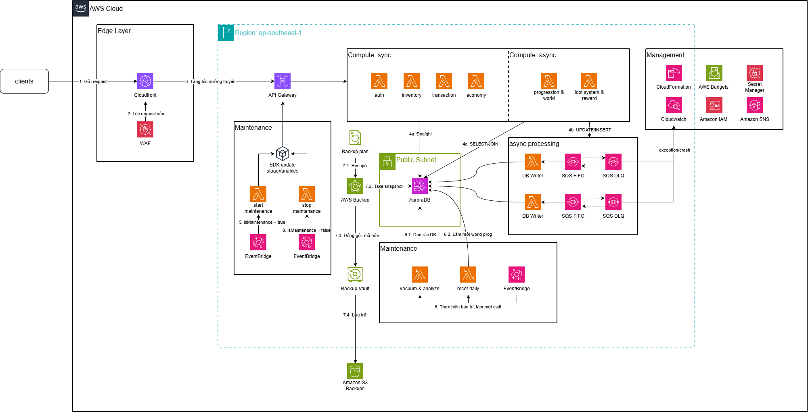

## Game Backend Process Storage and Processing System

### 2.1 Summary

The project builds a storage and process handling system for a Game Backend with the goal of fully transforming the architecture from a traditional monolith to a Serverless Microservices ecosystem on AWS. By splitting business logic into 6 independent Lambda clusters, combining asynchronous processing through SQS, and flexible storage with Aurora Serverless v2, this solution solves the waste of compute resources during low-traffic periods and the risk of total system failure. The new architecture commits to reducing an estimated 40% of monthly infrastructure costs, enabling instant scaling during sudden player spikes, and accelerating secure feature deployment.

### 2.2 Problems

**Operational cost issue:**
The current monolith architecture runs on the server 24/7 even when no players are active. This causes significant compute waste. The server must be provisioned for peak load (high traffic periods) but still runs idle during off-peak hours, resulting in inefficient operational cost.

**Scalability issue:**
When player counts suddenly spike (game events, promotions, holiday seasons), the monolith cannot scale individual parts separately. For example, if only the Auth or Economy feature is overloaded, the entire system still has to scale. This is both expensive and inefficient. The monolith architecture also does not support flexible auto-scaling per domain.

**Deployment and maintenance issue:**
Every feature update or bug fix requires redeploying the entire application. A small bug in the Auth module can take down the whole game. The CI/CD process becomes more complex and deployment takes longer because the entire system must be rebuilt and restarted. Independent rollback for individual features is not possible.

**Asynchronous processing issue:**
Critical tasks such as currency updates (earn/spend), inventory changes (add/remove item), redeeming gift codes, and saving progress are currently handled synchronously in the request-response cycle. If the server fails mid-operation, data can be lost or become inconsistent. There is no retry mechanism or queue to guarantee successful processing.

**Backup and disaster recovery issue:**
Game data — accounts, currency, inventory, save data — is the most important asset. If the game server lacks an automated backup strategy and a clear disaster recovery plan, then when the database has a failure (disk corruption, replication issues, attack), player data can be permanently lost.

### 2.3 Solution Architecture

**Processing flow overview:**

The system architecture is designed following separation of layers (Edge, Compute, Data, Management) with interaction flows numbered on the diagram:

[1] -> [2] -> [3]: Intake and Routing Flow (Edge Layer)

- [1] Send request: The client sends API requests to the backend.
- [2] Filter bad requests: Traffic enters CloudFront and is immediately monitored by AWS WAF to block malformed requests, botnets, or application-layer DDoS attacks.
- [3] Accelerate and route: CloudFront optimizes global delivery and forwards secure traffic to API Gateway. API Gateway applies rate limiting and routes requests to the appropriate Lambda cluster.

[4a] & [4b, 4c]: Business Processing Flow (Compute & Database Layer)

- [4a] Synchronous read/write: For tasks requiring immediate response (such as login, inventory lookup in auth, inventory, transaction, economy domains), Lambda handles the request directly and reads/writes to Aurora RDS.
- [4c] Immediate read queries (SELECT/JOIN): For information requests, Lambda can fetch data from the database and return the result immediately to the client.
- [4b] Write/update operations (UPDATE/INSERT): For game data updates, requests are sent to SQS FIFO. DB Writer Lambdas then process the queue sequentially to write to the database, ensuring integrity and preventing data conflicts under concurrent operations.

[5] -> [6] -> [7] -> [8]: Maintenance and Backup Flow

- [5] Enter maintenance: On schedule, the system sets the `isMaintenance` flag on API Gateway to block external requests and freeze the system state.
- [6] Perform maintenance & reset: Background jobs trigger daily reset tasks (refresh daily gameplay activities, respawn monsters, reset events) and run vacuum/analyze to optimize database tables for fast access.
- [7] Backup data: While the system is in maintenance mode, export and backup processes run to save data safely to Amazon S3.
- [8] End maintenance: After tasks complete, the `isMaintenance` flag is removed and the system reopens to normal player requests.

**Component details:**

API Gateway is the single entry point for client requests, responsible for authentication, rate limiting, and routing to the correct Lambda. Six API Lambdas are deployed independently, each wrapping an Express app with `@vendia/serverless-express`, running on Node.js 20 and handling a specific game domain. These Lambdas scale independently based on request volume per domain.

Five SQS FIFO queues ensure messages are processed in order and not lost. Each queue has its own DLQ to collect failed messages after three retries, with CloudWatch alarms for timely alerts. Consumer Lambdas process batches of up to 10 messages with partial failure handling.

Aurora RDS Serverless PostgreSQL is the primary database, auto-scaling ACUs based on load and supporting IAM authentication for security. TypeORM auto-creates/updates schemas on startup (`synchronize: true`). There are 18 entities in 5 domains (User, Forum, GiftCode, Game, System).

EventBridge acts as the scheduler with four rules: enable maintenance, disable maintenance, vacuum/analyze/reindex tables, and daily reset (reset stamina, clean expired codes, logs, stale data). The Maintenance Lambda receives EventBridge events and performs the corresponding tasks.

AWS Backup performs automatic daily and weekly database backups.

Shared code is packaged through the npm workspace `@gameapi/shared`, including: 18 TypeORM entities, 3 middlewares (auth, admin, maintenance), an SQS producer with 8 static methods, utilities (JwtHelper, PasswordHasher, TimeHelper, ItemGenerationHelper, logger), services (GiftCodeService, GameLogicValidator), and CloudWatch metrics helper.

### 2.4 Architectural Tradeoffs

#### 2.4.1 Security vs. operational cost

**Problem:** Placing Aurora RDS in a private subnet requires Lambdas to access the Internet through NAT Gateway or VPC Endpoints.

**Decision:** Deploy Aurora RDS in a public subnet so Lambdas can run in the default subnet with Internet access without NAT Gateway.

**Benefit:** Immediately saves fixed NAT Gateway cost (~$32/month plus data transfer). For the early project stage with limited players and budget, additional networking cost is not financially feasible.

#### 2.4.2 AWS Lambda vs traditional EC2

**Problem:** Game traffic is highly bursty. Peak usage can spike in evenings, weekends, or events, while traffic drops at night. Traditional EC2 provisioned for peak load wastes resources, and Auto Scaling takes 2-5 minutes to launch new instances, missing sudden bursts.

**Decision:** Remove EC2 and migrate the entire processing logic to AWS Lambda.

**Tradeoff:** Accept loss of OS-level control, execution time limits, and cold start latency on the first request.

**Benefit:** Pay-per-use compute eliminates idle costs. When player count is zero, compute cost is essentially zero. The system gains instant, independent scaling per module, and infrastructure management shifts to AWS, letting developers focus on game logic.

#### 2.4.3 Aurora Serverless vs traditional RDS

**Problem:** Relational databases are the hardest scalability bottleneck. Traditional RDS requires choosing instance size in advance. Scaling up during sudden load requires restarts and minutes of downtime.

**Decision:** Use Amazon Aurora Serverless v2 PostgreSQL instead of traditional RDS PostgreSQL/MySQL.

**Tradeoff:** Aurora Serverless has a higher ACU unit price than an equivalent provisioned RDS instance. It also requires stricter connection management because many Lambda instances may connect concurrently.

**Benefit:** The cost difference is offset by instant vertical scaling from 0.5 ACU to tens of ACUs without downtime. Aurora scales down during low traffic, aligning costs to actual usage and avoiding paying for a high-capacity database 24/7.

### 2.5 Technical Implementation

**Six Lambda APIs** are divided by domain — Auth (register/login/dashboard), Economy (balance/earn/spend), Inventory (item CRUD + storage), Transaction (shop + gift code), Progression (stats + farming), Loot-Reward (leaderboard + forum + save data + game data).

**Five SQS FIFO queues** — economy, inventory, giftcode, stats, save-data. Each queue has its own DLQ with CloudWatch alarm. Messages are processed asynchronously by consumer Lambdas.

**Database** — Aurora RDS PostgreSQL with TypeORM (`synchronize: true`). 18 entities across 5 domains. Supports IAM authentication for production and password auth for local development.

**Security** — JWT for APIs, admin secret for admin endpoints, rate limiting, IAM authentication.

**Shared code** — npm workspace `@gameapi/shared` containing models, middlewares, utils, SQS producer, and shared services.

**Maintenance** — four EventBridge rules: enable/disable maintenance, vacuum/analyze, and daily reset.

**Deployment** — Docker Compose for local dev, Serverless Framework + esbuild for AWS production.

### 2.6 Roadmap

Week 4: Survey and solution design.

Week 5: Set up AWS infrastructure (RDS, API Gateway, SQS, EventBridge, IAM).

Week 6: Deploy Auth + Economy Lambda and corresponding consumers.

Week 7: Deploy Inventory + Transaction Lambda and corresponding consumers.

Week 8: Deploy Progression + Loot-Reward Lambda and corresponding consumers.

Week 9: Deploy Maintenance Lambda, backup, and monitoring.

Week 10: Integration testing, load testing, cutover, go-live.

### 2.7 Budget Estimate

**Assumptions:**

* 500 DAU.
* ~5,000,000 requests/month through API Gateway.
* Average request/response payload size 34 KB.
* 50 GB/month outbound data transfer.
* Lambda memory 512 MB, average execution 100 ms, ARM architecture.
* SQS ~2,000,000 async requests, 6,000,000 total operations, <0.1% failure rate.
* Storage: S3 ~10 GB, CloudWatch Logs ~10 GB/month.
* Aurora Serverless PostgreSQL average 2 ACU 24/7.

| Service | Monthly Cost (USD) | Annual Cost (USD) |
| --- | --- | --- |
| Amazon Aurora PostgreSQL-Compatible DB | 74.68 | 896.16 |
| AWS WAF | 11.00 | 132.00 |
| Amazon CloudFront | 10.25 | 123.00 |
| Amazon CloudWatch | 7.05 | 84.54 |
| Amazon API Gateway | 6.25 | 75.00 |
| AWS Lambda | 4.33 | 51.96 |
| Amazon SQS | 3.00 | 36.00 |
| Amazon S3 | 0.51 | 6.12 |
| Data Transfer | 0.00 | 0.00 |
| **Total** | **117.07** | **1,404.78** |

This architecture costs $117.07/month and $1,404.78/year for the estimated load. Compute-related services (Lambda + API Gateway + SQS) are under $15/month, while Aurora and RDS Proxy remain the largest expense.

### 2.8 Risk Assessment

**Lambda cold starts:** First request after idle time can be slow due to runtime initialization and DB connection. Medium impact. Mitigated with Provisioned Concurrency for critical Lambdas.

**Public DB endpoint risk:** Placing Aurora RDS in a public subnet without NAT Gateway exposes a public endpoint. High impact. Mitigated with strict Security Groups, IAM authentication, and a future Private Subnet migration plan.

**SQS FIFO throughput limit:** 3000 TPS limit. Low impact for the current scale; future scaling can add additional queues and sharding.

**Duplicate messages:** Consumer crashes after processing but before ack may cause duplicates. Low impact. Mitigated with idempotent handlers and DLQ alarms.

**DB connection exhaustion:** Many Lambda instances may exhaust DB connections. Medium-high impact. Mitigated by limiting pool size per Lambda and using RDS Proxy.

**AWS bill spikes:** Viral traffic can increase Lambda, API Gateway, and DB costs. High impact. Mitigated with AWS Budgets, usage plans, rate limiting, and CloudWatch alerts.

**Large save data timeouts:** Large save payloads may hit Lambda timeout. Medium impact. Mitigated by increasing timeout or handling large data async via SQS.

**AWS dependency:** Regional AWS outages can fully impact availability. High impact. Mitigated by multi-AZ RDS, cross-region DR backups, and recovery docs.

### 2.9 Expected Outcomes

*Reduced costs* — pay-per-use Lambda means no idle compute cost, with an expected 40-60% savings over a fixed-server monolith.
*Flexible scaling* — each domain scales independently, avoiding system-wide bottlenecks.
*Faster deployment* — independent Lambda deployment reduces rollout time and enables safer rollbacks.
*Reliable async processing* — FIFO queue ordering, retries, DLQ alarms, and idempotency.
*Production readiness* — automated backups, monitoring, alarms, JWT security, rate limiting, IAM auth, and maintenance mode.
*Smooth migration* — run the monolith in parallel during cutover and migrate domains gradually.
