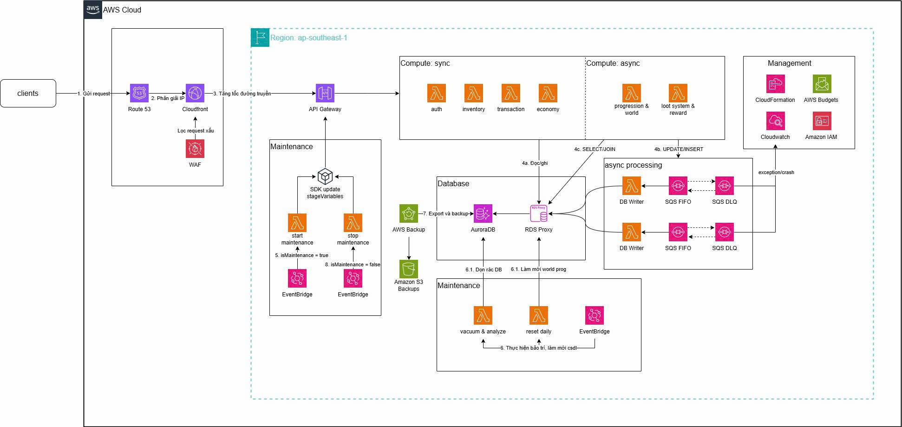

## Giải pháp AWS Serverless cho dự án này là Game Backend API

### 2.1 Tóm tắt điều hành

Dự án Game Backend API cho game 2D RPG với backend Node.js + TypeScript + Express 5, database PostgreSQL/Aurora RDS. Giải pháp AWS Serverless chuyển đổi từ monolith sang **microservices serverless** với 6 Lambda API + 5 SQS Consumer + 1 Maintenance Lambda, giúp giảm chi phí, tăng khả năng mở rộng, và triển khai linh hoạt.

### 2.2 Tuyên bố vấn đề

**Vấn đề về chi phí vận hành:**
Kiến trúc monolith hiện tại chạy trên server 24/7, ngay cả khi không có người chơi nào hoạt động. Điều này gây lãng phí tài nguyên tính toán đáng kể. Server phải được cấp phát theo peak load (giờ cao điểm) nhưng lại chạy không tải vào giờ thấp điểm, dẫn đến chi phí vận hành không tối ưu.

**Vấn đề về khả năng mở rộng:**
Khi lượng người chơi tăng đột biến (sự kiện game, quảng cáo, mùa lễ), monolith không thể scale từng phần riêng lẻ. Ví dụ, chỉ riêng tính năng Auth hay Economy bị quá tải nhưng buộc phải scale toàn bộ hệ thống. Điều này vừa tốn kém vừa không hiệu quả. Kiến trúc monolith cũng không hỗ trợ auto-scaling linh hoạt theo từng domain.

**Vấn đề về triển khai và bảo trì:**
Mỗi lần cập nhật tính năng hoặc sửa lỗi đều phải deploy lại toàn bộ ứng dụng. Một lỗi nhỏ ở module Auth có thể làm sập toàn bộ game. Quy trình CI/CD phức tạp hơn và thời gian deploy lâu hơn do phải build và restart toàn bộ hệ thống. Không thể rollback độc lập từng tính năng.

**Vấn đề về xử lý bất đồng bộ:**
Các tác vụ quan trọng như cập nhật currency (earn/spend), thay đổi inventory (add/remove item), redeem gift code, lưu save data hiện đang được xử lý đồng bộ trong request-response cycle. Nếu server gặp sự cố giữa chừng, dữ liệu có thể bị mất hoặc không nhất quán. Thiếu cơ chế retry và hàng đợi để đảm bảo xử lý thành công.

**Vấn đề về backup và phục hồi thảm họa:**
Dữ liệu game — tài khoản, tiền tệ, inventory, save data — là tài sản quan trọng nhất. Hiện tại chưa có chiến lược backup tự động, chưa có kế hoạch phục hồi thảm họa (DR) rõ ràng. Nếu database gặp sự cố (hỏng ổ cứng, lỗi replication, tấn công), dữ liệu người chơi có thể bị mất vĩnh viễn.

### 2.3 Kiến trúc giải pháp

**Tổng quan luồng xử lý:**

Client (game app) gửi request qua API Gateway, request được định tuyến đến Lambda tương ứng theo từng domain. Các Lambda API xử lý logic nghiệp vụ và ghi dữ liệu vào Aurora RDS PostgreSQL. Đối với các tác vụ quan trọng cần đảm bảo tính toàn vẹn (earn/spend currency, add/remove item, redeem gift code, distribute stats, upload save data), Lambda API gửi message vào SQS FIFO queue. Các SQS Consumer Lambda xử lý message từ queue và thực hiện ghi vào database, đảm bảo xử lý bất đồng bộ và có thể retry nếu thất bại.

**Chi tiết các thành phần:**

API Gateway đóng vai trò cổng duy nhất nhận request từ client, chịu trách nhiệm xác thực (JWT), rate limiting, và routing đến đúng Lambda. 6 Lambda API được triển khai độc lập, mỗi Lambda là một Express app được wrap bởi `@vendia/serverless-express`, chạy trên Node.js 20, xử lý một domain cụ thể của game. Các Lambda này scale độc lập dựa trên số request đến từng domain.

5 SQS FIFO queue đảm bảo message được xử lý đúng thứ tự (FIFO) và không bị mất. Mỗi queue có DLQ (Dead Letter Queue) riêng để thu gom message thất bại sau 3 lần retry, kèm CloudWatch alarm để cảnh báo kịp thời. SQS Consumer Lambda xử lý message theo batch (tối đa 10 message/batch) với cơ chế partial failure (SGDBatchResponse).

Aurora RDS Serverless v2 PostgreSQL là database chính, tự động scale ACU theo tải, hỗ trợ IAM authentication cho bảo mật. TypeORM tự động tạo/cập nhật schema khi khởi động (synchronize: true). Có 18 entities chia làm 5 domain (User, Forum, GiftCode, Game, System).

EventBridge đóng vai trò scheduler với 4 rule: bật chế độ bảo trì (thứ Hai 10h UTC), tắt chế độ bảo trì (thứ Hai 12h UTC), vacuum analyze và reindex tất cả bảng (3h sáng hàng ngày), reset daily (nửa đêm — reset stamina, dọn expired codes, logs, stale data). Maintenance Lambda nhận event từ EventBridge và thực thi các tác vụ tương ứng.

AWS Backup thực hiện backup database tự động hàng ngày (lúc 5h UTC, retention 14 ngày) và hàng tuần (chủ nhật 5h UTC, retention 56 ngày).

Code dùng chung được đóng gói qua npm workspace `@gameapi/shared` bao gồm: 18 TypeORM entities, 3 middlewares (auth, admin, maintenance), SQS producer với 8 static methods, utils (JwtHelper, PasswordHasher, TimeHelper, ItemGenerationHelper, logger), services (GiftCodeService, GameLogicValidator), và CloudWatch metrics helper.

### 2.4 Triển khai kỹ thuật

**6 Lambda API** chia theo domain — Auth (đăng ký/đăng nhập/dashboard), Economy (balance/earn/spend), Inventory (CRUD đồ + storage), Transaction (shop + gift code), Progression (stats + nông trại), Loot-Reward (leaderboard + diễn đàn + save data + game data).

**5 SQS FIFO queue** — economy, inventory, giftcode, stats, save-data. Mỗi queue có DLQ riêng với CloudWatch alarm. Message được xử lý bất đồng bộ bởi các consumer Lambda tương ứng.

**Database** — Aurora RDS PostgreSQL với TypeORM (synchronize: true). 18 entities chia làm 5 domain. Hỗ trợ IAM authentication cho production, password cho local dev.

**Bảo mật** — JWT cho API, admin secret cho endpoint admin, rate limiting, IAM authentication.

**Shared code** — npm workspace `@gameapi/shared` chứa models, middlewares, utils, SQS producer, services dùng chung.

**Maintenance** — 4 EventBridge rules: bật/tắt bảo trì (thứ Hai), vacuum analyze (3h sáng), reset daily (0h sáng).

**Triển khai** — Docker Compose cho local dev, Serverless Framework + esbuild cho AWS production.

### 2.5 Lộ trình 

Tuần 1-2: Khảo sát và thiết kế giải pháp.
Tuần 3-4: Thiết lập hạ tầng AWS (RDS, API Gateway, SQS, EventBridge, IAM).
Tuần 5-6: Triển khai Lambda Auth + Economy + consumer tương ứng.
Tuần 7-8: Triển khai Lambda Inventory + Transaction + consumer tương ứng.
Tuần 9-10: Triển khai Lambda Progression + Loot-Reward + consumer tương ứng.
Tuần 11: Triển khai Maintenance Lambda, backup, monitoring.
Tuần 12: Kiểm thử tích hợp, load testing, cutover, go-live.

### 2.6 Ước tính ngân sách

Chi phí các dịch vụ AWS hàng tháng (ước tính cho quy mô ~1000 người chơi):

- **AWS Lambda (12 functions):** $50-200/tháng — tính theo số request và thời gian thực thi. 6 API Lambda + 5 Consumer Lambda + 1 Maintenance Lambda. Miễn phí 1 triệu request/tháng, sau đó $0.20/triệu request.
- **API Gateway (REST API):** $30-100/tháng — tính theo số request. Miễn phí 1 triệu request/tháng trong 12 tháng đầu.
- **Aurora RDS Serverless v2 (PostgreSQL):** $50-150/tháng — tính theo ACU (Aurora Capacity Unit). Khởi động với 2 ACU, scale tự động.
- **SQS FIFO (5 queues + 5 DLQs):** $5-15/tháng — FIFO $0.50/triệu request, DLQ lưu trữ $0.023/GB/tháng.
- **EventBridge (4 rules):** $5-10/tháng — $1/triệu events, 4 rules schedule mỗi ngày.
- **CloudWatch Logs + Metrics:** $10-30/tháng — lưu log từ Lambda, metric tùy chỉnh, alarm cho DLQ.
- **AWS Backup (daily + weekly):** $10-20/tháng — backup dung lượng database + retention 14-56 ngày.

**Tổng cộng: $160-525/tháng.** Với quy mô nhỏ dưới 1000 người chơi, chi phí có thể chỉ ~$200/tháng.

### 2.7 Đánh giá rủi ro

**Cold start Lambda:**
Khi không có request trong thời gian dài, Lambda bị thu hồi tài nguyên. Request đầu tiên sau đó sẽ bị chậm do phải khởi tạo runtime và kết nối database (cold start). Mức độ ảnh hưởng trung bình — người chơi có thể bị lag nhẹ ở lần request đầu tiên. Giảm thiểu bằng cách sử dụng Provisioned Concurrency cho các Lambda quan trọng (Auth và GameData) để giữ sẵn môi trường chạy.

**FIFO queue throughput giới hạn:**
SQS FIFO giới hạn 3000 TPS (transaction per second) — nếu vượt quá, message sẽ bị throttling. Mức độ ảnh hưởng thấp vì với quy mô dưới 1000 người chơi cùng lúc, throughput này là quá đủ. Nếu cần mở rộng sau này, có thể tăng số lượng queue và sharding theo account.

**Mất dữ liệu hoặc duplicate message:**
SQS FIFO đảm bảo exactly-once processing nhưng consumer có thể crash sau khi xử lý nhưng trước khi acknowledge, dẫn đến duplicate. Mức độ ảnh hưởng thấp — các handler cần được thiết kế idempotent. DLQ với maxReceiveCount=3 đảm bảo message không bao giờ bị mất, và đội ngũ vận hành được cảnh báo qua CloudWatch alarm khi DLQ có message.

**Database connection pool exhaustion:**
Mỗi Lambda instance tạo connection pool riêng đến database. Nếu có nhiều Lambda instance chạy đồng thời, số lượng connection có thể vượt quá giới hạn của RDS. Mức độ ảnh hưởng trung bình-cao. Giảm thiểu bằng cách giới hạn pool size mỗi Lambda (tối đa 2-5 connections), sử dụng RDS Proxy để quản lý connection pool tập trung, và tận dụng IAM authentication để tránh lưu password.

**Chi phí AWS tăng đột biến:**
Khi game viral hoặc có sự kiện lớn, lượng request tăng đột biến kéo theo chi phí Lambda, API Gateway, và database tăng theo. Mức độ ảnh hưởng cao — có thể dẫn đến hóa đơn AWS bất ngờ. Giảm thiểu bằng cách thiết lập AWS Budget Alert ở 3 ngưỡng (50%, 80%, 100%), giới hạn API Gateway usage plan, rate limiting, và monitoring qua CloudWatch dashboard.

**Lambda timeout với dữ liệu lớn:**
Save data của người chơi có thể rất lớn (nhiều item, nhiều plot, lịch sử giao dịch), dẫn đến Lambda timeout (mặc định 30s, tối đa 900s). Mức độ ảnh hưởng trung bình. Giảm thiểu bằng cách tăng Lambda timeout lên phù hợp, chia nhỏ save data thành nhiều phần, hoặc xử lý bất đồng bộ qua SQS cho các tác vụ nặng.

**Phụ thuộc vào AWS:**
Toàn bộ hệ thống chạy trên AWS — nếu AWS gặp sự cố regional (outage ở ap-southeast-1), game sẽ ngừng hoạt động hoàn toàn. Mức độ ảnh hưởng cao nhưng xác suất thấp. Giảm thiểu bằng cách thiết lập multi-AZ cho RDS, có kế hoạch DR với cross-region backup, và tài liệu hướng dẫn recovery chi tiết.

### 2.8 Kết quả kỳ vọng

**Giảm chi phí vận hành:**
Với Lambda pay-per-use, chi phí tính toán chỉ phát sinh khi có request từ người chơi. Không còn lãng phí tài nguyên chạy server 24/7. Dự kiến tiết kiệm 40-60% chi phí vận hành so với monolith chạy server cố định, đặc biệt là giai đoạn đầu khi lượng người chơi còn thấp.

**Khả năng mở rộng linh hoạt:**
Mỗi domain scale độc lập dựa trên tải thực tế. Auth Lambda có thể scale lên 1000 instance trong khi Inventory Lambda chỉ cần 10 instance. API Gateway auto-scale theo số request. Aurora Serverless v2 tự động điều chỉnh ACU theo tải database. Không còn bottleneck toàn hệ thống.

**Triển khai nhanh và an toàn:**
Deploy từng Lambda riêng lẻ, không ảnh hưởng đến các domain khác. Thời gian deploy giảm từ 10-15 phút (monolith) xuống còn 1-2 phút (từng Lambda). Rollback độc lập nếu có sự cố. CI/CD đơn giản hơn với Serverless Framework.

**Xử lý bất đồng bộ tin cậy:**
FIFO queue đảm bảo message được xử lý đúng thứ tự và không bị mất. DLQ + CloudWatch alarm cho phép phát hiện và xử lý kịp thời các message thất bại. Retry tự động tối đa 3 lần. Idempotent handler tránh duplicate do retry.

**Sẵn sàng production:**
AWS Backup tự động (daily + weekly) với retention policy rõ ràng. CloudWatch monitoring và alarm cho tất cả các thành phần (DLQ, Lambda errors, API Gateway 5xx, database connections). Bảo mật đa lớp: JWT, admin secret, rate limiting, IAM authentication. Maintenance mode cho phép bảo trì có kiểm soát mà không ảnh hưởng đến dữ liệu.

**Dễ dàng chuyển đổi:**
Monolith có thể chạy song song trong quá trình cutover. Có thể chuyển dần từng domain từ monolith sang Lambda mà không cần dừng game. Rollback nhanh chóng bằng cách chuyển API Gateway về monolith nếu phát hiện vấn đề.
