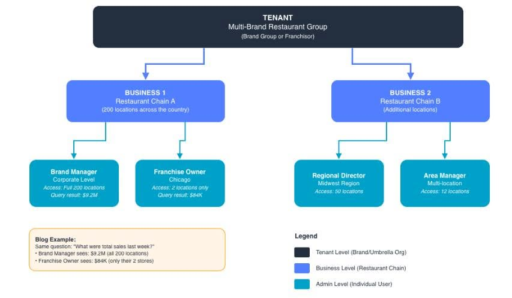
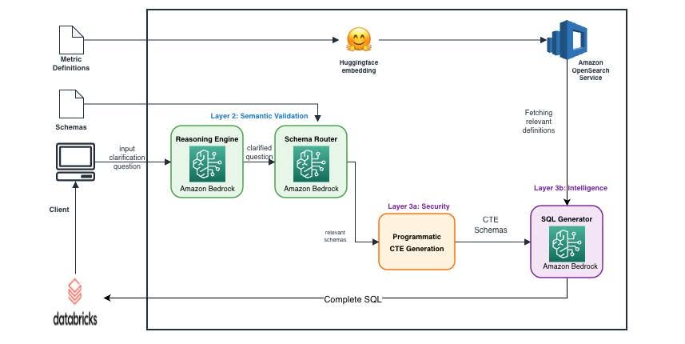

### Xây dựng hệ thống AI đa người dùng an toàn hơn với Amazon Bedrock

Chào mọi người, hôm nay mình muốn chia sẻ một bài viết khá hay của AWS về cách PAR Technology xây dựng hệ thống AI sử dụng Amazon Bedrock nhưng vẫn đảm bảo mỗi người dùng chỉ được xem đúng dữ liệu mà mình có quyền truy cập.

PAR là công ty cung cấp các giải pháp công nghệ cho nhiều chuỗi nhà hàng. Họ phát triển một hệ thống cho phép người dùng đặt câu hỏi bằng ngôn ngữ tự nhiên, sau đó AI sẽ tự tạo câu lệnh SQL để lấy dữ liệu và trả lời. Ý tưởng nghe khá đơn giản, nhưng khi triển khai thực tế lại phát sinh một bài toán rất quan trọng là bảo mật dữ liệu.

#### 3.1.1 Bài toán gặp phải

Trong hệ thống của PAR, có rất nhiều khách hàng cùng sử dụng chung một nền tảng. Ví dụ, chủ một cửa hàng chỉ được xem doanh thu của cửa hàng mình, trong khi quản lý cấp cao có thể xem doanh thu của toàn bộ chuỗi.

Nếu AI tạo truy vấn không đúng hoặc lấy nhầm dữ liệu thì người dùng có thể nhìn thấy thông tin mà họ không được phép truy cập. Đây là vấn đề rất nghiêm trọng đối với các hệ thống doanh nghiệp.

#### 3.1.2 Giải pháp của PAR

Thay vì để AI tự quyết định tất cả, PAR xây dựng hệ thống với nhiều lớp bảo vệ:

* **Xác thực danh tính:** Mọi yêu cầu đều được xác thực để đảm bảo người gửi là hợp lệ.
* **Kiểm duyệt yêu cầu:** Hệ thống sẽ kiểm tra câu hỏi của người dùng có rõ ràng và phù hợp hay không trước khi chuyển cho AI xử lý.
* **Lọc dữ liệu theo quyền:** Quan trọng nhất là dữ liệu sẽ được lọc theo quyền truy cập của từng người dùng *trước khi* AI tạo câu lệnh SQL. Điều này giúp AI chỉ làm việc trên phần dữ liệu đã được cấp quyền, thay vì toàn bộ cơ sở dữ liệu.

#### 3.1.3 Vì sao cách làm này hiệu quả?

Điểm mình thấy hay là AWS và PAR không đặt toàn bộ niềm tin vào LLM. AI chỉ chịu trách nhiệm hiểu câu hỏi và hỗ trợ tạo SQL, còn việc kiểm soát quyền truy cập vẫn do hệ thống xử lý. Nhờ vậy, ngay cả khi AI tạo truy vấn chưa chính xác hoặc bị tác động bởi các prompt không mong muốn thì dữ liệu ngoài phạm vi cho phép vẫn không thể bị truy cập.

#### 3.1.4 Kết quả đạt được

Theo bài viết, kiến trúc này đã được sử dụng trong môi trường thực tế và xử lý hơn **50.000 truy vấn** mà không xảy ra tình trạng rò rỉ dữ liệu giữa các người dùng. Ngoài việc tăng tính bảo mật, cách thiết kế này cũng giúp doanh nghiệp yên tâm hơn khi triển khai các ứng dụng AI trên dữ liệu quan trọng.

#### 3.1.5 Cảm nhận cá nhân & Kết luận

Theo mình, đây là một bài học khá thú vị khi xây dựng ứng dụng AI. Trước đây mình thường nghĩ chỉ cần chọn một mô hình LLM tốt là đủ, nhưng thực tế việc thiết kế kiến trúc và kiểm soát quyền truy cập còn quan trọng hơn.

Amazon Bedrock giúp việc xây dựng ứng dụng AI trở nên thuận tiện, nhưng để hệ thống hoạt động an toàn thì vẫn cần kết hợp với các cơ chế xác thực, phân quyền và lọc dữ liệu ngay từ đầu. Qua bài viết này mình thấy AI không nên là thành phần duy nhất quyết định việc truy cập dữ liệu. Khi kết hợp Amazon Bedrock với các lớp bảo mật phù hợp, doanh nghiệp có thể xây dựng những hệ thống AI vừa thông minh, vừa an toàn và đáng tin cậy hơn.

*Tác giả: Lại Văn Long*

**Nguồn tham khảo:** [Multi-tenant LLM analytics with row-level security: How we built a secure agent on AWS](https://aws.amazon.com/vi/blogs/machine-learning/multi-tenant-llm-analytics-with-row-level-security-how-we-built-a-secure-agent-on-aws/)
