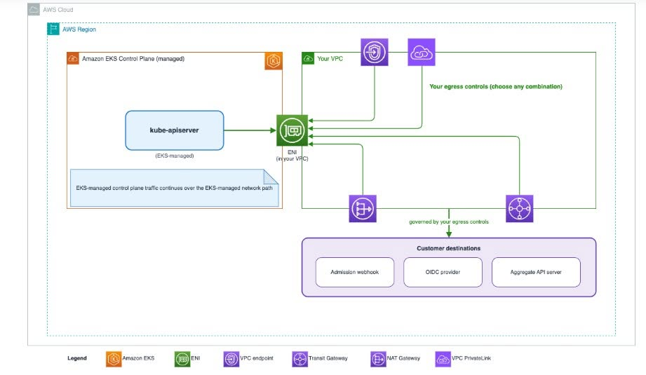

### Amazon EKS Supports Control Plane Egress Through Your VPC

While learning about Amazon EKS, I noticed that AWS recently introduced the **Customer-Routed Control Plane Egress** feature. This feature allows traffic from the Kubernetes Control Plane to be routed through the customer's Amazon VPC, increasing system control and security.

#### 3.2.1 What is Amazon EKS?

Amazon Elastic Kubernetes Service (Amazon EKS) is a managed Kubernetes service by AWS. This service helps users deploy and operate Kubernetes more easily without needing to manage the Control Plane themselves. Additionally, EKS integrates with many AWS services such as IAM, VPC, and CloudWatch to support system management and monitoring.

#### 3.2.2 What's new with this feature?

Previously, traffic from the Kubernetes Control Plane was handled by AWS-managed network infrastructure. With the new feature, this traffic can go through the customer's own Amazon VPC via an Elastic Network Interface (ENI). As a result, administrators can apply tools like Security Groups, Route Tables, VPC Endpoints, or AWS Network Firewall for better network traffic control.

#### 3.2.3 Key Benefits

In my opinion, this feature brings many benefits such as:

* **Increased Control:** Detailed management of outbound network traffic from the Control Plane.
* **Enhanced Security:** Apply the enterprise's own security barrier layers to the system.
* **Ensured Compliance:** Helps meet strict requirements for network system auditing.
* **Integration Capabilities:** Convenient when using authentication services or internal systems contained within the VPC.

#### 3.2.4 Deployment Notes

When using the `CUSTOMER_ROUTED` mode, administrators need to configure the network accurately because routing will be self-managed by the enterprise. Therefore, Route Tables and Security Groups should be carefully checked before deploying in a production environment to avoid losing connection to the Cluster.

#### 3.2.5 Personal Evaluation & Conclusion

In my opinion, this is quite a useful update for Amazon EKS. This feature helps businesses be more proactive in traffic management and enhances security when deploying Kubernetes on AWS. For a student learning about Cloud like myself, this is also an opportunity to better understand how AWS continuously improves its services to meet the practical needs of users.

In summary, **Customer-Routed Control Plane Egress** is a notable improvement. Allowing Control Plane traffic to be routed through the Amazon VPC makes the system more flexible, secure, and easier to manage. I believe this feature will be adopted by many businesses when deploying Kubernetes on AWS in the near future.

*Author: Lai Van Long*

**Reference:** [Amazon EKS now supports control plane egress through your VPC](https://aws.amazon.com/vi/blogs/containers/amazon-eks-now-supports-control-plane-egress-through-your-vpc/)