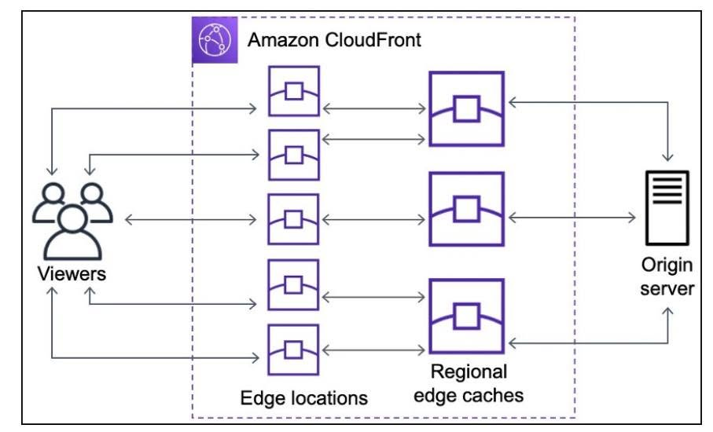

### Sử dụng Amazon CloudFront để tăng tốc và tối ưu quá trình xử lý yêu cầu của người dùng

Chào anh chị và các bạn, trong quá trình tìm hiểu về kiến trúc serverless trên AWS, mình có cơ hội tìm hiểu về **Amazon CloudFront** – dịch vụ CDN (Content Delivery Network) giúp tăng tốc độ truy cập và cải thiện trải nghiệm người dùng khi sử dụng ứng dụng. Sau khi đọc AWS Blog, mình xin chia sẻ một số kiến thức mà mình học được.

#### 3.3.1 Cơ chế hoạt động cơ bản

Khi người dùng gửi một request đến hệ thống, request sẽ được chuyển đến Amazon CloudFront trước:

* **Cache Hit:** Nếu nội dung đã được lưu trong bộ nhớ đệm (cache), CloudFront sẽ phản hồi ngay từ Edge Location gần người dùng nhất, giúp giảm độ trễ và tăng tốc độ tải nội dung.
* **Cache Miss:** Nếu dữ liệu chưa có trong cache, CloudFront sẽ chuyển request đến Origin (chẳng hạn như Amazon S3 hoặc API Gateway), lấy dữ liệu rồi lưu lại để phục vụ cho các lần truy cập tiếp theo.

#### 3.3.2 Tối ưu hiệu năng và bảo mật

Điểm mình thấy hay ở CloudFront là không chỉ giúp cải thiện hiệu năng mà còn giảm tải cho Origin khi nhiều người dùng cùng truy cập một nội dung. Nhờ tận dụng cơ chế cache tại các Edge Location trên toàn cầu, số lượng request gửi trực tiếp đến máy chủ được giảm đáng kể, từ đó giúp hệ thống hoạt động ổn định hơn và có thể tối ưu chi phí vận hành.

Ngoài khả năng tăng tốc, Amazon CloudFront còn có thể kết hợp với **AWS WAF** (Web Application Firewall) để lọc các request không hợp lệ trước khi chúng đến ứng dụng. Điều này góp phần tăng cường bảo mật và giảm nguy cơ từ các cuộc tấn công phổ biến trên web.

#### 3.3.3 Kết luận

Qua bài blog này, mình hiểu rõ hơn cách Amazon CloudFront xử lý request, cơ chế cache hoạt động như thế nào và vì sao đây là một trong những dịch vụ được sử dụng phổ biến khi triển khai các ứng dụng trên AWS. Đây là kiến thức khá hữu ích đối với mình khi tìm hiểu về các giải pháp xây dựng hệ thống có hiệu năng và khả năng mở rộng tốt trên nền tảng đám mây.

Hy vọng bài chia sẻ ngắn này sẽ hữu ích với mọi người. Nếu anh chị và các bạn có thêm kinh nghiệm sử dụng Amazon CloudFront trong thực tế, rất mong được cùng trao đổi và học hỏi thêm.

*Tác giả: Lại Văn Long*

**Nguồn tham khảo:** [Charting the life of an Amazon CloudFront request](https://aws.amazon.com/vi/blogs/networking-and-content-delivery/charting-the-life-of-an-amazon-cloudfront-request/)
