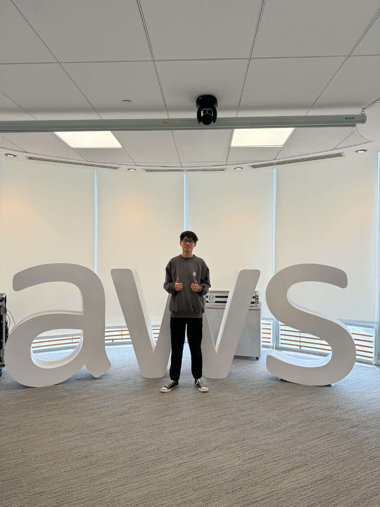

# Bài thu hoạch sự kiện FCAJ Community Day

| Thông tin   | Chi tiết                                                                                  |
| ------------ | ------------------------------------------------------------------------------------------ |
| Ngày        | 09/05/2026                                                                                 |
| Địa điểm | Tầng 26 Tòa nhà Bitexco, 02 Hải Triều, Phường Bến Nghé, Quận 1, TP Hồ Chí Minh |
| Vai trò     | Người tham dự                                                                           |

## 4.1.1 Mục tiêu của sự kiện

Buổi chia sẻ tập trung vào việc cung cấp cho người tham dự những kiến thức và kinh nghiệm thực tế trong quá trình học tập cũng như phát triển nghề nghiệp trong lĩnh vực công nghệ thông tin. Nội dung chính bao gồm:

* Các phương pháp duy trì động lực và xây dựng thói quen học tập hiệu quả.
* Cách khai thác AI thông qua Prompt Engineering để nâng cao chất lượng kết quả.
* Giới thiệu kiến trúc Serverless trên AWS và các dịch vụ thường được sử dụng.
* Chia sẻ góc nhìn về nền tảng kiến thức, tư duy và định hướng nghề nghiệp của kỹ sư phần mềm.
* Giới thiệu phương pháp phối hợp AI Agent trong quy trình phát triển phần mềm.

## 4.1.2 Diễn giả

* **Mr. Huỳnh Hoàng Long** – Chia sẻ về tâm lý học trong học tập và cách duy trì động lực.
* **Mr. Thịnh Nguyễn** – Trình bày về Prompt Engineering, AI và kiến trúc Serverless trên AWS.
* **Mr. Khang** – Solutions Architect tại Cloud Kinetics.
* **Ms. Thảo** – Software Developer tại VIB.

## 4.1.3 Nội dung chính

### Xây dựng động lực học tập

Diễn giả giới thiệu một số phương pháp giúp duy trì việc học trong thời gian dài. Thay vì cố gắng học quá nhiều trong một lần, nên chia mục tiêu thành những phần nhỏ để dễ thực hiện. Đồng thời, việc tạo các mốc hoàn thành hoặc duy trì chuỗi ngày học liên tục cũng giúp tăng tính kỷ luật và giảm cảm giác chán nản.

Một điểm đáng chú ý là quy tắc  **2 phút** , khuyến khích xử lý ngay các công việc nhỏ để tránh tích tụ và hình thành thói quen trì hoãn.

### Prompt Engineering và kiến trúc Serverless

Phần tiếp theo tập trung vào cách xây dựng prompt hiệu quả khi làm việc với các mô hình ngôn ngữ lớn (LLM). Một prompt tốt cần xác định rõ vai trò, mục tiêu, bối cảnh, dữ liệu đầu vào và định dạng đầu ra mong muốn. Bên cạnh đó, các kỹ thuật như **Chain of Thought** được giới thiệu nhằm hỗ trợ mô hình suy luận tốt hơn trong các bài toán phức tạp.

Diễn giả cũng minh họa một kiến trúc Serverless trên AWS, trong đó:

* Amazon S3 và CloudFront phục vụ nội dung tĩnh.
* Amazon Cognito đảm nhiệm xác thực người dùng.
* API Gateway kết hợp AWS Lambda xử lý logic nghiệp vụ.
* Amazon Bedrock tích hợp các mô hình AI.
* DynamoDB lưu trữ dữ liệu và CloudWatch hỗ trợ giám sát hệ thống.

### Nền tảng và tư duy nghề nghiệp

Một thông điệp được nhấn mạnh là AI chỉ đóng vai trò hỗ trợ, không thể thay thế kiến thức nền và khả năng tư duy của lập trình viên. Vì vậy, việc hiểu bản chất của hệ thống, thường xuyên đặt câu hỏi "vì sao" và duy trì chất lượng công việc là những yếu tố quan trọng trong quá trình phát triển sự nghiệp.

Diễn giả cũng khuyến khích sinh viên tập trung tích lũy kinh nghiệm, mở rộng mối quan hệ và học hỏi liên tục thay vì chỉ quan tâm đến thu nhập ở giai đoạn đầu.

### AI Agent trong quy trình phát triển phần mềm

Buổi chia sẻ giới thiệu mô hình phân chia AI thành nhiều vai trò khác nhau tương ứng với từng giai đoạn của SDLC. Mỗi AI Agent phụ trách một nhiệm vụ riêng như phân tích yêu cầu, thiết kế hệ thống, lập trình hoặc kiểm thử. Cách tiếp cận này giúp giảm nhầm lẫn về ngữ cảnh, nâng cao chất lượng đầu ra và hỗ trợ nhóm phát triển làm việc hiệu quả hơn.

## 4.1.4 Bài học và định hướng áp dụng

* Thiết kế prompt có cấu trúc rõ ràng khi sử dụng AI để hỗ trợ lập trình hoặc nghiên cứu.
* Tiếp tục tìm hiểu các dịch vụ Serverless của AWS như Lambda, API Gateway, CloudFront và Bedrock để áp dụng vào các dự án thực tế.
* Dành thời gian củng cố kiến thức nền về hệ điều hành, mạng máy tính, cơ sở dữ liệu và thiết kế hệ thống nhằm giảm sự phụ thuộc vào AI.
* Khi sử dụng AI trong phát triển phần mềm, nên phân chia rõ nhiệm vụ cho từng giai đoạn thay vì yêu cầu AI xử lý toàn bộ dự án trong một lần.

