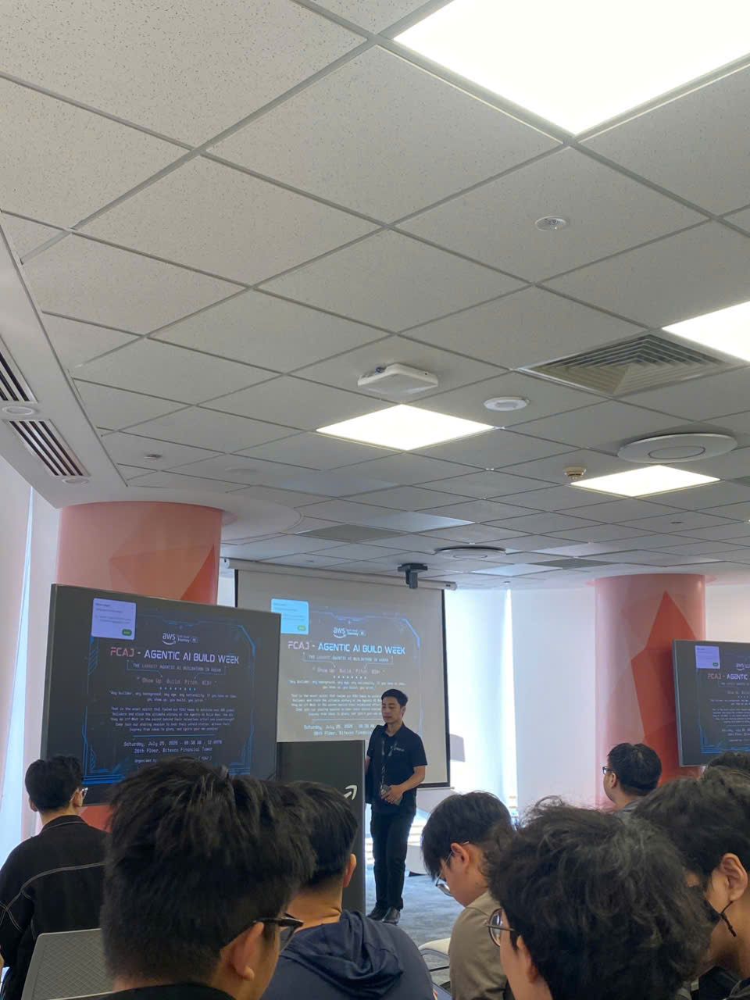

# Bài thu hoạch “FCAJ - Agentic AI Build Week Sharing Session”

### Mục Đích Của Sự Kiện

- Chia sẻ hành trình xây dựng sản phẩm của các đội đạt giải tại Agentic AI Build Week.
- Giới thiệu các giải pháp Agentic AI được phát triển trên nền tảng AWS.
- Chia sẻ kinh nghiệm xây dựng sản phẩm, làm việc nhóm và pitching trong Hackathon.
- Truyền cảm hứng cho học viên FCAJ tiếp tục học tập và tham gia các cuộc thi về AI.

### Danh Sách Diễn Giả

- **Đội AI-Powered Conversation Ordering**
- **Đội Signal Scout**
- **Đội Plan V**
- **Đội Hackathon Journey**
- **Đội Six Pillars**

### Nội Dung Nổi Bật

#### AI-Powered Conversation Ordering

Đội đạt giải chia sẻ quá trình xây dựng hệ thống AI hỗ trợ đặt món thông qua nhiều kênh giao tiếp khác nhau.

- Xây dựng Multi-channel AI Agent.
- Thiết kế quy trình xử lý hội thoại thông minh.
- Ứng dụng AI để hiểu nhu cầu người dùng.
- Chia sẻ kinh nghiệm triển khai sản phẩm trong Hackathon.

#### Signal Scout

Nhóm trình bày giải pháp sử dụng Agentic AI để thu thập và phân tích dữ liệu.

- Thu thập dữ liệu từ nhiều nguồn.
- Phân tích thông tin bằng AI.
- Trực quan hóa kết quả hỗ trợ ra quyết định.
- Chia sẻ kiến trúc hệ thống và kinh nghiệm phát triển.

#### Solution Architect Professional Native App

Giới thiệu kiến trúc triển khai ứng dụng trên AWS.

- Thiết kế kiến trúc Cloud.
- Phân chia các thành phần của hệ thống.
- Tối ưu khả năng mở rộng.
- Áp dụng các dịch vụ AWS trong thực tế.

#### Hackathon Journey

Các thành viên chia sẻ hành trình tham gia cuộc thi kéo dài 24 giờ.

- Quá trình lên ý tưởng.
- Phân chia công việc trong nhóm.
- Giải quyết các vấn đề phát sinh.
- Chuẩn bị demo và pitching.

#### Adaptive AML Workflow Engine

Giới thiệu giải pháp sử dụng AI để tự động hóa quy trình phân tích dữ liệu.

- Ứng dụng AI trong xử lý dữ liệu.
- Tự động hóa quy trình làm việc.
- Hỗ trợ tạo báo cáo nhanh chóng.
- Nâng cao hiệu quả xử lý nghiệp vụ.

### Những Gì Học Được

#### Tư Duy Phát Triển Sản Phẩm

- **Problem-first approach**: Luôn bắt đầu từ bài toán thực tế của người dùng.
- **Team collaboration**: Phối hợp hiệu quả giữa các thành viên trong nhóm.
- **Product thinking**: Xây dựng sản phẩm hướng đến giá trị mang lại cho khách hàng.

#### Kiến Thức Kỹ Thuật

- Hiểu rõ hơn về **Agentic AI** và mô hình Multi-Agent.
- Biết cách xây dựng hệ thống trên nền tảng AWS.
- Học cách thiết kế kiến trúc Cloud có khả năng mở rộng.
- Hiểu quy trình phát triển một sản phẩm AI từ ý tưởng đến triển khai.

#### Kỹ Năng Thực Tế

- Kỹ năng làm việc nhóm trong môi trường Hackathon.
- Kỹ năng trình bày và pitching sản phẩm.
- Kỹ năng quản lý thời gian khi phát triển dự án.
- Học hỏi từ kinh nghiệm thực tế của các đội đạt giải.

### Ứng Dụng Vào Công Việc

- Áp dụng tư duy **Problem-first** khi xây dựng dự án.
- Thiết kế kiến trúc Cloud phù hợp với yêu cầu hệ thống.
- Xây dựng ứng dụng AI trên nền tảng AWS.
- Cải thiện kỹ năng làm việc nhóm và quản lý tiến độ.
- Chuẩn bị tốt hơn khi tham gia các cuộc thi và dự án thực tế.

### Trải nghiệm trong event

Tham gia sự kiện **"FCAJ - Agentic AI Build Week Sharing Session"** giúp tôi hiểu rõ hơn về quá trình xây dựng một sản phẩm AI từ ý tưởng ban đầu đến khi hoàn thiện và trình bày trước ban giám khảo. Những chia sẻ thực tế từ các đội đạt giải mang đến nhiều kinh nghiệm hữu ích trong cả khía cạnh kỹ thuật lẫn kỹ năng làm việc nhóm.

#### Học hỏi từ các đội đạt giải

- Các đội chia sẻ chi tiết quá trình xây dựng sản phẩm AI trong thời gian ngắn.
- Hiểu được cách lựa chọn ý tưởng phù hợp với bài toán thực tế.
- Học hỏi kinh nghiệm phân chia công việc và phối hợp giữa các thành viên.

#### Trải nghiệm kỹ thuật thực tế

- Quan sát các kiến trúc triển khai trên AWS.
- Hiểu cách ứng dụng Agentic AI vào từng bài toán cụ thể.
- Tìm hiểu quy trình phát triển sản phẩm từ thiết kế, triển khai đến demo.

#### Kỹ năng Hackathon

- Học cách quản lý thời gian hiệu quả trong thời gian giới hạn.
- Rèn luyện kỹ năng trình bày sản phẩm trước hội đồng.
- Biết cách xử lý các tình huống phát sinh khi demo.

#### Kết nối và trao đổi

- Có cơ hội lắng nghe kinh nghiệm từ các đội đạt giải.
- Trao đổi thêm về cách xây dựng sản phẩm AI trên AWS.
- Hiểu rõ hơn về quy trình phát triển một dự án thực tế.

#### Bài học rút ra

- Một sản phẩm thành công cần giải quyết đúng nhu cầu của người dùng.
- Làm việc nhóm hiệu quả là yếu tố quan trọng trong Hackathon.
- Việc chuẩn bị kỹ phần demo và pitching sẽ tạo lợi thế khi trình bày.
- Kiến thức về AWS và Agentic AI có thể áp dụng vào nhiều dự án trong tương lai.

#### Một số hình ảnh khi tham gia sự kiện

