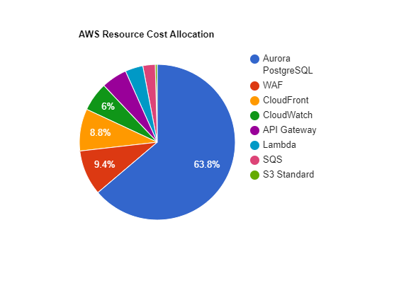

### 5.2.1 Thiết lập các Role với quyền hạn tối thiểu bằng AWS IAM.

Trong sơ đồ kiến trúc hệ thống, các hàm AWS Lambda được phân thành ba nhóm với quyền hạn riêng biệt nhằm đảm bảo tính phân quyền và an toàn trong quá trình vận hành.

#### 5.2.1.1 Nhóm Backend: Chịu trách nhiệm xử lý các nghiệp vụ của ứng dụng và được cấp quyền đọc/ghi dữ liệu trên cơ sở dữ liệu Amazon Aurora PostgreSQL.

##### Tạo IAM Policy (Chính sách cấp quyền truy cập Database).


<div align="center"><i>Hình 5.2.1: Tạo policy tự cấu hình bằng JSON.</i></div>

```
{
	"Version": "2012-10-17",
	"Statement": [
		{
			"Effect": "Allow",
			"Action": [
				"rds-db:connect"
			],
			"Resource": [
				"arn:aws:rds-db:<region>:<aws-account-id>:dbuser:cluster-id/database-user-name"
			]
		}
	]
}
```

region: ap-southeast-1 là khu vực chạy database.

account-id: <aws-account-id> là ID tài khoản AWS cho phép truy cập database.

cluster-id là ID của Aurora Cluster.

database-user-name là tên database.

Tạm thời cứ để cluster-id và database-user-name ở đó.


<div align="center"><i>Hình 5.2.2: Đặt tên và xác nhận policy.</i></div>

##### Tạo IAM Role cho Backend.


<div align="center"><i>Hình 5.2.3: Chọn dịch vụ được cấp phép truy cập database.</i></div>

Vì database được xử lý thông qua các hàm Lambda nên ta chọn Service Use Case Lambda.


<div align="center"><i>Hình 5.2.4: Thêm policy cho Role này.</i></div>

Tìm và tích chọn 2 policy dưới đây:

* Backend-Aurora-Connect-Policy: policy vừa tạo để cấp phép truy cập database.
* AWSLambdaBasicExecutionRole: policy này cấp phép ghi log ra CloudWatch.


<div align="center"><i>Hình 5.2.5: Đặt tên và xác nhận role.</i></div>

#### 5.2.1.2 Nhóm Thực thi bảo trì database: Phụ trách các tác vụ bảo trì định kỳ của cơ sở dữ liệu, bao gồm đặt lại tiến trình thế giới hằng ngày và thực hiện lệnh `VACUUM` để dọn dẹp dữ liệu không còn sử dụng, góp phần duy trì hiệu năng của hệ thống.

Tương tự...

```
{
    "Version": "2012-10-17",
    "Statement": [
        {
            "Sid": "AllowInvokeMaintenanceLambda",
            "Effect": "Allow",
            "Action": [
                "lambda:InvokeFunction"
            ],
			"Resource": [
				"arn:aws:lambda:<region>:<aws-account-id>:function:lambda-function-name"
			]
        }
    ]
}
```

region: ap-southeast-1 là khu vực chạy database.

account-id: <aws-account-id> là ID tài khoản AWS cho phép truy cập database.

lambda-function-name: tên function lambda phụ trách việc bảo trì database.

Tạm thời cứ để lambda-function-name ở đó.


<div align="center"><i>Hình 5.2.6: Đặt tên và xác nhận policy.</i></div>


<div align="center"><i>Hình 5.2.7: Đặt tên và xác nhận role.</i></div>

#### 5.2.1.3 Điều phối luồng API: Can thiệp vào các biến môi trường của Amazon API Gateway nhằm thực hiện việc mở hoặc đóng cổng truy cập hệ thống khi cần thiết.

Tương tự...

```
{
    "Version": "2012-10-17",
    "Statement": [
        {
            "Sid": "AllowUpdateAPIValues",
            "Effect": "Allow",
            "Action": [
                "apigateway:PATCH"
            ],
            "Resource": [
                "arn:aws:apigateway:ap-southeast-1::/restapis/api-id/stages/*"
            ]
        }
    ]
}
```

api-id: ID của API Gateway.

Tạm thời cứ để api-id ở đó.


<div align="center"><i>Hình 5.2.8: Đặt tên và xác nhận policy.</i></div>


<div align="center"><i>Hình 5.2.9: Đặt tên và xác nhận role.</i></div>

---

### 5.2.2 Quản lý chi phí bằng AWS Budgets.

#### 5.2.2.1 Tính toán chi phí vận hành.

Giả định Lượng tải và Thông số Hệ thống

* Lượng người dùng: 500 người dùng hoạt động hằng ngày.
* Tổng số lượng Request: 5,000,000 requests/tháng qua API Gateway.
* Kích thước dữ liệu trung bình: 34 KB mỗi request/response.
* Lưu lượng mạng: ~50 GB dữ liệu truyền tải ra Internet (Data Transfer Out) mỗi tháng.
* AWS Lambda:
  * Dung lượng bộ nhớ: 512 MB RAM.
  * Thời gian thực thi trung bình: 100 ms/request.
  * Kiến trúc vi xử lý: ARM.
* Amazon SQS: ~2,000,000 requests cần xử lý bất đồng bộ, phát sinh tổng cộng 6,000,000 tác vụ SQS. Tỷ lệ lỗi đẩy vào hàng đợi DLQ ước tính <0.1%.
* Amazon S3: ~10 GB.
* Amazon CloudWatch Logs: ~10 GB nạp và lưu trữ log/tháng.
* Amazon Aurora PostgreSQL: trung bình ở chạy mức 2 ACU 24/7.

| Service Name                           | Monthly Cost (USD) | Annual Cost (USD) |
| :------------------------------------- | :----------------: | :---------------: |
| Amazon Aurora PostgreSQL-Compatible DB |       74.68       |      896.16      |
| AWS Web Application Firewall (WAF)     |       11.00       |      132.00      |
| Amazon CloudFront                      |       10.25       |      123.00      |
| Amazon CloudWatch                      |        7.05        |       84.54       |
| Amazon API Gateway                     |        6.25        |       75.00       |
| AWS Lambda                             |        4.33        |       51.96       |
| Amazon Simple Queue Service (SQS)      |        3.00        |       36.00       |
| S3 Standard                            |        0.51        |       6.12       |
| Data Transfer                          |        0.00        |       0.00       |
| **Total**                        | **$117.07** |  **$1,404.78**  |



<div align="center"><i>Hình 5.2.10: Biểu đồ tỉ lệ chi phí dịch vụ.</i></div>

#### 5.2.2.2 Thiết lập hạn mức cho AWS Budgets.

##### Budget 1: Tính toán tổng chi phí vận hành của toàn bộ hệ thống.


<div align="center"><i>Hình 5.2.11: Thiết lập cấu hình Cost Budget.</i></div>


<div align="center"><i>Hình 5.2.12: Thiết lập thông số Cost Budget.</i></div>

Hạn mức 140 USD cố định hàng tháng.


<div align="center"><i>Hình 5.2.13: Thiết lập cảnh cáo sớm (dự báo).</i></div>


<div align="center"><i>Hình 5.2.14: Thiết lập cảnh cáo thực tế (gần chạm trần).</i></div>


<div align="center"><i>Hình 5.2.15: Thiết lập cảnh cáo khẩn cấp (vượt trần).</i></div>


<div align="center"><i>Hình 5.2.16: Xác nhận và hoàn tất tạo Cost Budget.</i></div>

##### Budget 2: Giám sát Aurora DB.


<div align="center"><i>Hình 5.2.17: Thiết lập cấu hình Usage Budget.</i></div>


<div align="center"><i>Hình 5.2.18: Thiết lập thông số Usage Budget.</i></div>

Hệ thống 2 ACU chạy 24/7, 1 tháng cần khoảng 1460 ACU-Hrs.


<div align="center"><i>Hình 5.2.19: Thiết lập cảnh cáo thực tế.</i></div>


<div align="center"><i>Hình 5.2.20: Thiết lập cảnh cáo thực tế khẩn cấp.</i></div>


<div align="center"><i>Hình 5.2.21: Xác nhận và hoàn tất tạo Usage Budget.</i></div>

### 5.2.3 Khởi tạo lớp biên mạng.

Lớp này sẽ bao gồm: CloudFront, Route 53 và WAF.

Tạo file .yaml `network-security-stack.yaml` với nội dung như sau:

```
AWSTemplateFormatVersion: '2010-09-09'
Description: 'Edge Layer: CloudFront + WAF'

Parameters:
  ApiGatewayDomainName:
    Type: String
    Description: Endpoint URL của API Gateway

Resources:
# Khởi tạo WAF
  ApiWafWebACL:
    Type: AWS::WAFv2::WebACL
    Properties:
      Name: GameApiWaf
      Scope: CLOUDFRONT
      DefaultAction:
        Allow: {}
      VisibilityConfig:
        CloudWatchMetricsEnabled: true
        MetricName: GameApiWafMetrics
        SampledRequestsEnabled: true
      Rules:
        - Name: AWSManagedRulesCommonRuleSet
          Priority: 1
          OverrideAction:
            None: {}
          Statement:
            ManagedRuleGroupStatement:
              VendorName: AWS
              Name: AWSManagedRulesCommonRuleSet
          VisibilityConfig:
            CloudWatchMetricsEnabled: true
            MetricName: AWSCommonRulesMetrics
            SampledRequestsEnabled: true

# Khởi tạo CloudFront
  ApiCloudFrontDistribution:
    Type: AWS::CloudFront::Distribution
    Properties:
      DistributionConfig:
        Enabled: true
        Comment: "CDN API Gateway"
        WebACLId: !GetAtt ApiWafWebACL.Arn
        Origins:
          - Id: ServerlessApiGatewayOrigin
            DomainName: !Ref ApiGatewayDomainName
            CustomOriginConfig:
              HTTPSPort: 443
              OriginProtocolPolicy: https-only
        DefaultCacheBehavior:
          TargetOriginId: ServerlessApiGatewayOrigin
          ViewerProtocolPolicy: redirect-to-https
          AllowedMethods: 
            - GET
            - HEAD
            - OPTIONS
            - PUT
            - PATCH
            - POST
            - DELETE
          CachePolicyId: 4135ea2d-6df8-44a3-9df3-4b5a84be39ad
          OriginRequestPolicyId: b689b0a8-53d0-40ab-b3f3-19cb4105c74c

Outputs:
  CloudFrontUrl:
    Description: "URL cho Client"
    Value: !GetAtt ApiCloudFrontDistribution.DomainName
```

Lưu ý: Mặc dù hệ thống core ở ap-southeast-1 nhưng chứng chỉ SSL và WAF bảo vệ cho CloudFront lại nằm ở us-east-1 nên lớp biên mạng sẽ nằm ở us-east-1.


<div align="center"><i>Hình 5.2.22: Tạo CloudFormation Stack và nạp file network-security-stack.yaml vào.</i></div>


<div align="center"><i>Hình 5.2.23: Đặt tên và truyền endpoint.</i></div>

Hiện tại chưa có tên miền API Gateway để giao tiếp, nên đặt tạm tên miền bất kỳ `aws.amazon.com` để bypass qua bước này, rồi sẽ sửa lại sau khi có domain thật.


<div align="center"><i>Hình 5.2.24: Xác nhận và Submit.</i></div>


<div align="center"><i>Hình 5.2.25: Kiểm tra lại thành phần đã tạo.</i></div>
