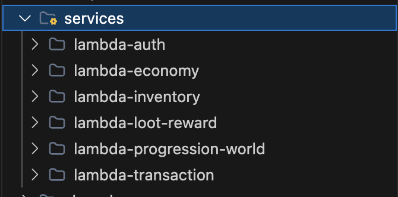

#### 5.4.1 Tổng quan kiến trúc

Kiến trúc hệ thống trước dự án trước khi triển khai:


Kiến trúc hệ thống mong muốn sau khi triển khai với serverless (Lambda):

```
services/
├── lambda-auth/                    # gameapi-auth
│   ├── src/
│   │   ├── controllers/AccountsController.ts
│   │   ├── models/
│   │   │   ├── Account.ts
│   │   │   ├── Role.ts
│   │   │   ├── UserStat.ts
│   │   │   └── UserCurrency.ts
│   │   ├── routes.ts
│   │   ├── lambda.ts               # Lambda handler
│   │   └── index.ts
│   ├── package.json
│   ├── tsconfig.json
│   └── serverless.yml
│
├── lambda-economy/                 # gameapi-economy
│   ├── src/
│   │   ├── controllers/EconomyController.ts
│   │   ├── models/UserCurrency.ts
│   │   ├── routes.ts
│   │   ├── lambda.ts
│   │   └── index.ts
│   ├── package.json
│   ├── tsconfig.json
│   └── serverless.yml
│
├── lambda-player-stats/            # gameapi-player-stats
├── lambda-forum/                   # gameapi-forum
├── lambda-inventory/               # gameapi-inventory
├── lambda-giftcode/                # gameapi-giftcode
├── lambda-gamedata/                # gameapi-gamedata
├── lambda-leaderboard/             # gameapi-leaderboard
├── lambda-farm/                    # gameapi-farm (depends on inventory)
├── lambda-storage/                 # gameapi-storage (depends on inventory)
├── lambda-shop/                    # gameapi-shop (depends on economy)
├── lambda-admin/                   # gameapi-admin
│
├── shared/                         # Shared code
│   ├── models/                     # Shared models (copy or package)
│   ├── middlewares/                # auth.middleware, admin.middleware
│   ├── utils/                      # JwtHelper, PasswordHasher, TimeHelper
│   ├── config/                     # database.ts, CropConfig.ts
│   ├── types/                      # Shared DTOs and types
│   └── package.json                # Shared package
│
└── docker-compose.yml              # Local development
```

Hệ thống được xây dựng theo mô hình **Serverless Microservices** trên nền tảng AWS Lambda. Thay vì triển khai toàn bộ backend trong một ứng dụng duy nhất (Monolithic), hệ thống được chia thành nhiều Lambda Functions, mỗi Lambda phụ trách một nhóm nghiệp vụ (Business Domain) riêng.

Mỗi Lambda được triển khai như một dịch vụ độc lập, có thể phát triển, kiểm thử và triển khai riêng biệt. Tất cả các dịch vụ được truy cập thông qua Amazon API Gateway và cùng sử dụng cơ sở dữ liệu Amazon Aurora PostgreSQL.

Kiến trúc này giúp hệ thống dễ mở rộng, giảm chi phí vận hành và tăng khả năng bảo trì.

#### 5.4.2 Triển khai hệ thống **Serverless Microservices** trên nền tảng AWS Lambda

##### * **Bước 1 : Phân tách domain**



Mỗi domain có thể phát triển, deploy, scale độc lập. Service A gọi Service B qua HTTP.

##### * **Bước 2: Thiết Lập Monorepo với npm Workspaces**

```
gameapi/
├── shared/                         # Package dùng chung (@gameapi/shared)
│   └── src/
│       ├── models/                 # TypeORM entities (Account, UserItem, FarmPlot...)
│       ├── middlewares/            # authMiddleware, adminMiddleware
│       ├── utils/                  # JwtHelper, PasswordHasher...
│       └── DTO/                    # Request/Response types
├── services/
│   ├── lambda-auth/                # Mỗi service là 1 workspace riêng
│   ├── lambda-economy/
│   ├── lambda-inventory/
│   ├── lambda-transaction/
│   ├── lambda-progression-world/
│   └── lambda-loot-reward/
└── package.json                    # workspaces: ["shared", "services/*"]
```

Root `package.json`:

```json
{
  "workspaces": ["shared", "services/*", "frontend"],
  "scripts": {
    "build:shared": "npm run build --workspace shared",
    "build:lambdas": "npm run build --workspaces --if-present -- --exclude shared",
    "dev:auth": "npm run dev --workspace services/lambda-auth"
  }
}
```

Chia sẻ entities, middlewares, utils giữa các Lambda mà không cần copy-paste.

##### * Bước 3: Xây Dựng Lambda Handler Pattern

Mỗi service dùng `@vendia/serverless-express` để wrap Express app thành Lambda handler:

```typescript
// services/lambda-auth/src/lambda.ts
import serverlessExpress from '@vendia/serverless-express';
import app from './index';

let serverlessExpressInstance;

export const handler = async (event, context) => {
  if (!serverlessExpressInstance) {
    serverlessExpressInstance = serverlessExpress({ app });
  }
  return serverlessExpressInstance(event, context);
};
```

Giữ nguyên code Express controller quen thuộc, hot-reload local với nodemon, chỉ thay đổi entry point khi lên Lambda.

##### * Bước 4: Cấu Hình Serverless Framework Cho Từng Service

```typescript
# services/lambda-auth/serverless.yml
service: gameapi-auth

provider:
  name: aws
  runtime: nodejs20.x
  region: ap-southeast-1
  environment:
    DB_HOST: ${env:DB_HOST}
    DB_PORT: ${env:DB_PORT}
    JWT_SECRET: ${env:JWT_SECRET}
    USE_RDS_IAM_AUTH: 'true'
  iamRoleStatements:
    - Effect: Allow
      Action:
        - rds-db:connect
      Resource: 'arn:aws:rds-db:<region>:<aws-account-id>:dbuser:*/<db-username>'

functions:
  api:
    handler: src/lambda.handler
    timeout: 30
    memorySize: 512

plugins:
  - serverless-esbuild

custom:
  esbuild:
    bundle: true
    minify: false
    target: node20
```

##### * Bước 5: Kết nối Database (Aurora PostgreSQL + IAM Auth)

Mỗi Lambda kết nối đến cùng 1 Aurora PostgreSQL cluster qua TypeORM:

```typescript
// shared/src/config/database.ts
async function getAuroraIamToken(): Promise<string> {
  if (process.env.USE_RDS_IAM_AUTH !== "true")
    return process.env.DB_PASSWORD || "";

  const signer = new Signer({
    hostname: process.env.DB_HOST!,
    port: parseInt(process.env.DB_PORT || "5432"),
    username: process.env.DB_USER!,
    region: process.env.AWS_REGION || "ap-southeast-1",
  });
  return signer.getAuthToken();
}

export const createApplicationDbContext = async () => {
  const dbConfig = await getDbConfigCached();
  return new DataSource({
    ...dbConfig,
    synchronize: true,   // Tự động sync schema khi dev
    entities: [Account, UserCurrency, ..., FarmPlot]
  });
};
```

**IAM Auth:** Dùng `@aws-sdk/rds-signer` sinh token tự động, không cần lưu password trong env. IAM Role của Lambda cần `rds-db:connect` permission.

##### * Bước 6 : Giao Tiếp Giữa Các Service (Cross-Service HTTP)

Khi một Lambda cần gọi service khác (vd: `Shop.buyItem` cần trừ tiền ở Economy + thêm item vào Inventory), nó gọi HTTP đến API Gateway:

```TypeScript
// lambda-transaction gọi lambda-economy
await axios.post(`${API_GATEWAY_URL}/Economy/spend`, {
  accountId, amount, currency
});

// lambda-transaction gọi lambda-inventory
await axios.post(`${API_GATEWAY_URL}/Inventory/add`, {
  accountId, itemId, quantity
});
```

Service độc lập, không share DB trực tiếp, chỉ giao tiếp qua API. `API_GATEWAY_URL` được inject qua environment variable.

##### * Bước 7: Deploy Script

```typescript
#!/bin/bash
# scripts/deploy-lambdas.sh

# Batch 1: Core services (không phụ thuộc)
deploy_service "auth" &
deploy_service "economy" &
deploy_service "inventory" &
wait

# Batch 2: Dependent services
deploy_service "transaction" &
deploy_service "progression-world" &
deploy_service "loot-reward" &
wait
```
