#### 5.5.1 Giới thiệu về API Gateway

Amazon API Gateway giúp tạo, xuất bản, bảo trì, theo dõi và bảo vệ các API ở bất kỳ quy mô nào. Trong hệ thống API Gateway đóng vai trò là cửa ngõ tiếp nhận tất cả các request từ Client và định tuyến đến các hàm xử lý logic (Lambda).

#### 5.5.2 Luồng hoạt động

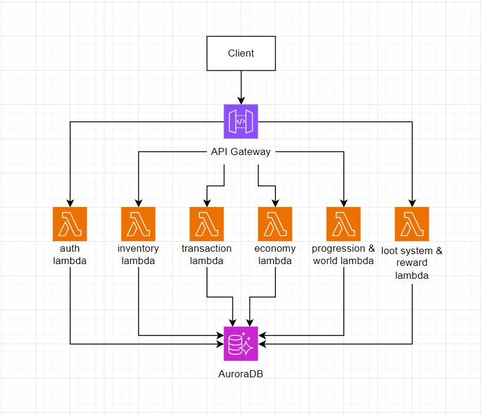

<div align="center"><i>Hình 5.5.1: Luồng hoạt động api gateway</i></div>

* Client gửi yêu cầu HTTP đến Amazon API Gateway.
* API Gateway xác định Endpoint và định tuyến yêu cầu đến Lambda tương ứng.
* Lambda được kích hoạt và khởi tạo môi trường thực thi.
* Lambda chuyển yêu cầu đến Controller phù hợp để xử lý nghiệp vụ.
* Controller truy cập Amazon Aurora PostgreSQL để đọc hoặc ghi dữ liệu.
* Sau khi xử lý xong, Lambda trả kết quả về API Gateway.
* API Gateway gửi phản hồi cuối cùng về cho Client.

#### 5.5.3 Cấu hình AWS API GATEWAY

* Cấu hình AWS credentials :

```env
AWS_ACCESS_KEY_ID=
AWS_SECRET_ACCESS_KEY=
AWS_REGION=ap-southeast-1
DB_HOST=
DB_PORT=5432
DB_USER=<db-username>
DB_NAME=postgres
DB_SSL=true
JWT_SECRET=
```

- RDS cluster `<cluster-name>` (Aurora PostgreSQL 17) dùng IAM authentication:

```sql
-- Tạo user và cấp quyền
CREATE USER <db-username>;
GRANT rds_iam TO <db-username>;
GRANT ALL ON SCHEMA public TO <db-username>;
GRANT ALL PRIVILEGES ON ALL TABLES IN SCHEMA public TO <db-username>;
ALTER DEFAULT PRIVILEGES IN SCHEMA public GRANT ALL ON TABLES TO <db-username>;
```

* Lambda IAM Role cần permission:

```json
{
    "Effect": "Allow",
    "Action": "rds-db:connect",
    "Resource": "arn:aws:rds-db:<region>:<aws-account-id>:dbuser:*/<db-username>"
}
```

* Code sinh IAM token (shared/src/config/database.ts):

```typescript
const signer = new Signer({
    hostname: process.env.DB_HOST,
    port: parseInt(process.env.DB_PORT || "5432"),
    username: process.env.DB_USER,
    region: process.env.AWS_REGION || "ap-southeast-1",
});
const password = await signer.getAuthToken();
```

* Khởi tạo serverless.yml cho các function lambda , ví dụ cấu hình cho function auth :

```yaml
service: gameapi-auth

frameworkVersion: '3'

provider:
  name: aws
  runtime: nodejs20.x
  region: ap-southeast-1
  environment:
    DB_HOST: ${env:DB_HOST}
    DB_PORT: ${env:DB_PORT}
    DB_USER: ${env:DB_USER}
    DB_NAME: ${env:DB_NAME}
    DB_SSL: 'true'
    USE_RDS_IAM_AUTH: 'true'
    JWT_SECRET: ${env:JWT_SECRET}
    JWT_ISSUER: ${env:JWT_ISSUER, 'ChroniclesBackend'}
    JWT_AUDIENCE: ${env:JWT_AUDIENCE, 'ChroniclesClient'}
  iamRoleStatements:
    - Effect: Allow
      Action:
        - rds-db:connect
      Resource: 'arn:aws:rds-db:<region>:<aws-account-id>:dbuser:*/<db-username>'

functions:
  api:
    handler: src/lambda.handler
    timeout: 30
    memorySize: 512

plugins:
  - serverless-esbuild

custom:
  esbuild:
    bundle: true
    minify: false
    target: node20
    packager: npm
    sourcemap: false
```

* Deploy :

```shell
npm run build:shared

cd services/lambda-auth && npx serverless@3 deploy
cd services/lambda-economy && npx serverless@3 deploy
cd services/lambda-inventory && npx serverless@3 deploy
cd services/lambda-transaction && npx serverless@3 deploy
cd services/lambda-progression-world && npx serverless@3 deploy
cd services/lambda-loot-reward && npx serverless@3 deploy

cd api-gateway && npx serverless@3 deploy
```

* Lambda functions after deploy:

```
gameapi-auth-dev-api              512MB  nodejs20.x
gameapi-economy-dev-api           512MB  nodejs20.x
gameapi-inventory-dev-api         512MB  nodejs20.x
gameapi-loot-reward-dev-api       512MB  nodejs20.x
gameapi-progression-world-dev-api  512MB  nodejs20.x
gameapi-transaction-dev-api       512MB  nodejs20.x
```


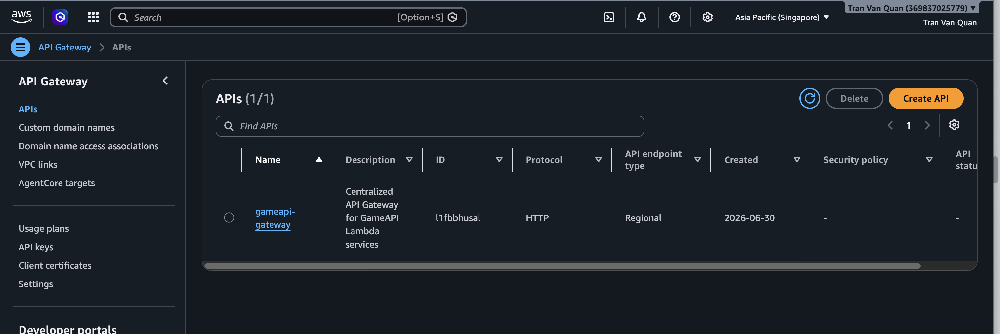

<div align="center"><i>Hình 5.5.2: api gateway của dự án</i></div>


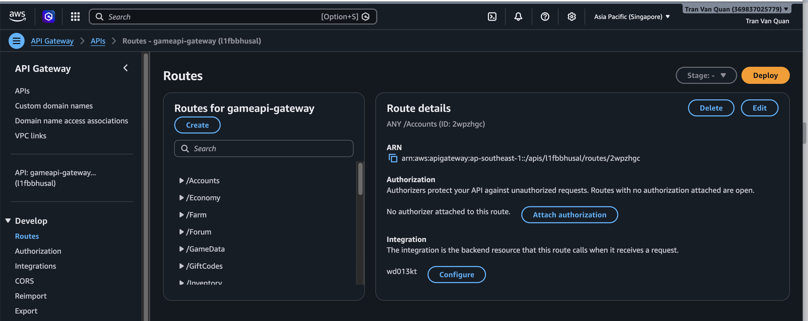

<div align="center"><i>Hình 5.5.3: các route được khởi tạo</i></div>

#### 5.5.4 Test AWS API GATEWAY

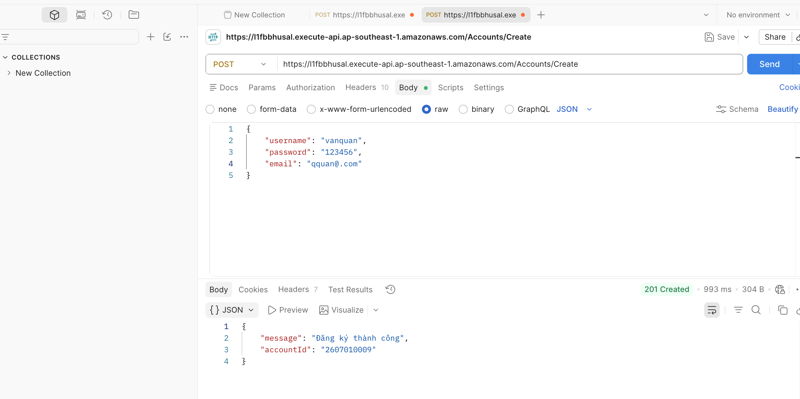

<div align="center"><i>Hình 5.5.4: Test đăng ký user</i></div>

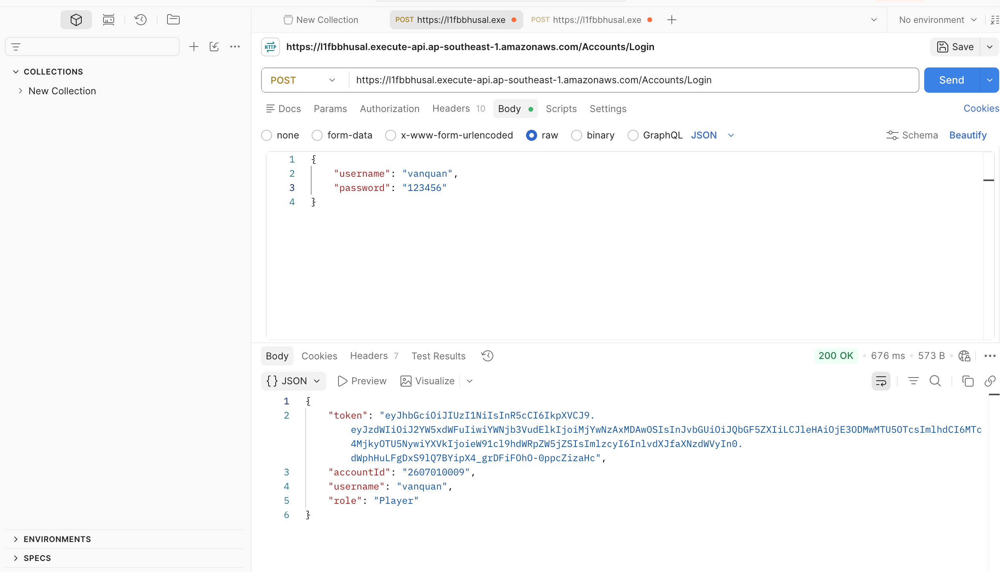

<div align="center"><i>Hình 5.5.5: Đăng nhập user.</i></div>

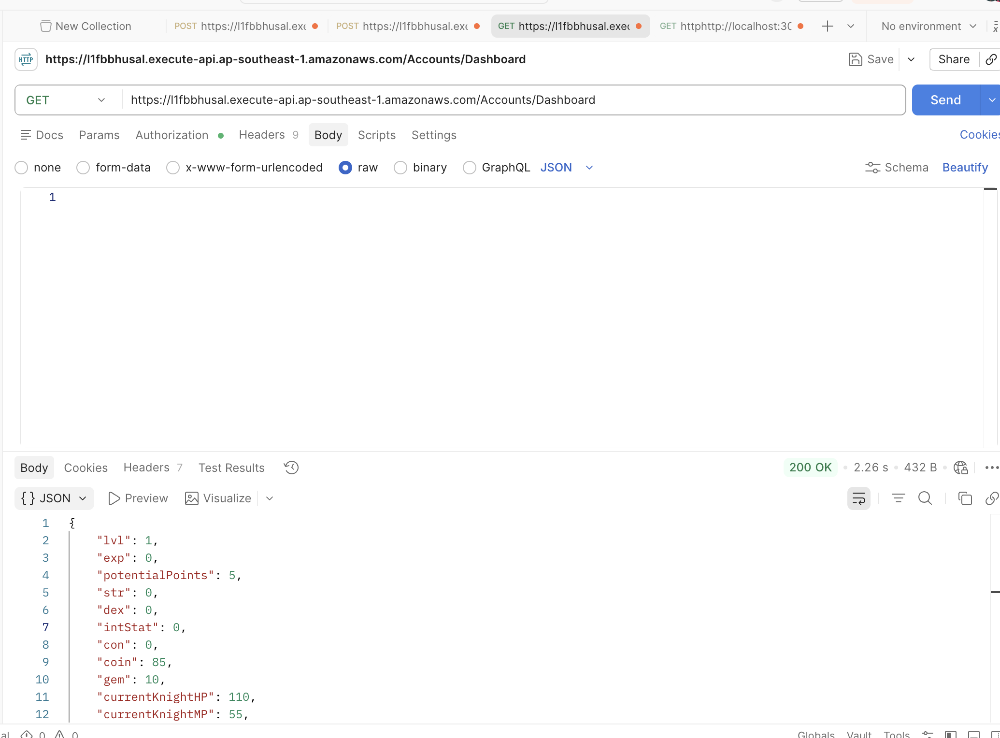

<div align="center"><i>Hình 5.5.6:Xem dashboard.</i></div>

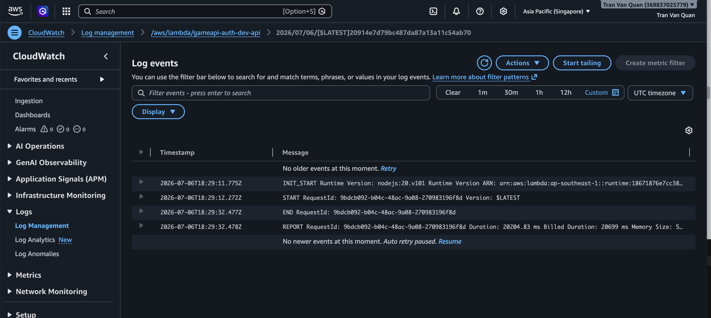

<div align="center"><i>Hình 5.5.7: Lambda nhận request thành công</i></div>

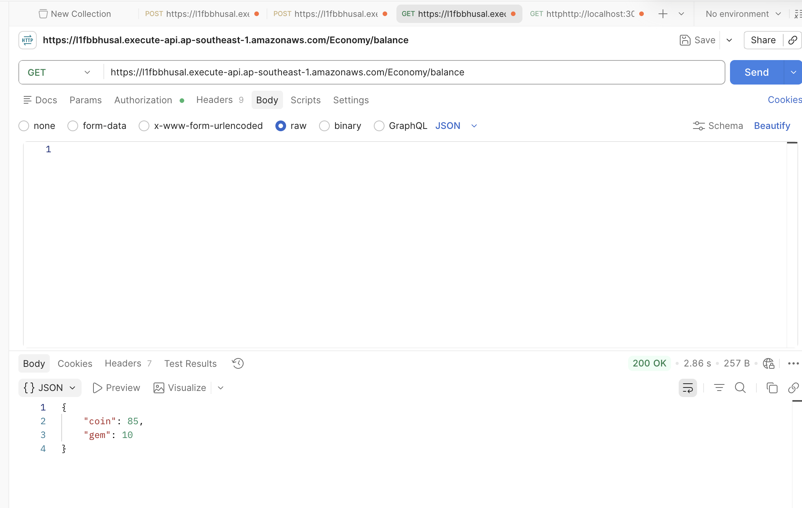

<div align="center"><i>Hình 5.5.8:Xem số dư ví.</i></div>


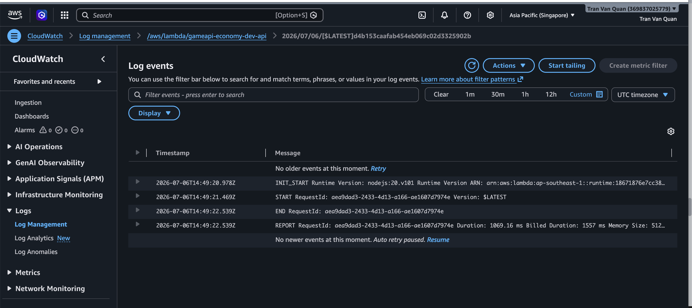

<div align="center"><i>Hình 5.5.9: Lambda nhận request thành công</i></div>


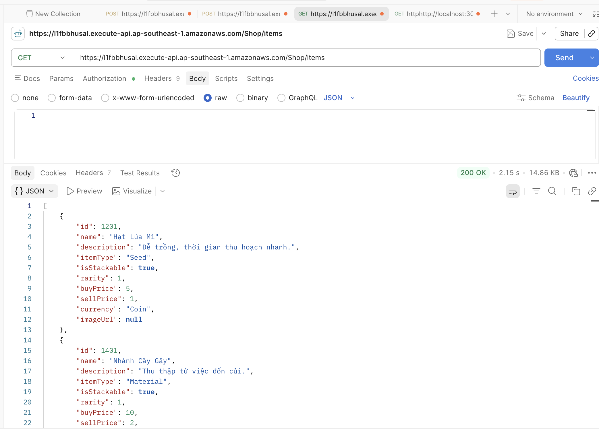

<div align="center"><i>Hình 5.5.10: Lấy danh sách trang bị</i></div>

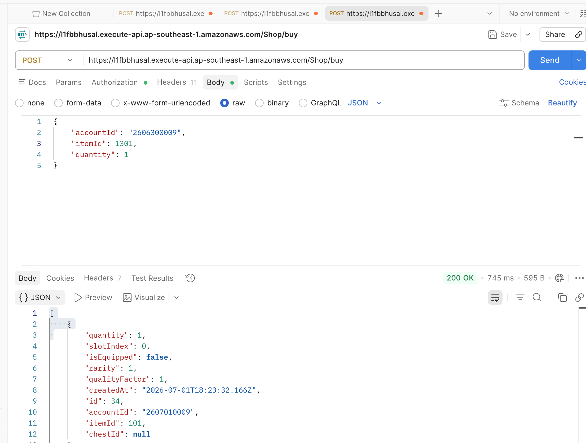

<div align="center"><i>Hình 5.5.11: Mua trang bị</i></div>

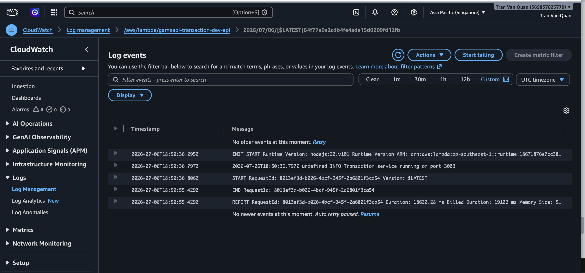

<div align="center"><i>Hình 5.5.12: Lambda nhận request thành công</i></div>

#### 5.5.5 Kết Quả

**Lambda Auth**

POST /Accounts/Create → 201 Created: Tạo tài khoản người dùng thành công.

POST /Accounts/Login → 200 OK: Đăng nhập và xác thực người dùng thành công.

**Lambda Economy**

GET /Economy/balance → 200 OK: Truy xuất số dư của người chơi thành công.

**Lambda Inventory**

GET /Inventory/sync → 200 OK: Đồng bộ dữ liệu kho đồ của người chơi thành công.

**Lambda Transaction**

GET /Shop/items → 200 OK: Lấy danh sách vật phẩm trong cửa hàng thành công.

**Lambda Progression World**

GET /PlayerStats/profile → 200 OK: Truy xuất thông tin hồ sơ và tiến trình phát triển của người chơi thành công.

**Lambda Loot Reward**

GET /Leaderboard → 200 OK: Lấy dữ liệu bảng xếp hạng thành công.

GET /GameData/ping → 200 OK: Kiểm tra trạng thái hoạt động của dịch vụ thành công.
