#### Amazon SQS FIFO

#### 5.6.1 Concept

**Amazon SQS FIFO (First-In-First-Out)** is a queue type provided by AWS, specifically designed to ensure two extremely important factors in distributed systems: **message processing order** and **data deduplication**.

#### 5.6.2 System Architecture

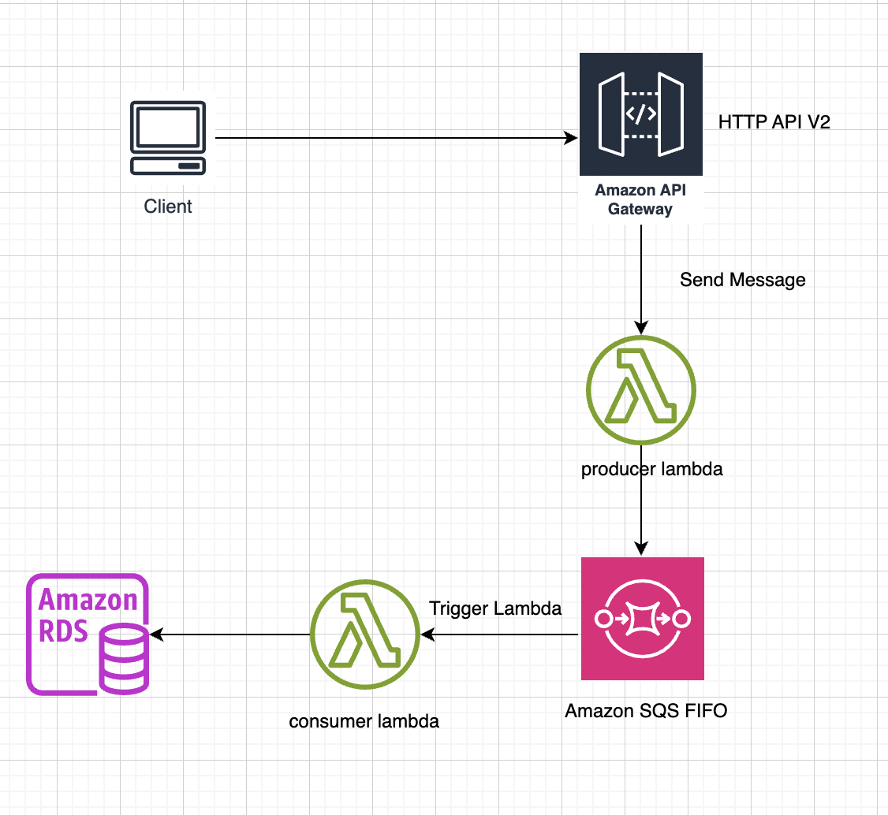

<div align="center"><i>Figure 5.6.1: System architecture.</i></div>

Example with the POST /Economy/earn processing flow:

* Client sends POST /Economy/earn.
* API Gateway forwards the request to Producer Lambda.
* Producer Lambda creates a message and sends it to Amazon SQS FIFO, without writing directly to the database.
* Producer Lambda responds immediately to the Client with a queued status.
* Amazon SQS triggers Consumer Lambda when a message is available.
* Consumer Lambda opens a transaction and uses SELECT ... FOR UPDATE to lock the record, preventing data conflicts.
* Consumer Lambda processes the business logic and writes data to Amazon Aurora/RDS.
* After successful processing, the message is deleted from SQS; on failure, it will be retried or moved to DLQ.

#### 5.6.3 Setup SQS FIFO

##### * Create FIFO Queue

Define the queue in services/sqs-infrastructure/serverless.yml:

```yaml
EconomyQueue:
  Type: AWS::SQS::Queue
  Properties:
    QueueName: game-economy.fifo
    FifoQueue: true
    ContentBasedDeduplication: true    # SQS auto dedup based on content
    VisibilityTimeout: 60              # 60s for consumer processing
    MessageRetentionPeriod: 345600     # 4 days
    RedrivePolicy:
      deadLetterTargetArn: !GetAtt EconomyDLQ.Arn
      maxReceiveCount: 3               # Retry 3 times then move to DLQ
```

##### * Initialize SQS Consumer Lambda

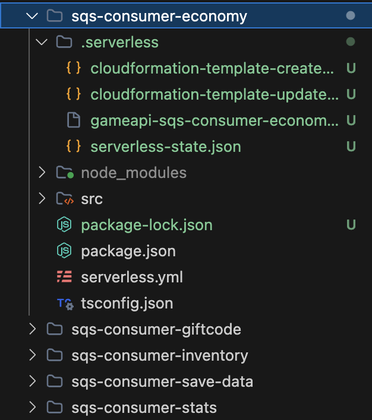

<div align="center"><i>Figure 5.6.2: SQS Consumer Lambda system.</i></div>

##### * IAM Configuration

.env file for local development:

```
AWS_REGION=ap-southeast-1
AWS_ENDPOINT_URL=http://localhost:4566
ECONOMY_QUEUE_URL=http://sqs.ap-southeast-1.localhost.localstack.cloud:4566/000000000000/game-economy.fifo
INVENTORY_QUEUE_URL=http://sqs.ap-southeast-1.localhost.localstack.cloud:4566/000000000000/game-inventory.fifo
GIFTCODE_QUEUE_URL=http://sqs.ap-southeast-1.localhost.localstack.cloud:4566/000000000000/game-giftcode.fifo
STATS_QUEUE_URL=http://sqs.ap-southeast-1.localhost.localstack.cloud:4566/000000000000/game-stats.fifo
SAVE_DATA_QUEUE_URL=http://sqs.ap-southeast-1.localhost.localstack.cloud:4566/000000000000/game-save-data.fifo
```

Add new policy:

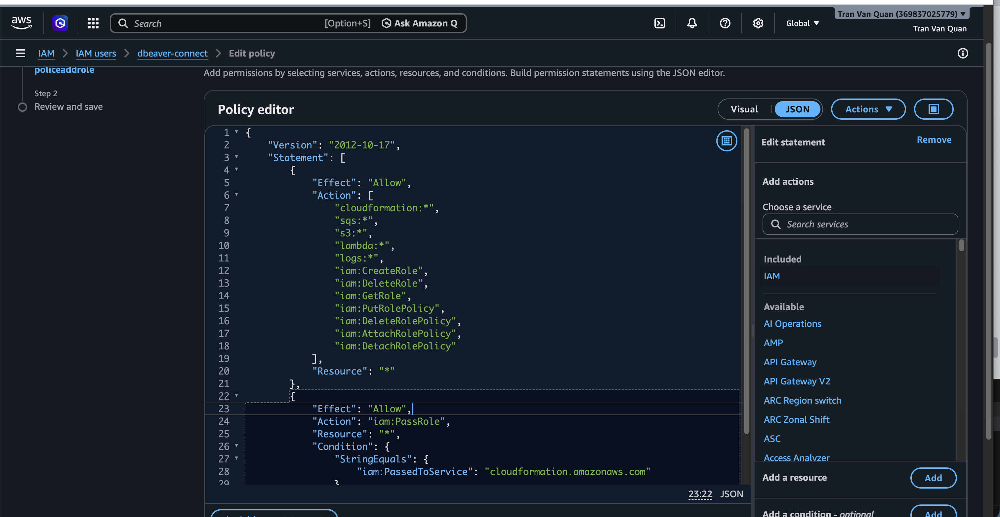

<div align="center"><i>Figure 5.6.3: Add new policy to grant SQS creation role.</i></div>

```json
{
	"Version": "2012-10-17",
	"Statement": [
		{
			"Effect": "Allow",
			"Action": [
				"cloudformation:*",
				"sqs:*",
				"s3:*",
				"lambda:*",
				"logs:*",
				"iam:CreateRole",
				"iam:DeleteRole",
				"iam:GetRole",
				"iam:PutRolePolicy",
				"iam:DeleteRolePolicy",
				"iam:AttachRolePolicy",
				"iam:DetachRolePolicy"
			],
			"Resource": "*"
		},
		{
			"Effect": "Allow",
			"Action": "iam:PassRole",
			"Resource": "*",
			"Condition": {
				"StringEquals": {
					"iam:PassedToService": "cloudformation.amazonaws.com"
				}
			}
		}
	]
}
```

**Producer IAM** (in services/lambda-economy/serverless.yml):

```yaml
iamRoleStatements:
  - Effect: Allow
    Action: [sqs:SendMessage]
    Resource: !ImportValue EconomyQueueArn
```

**Consumer IAM** (in services/sqs-consumer-economy/serverless.yml):

```yaml
iamRoleStatements:
  - Effect: Allow
    Action: [sqs:ReceiveMessage, sqs:DeleteMessage, sqs:GetQueueAttributes]
    Resource: !ImportValue EconomyQueueArn
```

##### * Connect Producer

Shared SQS client (shared/src/sqs/producer.ts):

```typescript
const client = new SQSClient({
  region: process.env.AWS_REGION || 'ap-southeast-1',
  endpoint: process.env.AWS_ENDPOINT_URL || undefined,  // LocalStack support
});
```

Message sent to the queue includes:

- MessageGroupId: account_{accountId} (or giftcode_{code})
- MessageDeduplicationId: auto-generated from {type}_{entityId}_{timestamp}_{random}
- MessageBody: JSON containing type, payload, timestamp, requestId

Use SqsProducer class in controller:

```typescript
// EconomyController.earnCurrency
const messageId = await SqsProducer.economyEarn({
  accountId,
  currencyType: 'coin',
  amount: 100,
});
res.status(202).json({ success: true, status: 'queued', requestId: messageId });
```

##### * Create Consumer Lambda

File services/sqs-consumer-economy/serverless.yml:

```yaml
functions:
  consumer:
    handler: src/lambda.handler
    timeout: 60
    memorySize: 256
    events:
      - sqs:
          arn: !ImportValue EconomyQueueArn
          batchSize: 1                    # FIFO requires batchSize = 1
          maximumConcurrency: 2
          functionResponseType: ReportBatchItemFailures
```

Handler pattern (services/sqs-consumer-economy/src/lambda.ts):

```typescript
export const handler = async (event: SQSEvent): Promise<SQSBatchResponse> => {
  if (!initialized) {          
    await initializeApplicationDbContext();
    initialized = true;
  }
  const batchItemFailures: { itemIdentifier: string }[] = [];
  for (const record of event.Records) {
    try {
      const message: SQSMessage = JSON.parse(record.body);
      switch (message.type) {  
        case 'economy.earn':
          await handleEarnCurrency(message.payload);
          break;
        case 'economy.spend':
          await handleSpendCurrency(message.payload);
          break;
      }
    } catch (error) {
      batchItemFailures.push({ itemIdentifier: record.messageId });
    }
  }
  return { batchItemFailures };
};
```

Process with pessimistic lock in handler:

```typescript
await ApplicationDbContext.manager.transaction(async (manager) => {
  const wallet = await manager.findOne(UserCurrency, {
    where: { accountId: payload.accountId },
    lock: { mode: 'pessimistic_write' },  
  });
  wallet.coin += payload.amount;
  await manager.save(wallet);
});
```

##### * Deploy SQS Infrastructure

```
cd services/sqs-infrastructure
serverless deploy --stage dev
```

Stack named gameapi-sqs-infrastructure-dev will create:

- 5 FIFO queues (game-economy.fifo, game-inventory.fifo, game-giftcode.fifo, game-stats.fifo, game-save-data.fifo)

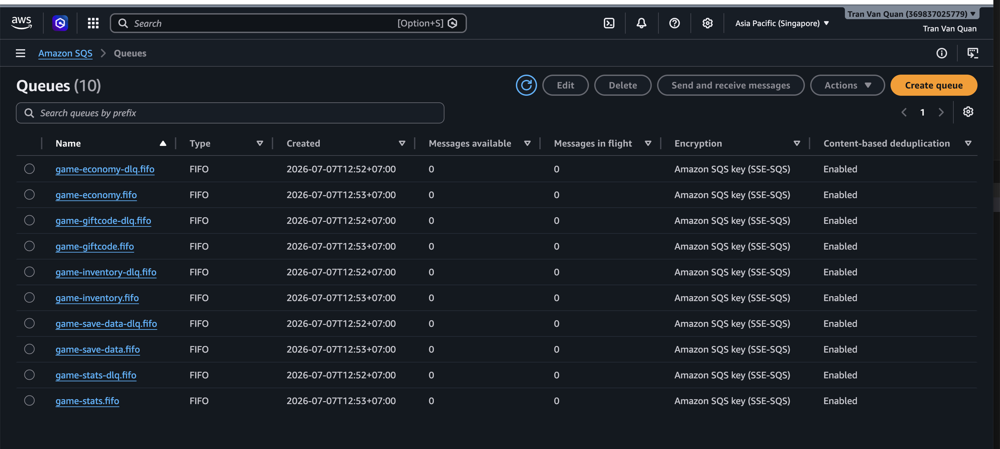

<div align="center"><i>Figure 5.6.4: SQS deployed successfully.</i></div>

Note: DLQ files in the queues will be set up and deployed in section 5.7 AWS SQS Dead Letter Queue.

##### * Deploy Consumer SQS

Example: deploy sqs-consumer-economy:

```
cd services/sqs-consumer-economy
serverless deploy --stage dev
```

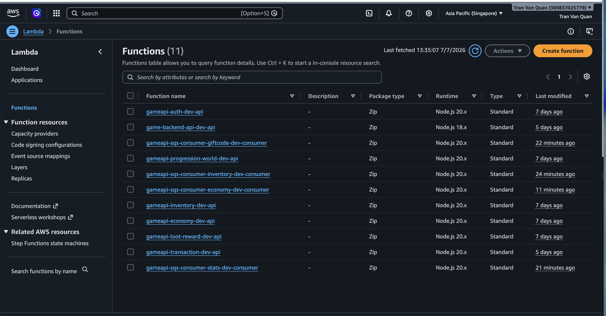

<div align="center"><i>Figure 5.6.5: Consumer SQS deployed successfully.</i></div>

#### 5.6.4 Test SQS FIFO

##### * Verify Producer Lambda sends message to SQS FIFO

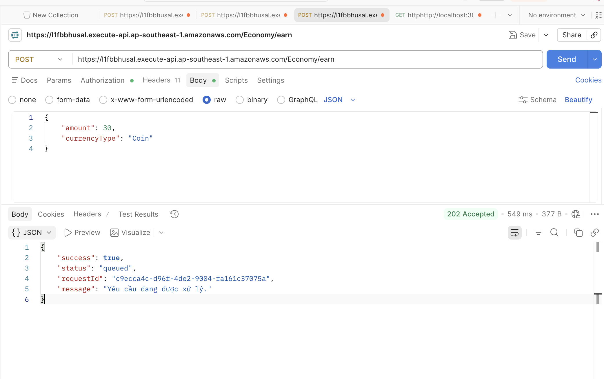

<div align="center"><i>Figure 5.6.6: Send earn currency request.</i></div>

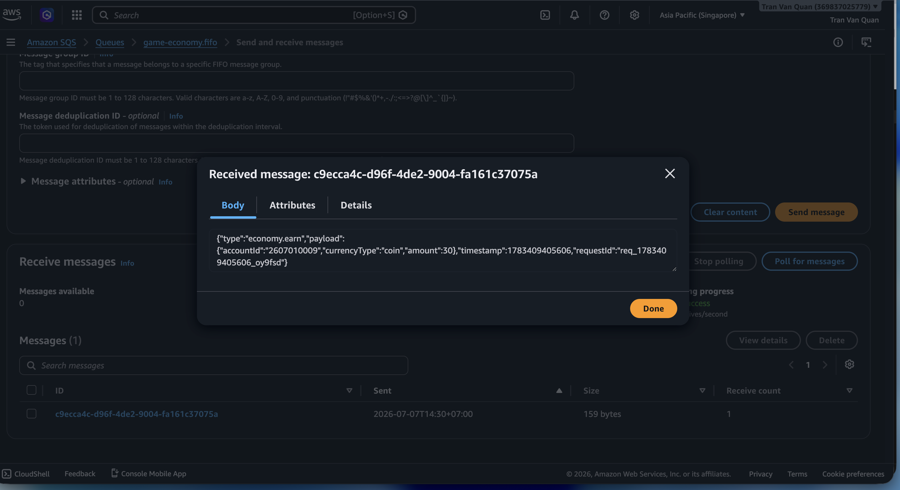

<div align="center"><i>Figure 5.6.7: Message returned.</i></div>

##### * Check Message in Queue

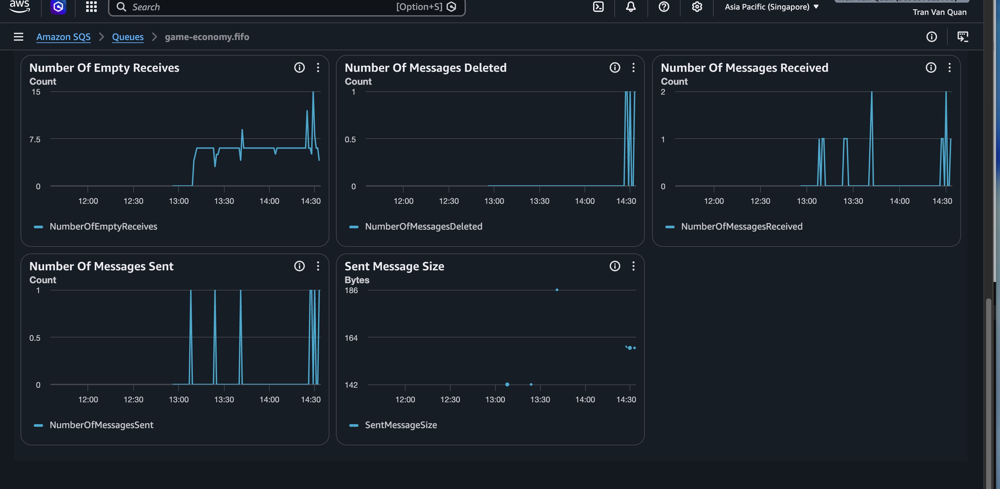

<div align="center"><i>Figure 5.6.8: NumberOfMessagesSent increases when receiving requests.</i></div>

##### * Check Consumer

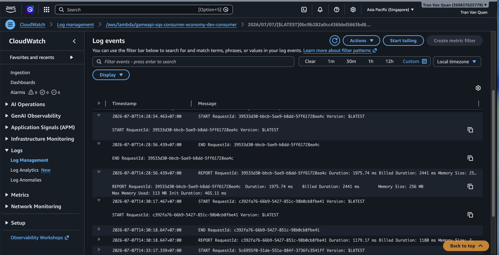

<div align="center"><i>Figure 5.6.9: Consumer received the message.</i></div>

##### * FIFO Ordering

Send 5 consecutive earn currency requests:

```
TOKEN="<jwt-token>"
API="<api-gateway-url>"

for i in 1 2 3 4 5; do
  curl -s -X POST "$API/Economy/earn" \
    -H "Content-Type: application/json" \
    -H "Authorization: Bearer $TOKEN" \
    -d "{\"currencyType\":\"coin\",\"amount\":$((i * 10))}"
  echo ""
done
```

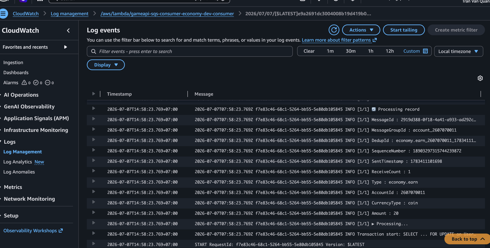

<div align="center"><i>Figure 5.6.10: Smallest SequenceNumber.</i></div>

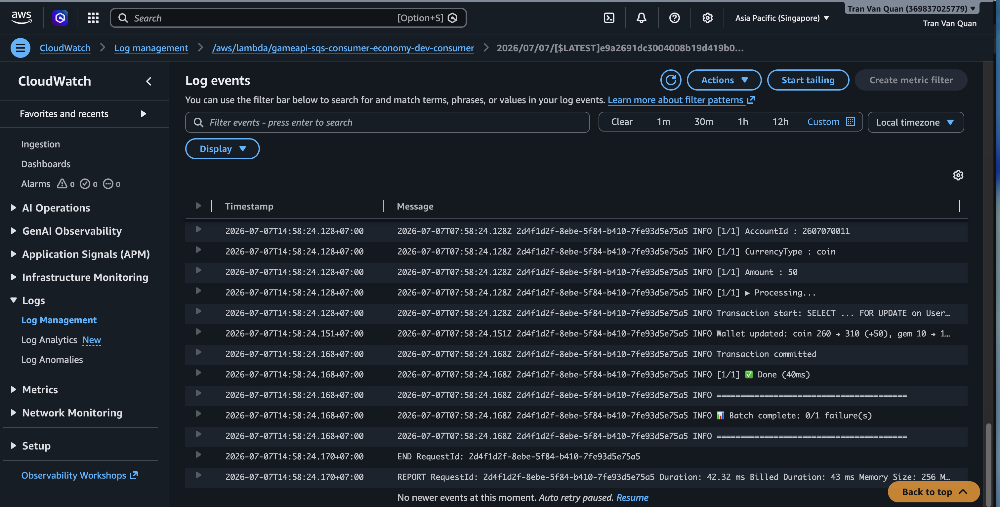

<div align="center"><i>Figure 5.6.11: Largest SequenceNumber.</i></div>

SequenceNumber increases in processing order from smallest to largest:

Message amount=20 → 18903297315744239872

Message amount=30 → 18903297315816687872

Message amount=40 → 18903297315898607872

Message amount=50 → 18903297315972591616

#### 5.6.5 Summary

The **Amazon SQS FIFO** system has been successfully deployed and integrated with **AWS Lambda**:

* Producer successfully sends messages to SQS FIFO.
* Lambda Consumer automatically receives and processes messages.
* FIFO ensures processing order for messages with the same MessageGroupId.
* The system operates on an asynchronous processing model, improving performance and scalability.
* Retry mechanism and Dead Letter Queue enhance reliability and recovery capabilities when errors occur.
