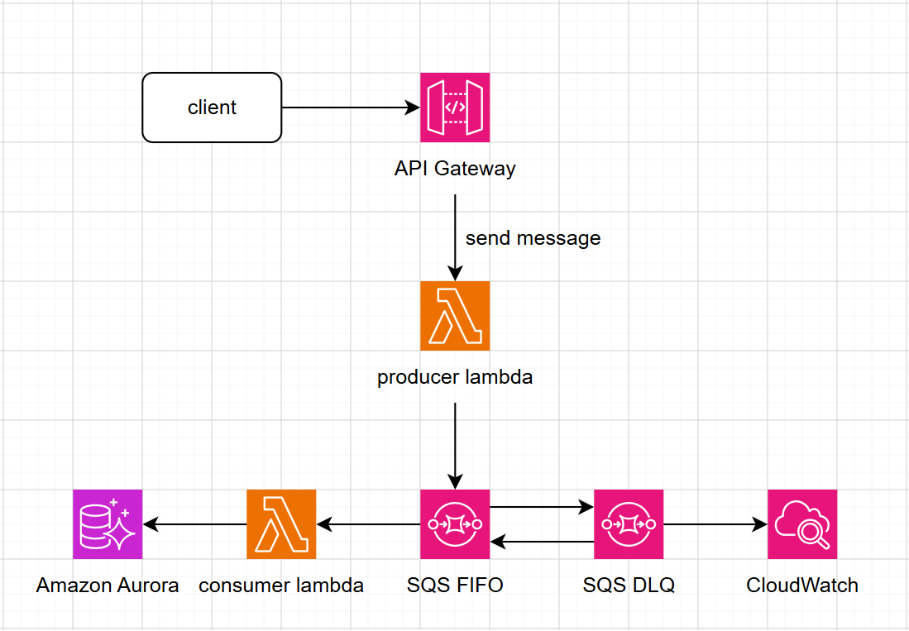

#### AWS DLQ & AWS CloudWatch

#### 5.7.1 Concept

**AWS SQS DLQ (Dead Letter Queue)** is not an independent queue type with different technical features, but rather a **role** assigned to a regular SQS queue (or SQS FIFO) for the purpose of **holding failed or unprocessable messages**.

#### 5.7.2 SQS DLQ and CloudWatch System Architecture



<div align="center"><i>Figure 5.7.1: System diagram.</i></div>

#### 5.7.3 DLQ Configuration

##### Define DLQ in serverless.yml

DLQ is defined in the same stack as the source queue in `services/sqs-infrastructure/serverless.yml`:

```yaml
EconomyQueue:
  Type: AWS::SQS::Queue
  Properties:
    QueueName: game-economy.fifo
    FifoQueue: true
    VisibilityTimeout: 60
    RedrivePolicy:
      deadLetterTargetArn: !GetAtt EconomyDLQ.Arn
      maxReceiveCount: 3       # ◄ After 3 failures → DLQ

EconomyDLQ:
  Type: AWS::SQS::Queue
  Properties:
    QueueName: game-economy-dlq.fifo
    FifoQueue: true
    MessageRetentionPeriod: 1209600  # 14 days
```

- **Maximum 3 retries:** When a Consumer Lambda fails to process a message, Amazon SQS automatically returns the message to the Queue for retry. In this workshop, each message is allowed a maximum of **3 attempts**.
- **4th attempt goes to DLQ:** If processing still fails after 3 attempts, Amazon SQS automatically moves the message to the **Dead Letter Queue (DLQ)** to prevent impact on the main Queue.
- **Messages retained for 14 days in DLQ:** Messages are stored in the DLQ for a maximum of **14 days**, giving administrators time to investigate the error cause and process or return the message to the main Queue if needed.

##### Deploy DLQ

```shell
cd services/sqs-infrastructure
npx serverless deploy --stage dev
```


<div align="center"><i>Figure 5.7.2: DLQ deployed successfully.</i></div>

#### 5.7.4 Redrive Policy Configuration

`RedrivePolicy` is a property of the main queue that determines **when** a message is pushed to DLQ.

```yaml
RedrivePolicy:
  deadLetterTargetArn: !GetAtt EconomyDLQ.Arn # ARN of DLQ
  maxReceiveCount: 3 # Maximum receive count
```

**How it works:**

1. Consumer receives message → processes → throws error
2. `batchItemFailures` returns `{ itemIdentifier: messageId }`
3. SQS does not delete the message → message returns to queue after `VisibilityTimeout` (60s)
4. SQS increments `ApproximateReceiveCount` by 1
5. Steps 1-4 repeat until `ApproximateReceiveCount > maxReceiveCount`
6. Message is **automatically moved to DLQ**

**Consumer Lambda mechanism**

```typescript
// services/sqs-consumer-economy/src/lambda.ts
export const handler = async (event: SQSEvent): Promise<SQSBatchResponse> => {
  const batchItemFailures: { itemIdentifier: string }[] = [];

  for (const record of event.Records) {
    try {
      const message: SQSMessage = JSON.parse(record.body);
      switch (message.type) {
        case 'economy.earn':
          await handleEarnCurrency(message.payload);
          break;
        case 'economy.spend':
          await handleSpendCurrency(message.payload);
          break;
        default:
          console.error(`Unknown message type: ${message.type}`);
      }
    } catch (error) {
      console.error(`Failed: ${record.messageId}`, error);
      batchItemFailures.push({ itemIdentifier: record.messageId });
    }
  }

  return { batchItemFailures };
};
```

Consumer configuration (`serverless.yml`) requires:

```yaml
events:
  - sqs:
      arn: !ImportValue EconomyQueueArn
      batchSize: 1                               # FIFO requires batchSize=1
      maximumConcurrency: 2
      functionResponseType: ReportBatchItemFailures  # <-- REQUIRED for retry to work
```

`functionResponseType: ReportBatchItemFailures` allows the consumer to report back to SQS which messages failed. Without this, SQS considers all messages in the batch as successful even if Lambda returns `batchItemFailures`.

#### 5.7.5 DLQ Retry Testing

##### * Send message to queue


<div align="center"><i>Figure 5.7.3: Create and send message to queue</i></div>

##### * View retry in consumer logs


<div align="center"><i>Figure 5.7.4: DLQ event logged successfully.</i></div>

Log repeats 3 times, each ~60s apart:

Attempt 2 (after 60s): `ReceiveCount: 2`
Attempt 3 (after 60s): `ReceiveCount: 3`
Attempt 4: message disappears from main queue → moved to DLQ

##### * Check ApproximateReceiveCount


<div align="center"><i>Figure 5.7.5: Observe metrics.</i></div>

If Consumer is retrying because:

- **Number of Messages Received** increases.
- **Number of Messages Deleted** remains 0 (due to processing failure).

##### * Check message in DLQ

Send a message that causes Consumer Lambda processing to fail:

```json
{
  "type": "economy.spend",
  "payload": {
    "accountId": "2507030006",
    "currencyType": "coin",
    "amount": 999999999
  },
  "timestamp": "2026-07-09T10:30:00Z"
}
```


<div align="center"><i>Figure 5.7.6: Send an error message to consumer lambda.</i></div>

##### * Monitor Consumer and wait for retry


<div align="center"><i>Figure 5.7.7: Retry log.</i></div>

Since Visibility Timeout = 30 seconds, we must wait 90 seconds for ReceiveCount = 4, then SQS moves the message to DLQ.

##### * Check DLQ


<div align="center"><i>Figure 5.7.8: Message sent to DLQ.</i></div>

#### 5.7.6 Implementing CloudWatch for DLQ Monitoring

Integrate Amazon CloudWatch into the SQS Consumer Lambda system to:

- **Structured JSON Logs** — Structured logs, easy to query, filter, and analyze
- **CloudWatch Metrics** — Track processing metrics (success/fail, processing time)
- **CloudWatch Alarm** — Alert when messages fall into DLQ

##### * Structured Logger

```typescript
export type LogLevel = 'debug' | 'info' | 'warn' | 'error';

const LOG_LEVELS: Record<LogLevel, number> = {
  debug: 0,
  info: 1,
  warn: 2,
  error: 3,
};

const currentLevel: LogLevel = (process.env.LOG_LEVEL as LogLevel) || 'info';

function shouldLog(level: LogLevel): boolean {
  return LOG_LEVELS[level] >= LOG_LEVELS[currentLevel];
}

function log(level: LogLevel, message: string, meta?: Record<string, unknown>): void {
  if (!shouldLog(level)) return;
  const entry = {
    timestamp: new Date().toISOString(),
    level,
    service: process.env.AWS_LAMBDA_FUNCTION_NAME || 'unknown',
    message,
    ...(meta ? { ...meta } : {}),
  };
  const output = JSON.stringify(entry);
  if (level === 'error') {
    console.error(output);
  } else if (level === 'warn') {
    console.warn(output);
  } else {
    console.log(output);
  }
}

export const logger = {
  debug: (msg: string, meta?: Record<string, unknown>) => log('debug', msg, meta),
  info: (msg: string, meta?: Record<string, unknown>) => log('info', msg, meta),
  warn: (msg: string, meta?: Record<string, unknown>) => log('warn', msg, meta),
  error: (msg: string, meta?: Record<string, unknown>) => log('error', msg, meta),
};
```

The logger is defined in shared/src/utils/logger.ts, automatically writing logs in JSON format with fields: timestamp, level, service, message, messageId, receiveCount, type, accountId, error.

Consumer Lambdas use this logger via methods: logger.info(), logger.warn(), logger.error().

##### * CloudWatch Custom Metrics

```typescript
import { CloudWatchClient, PutMetricDataCommand } from '@aws-sdk/client-cloudwatch';

const client = new CloudWatchClient({
  region: process.env.AWS_REGION || 'ap-southeast-1',
});

const NAMESPACE = 'GameAPI';

export async function putMetric(
  metricName: string,
  value: number,
  unit: 'Count' | 'Milliseconds' | 'Seconds' | 'Percent' | 'Bytes' = 'Count',
  dimensions?: { Name: string; Value: string }[],
): Promise<void> {
  try {
    await client.send(new PutMetricDataCommand({
      Namespace: NAMESPACE,
      MetricData: [{
        MetricName: metricName,
        Value: value,
        Unit: unit,
        Dimensions: dimensions || [],
        Timestamp: new Date(),
      }],
    }));
  } catch (error) {
    const err = error as Error;
    console.warn(JSON.stringify({
      timestamp: new Date().toISOString(),
      level: 'warn',
      message: 'Failed to put CloudWatch metric',
      metricName,
      error: err.message,
    }));
  }
}

export async function trackProcessingTime<T>(
  metricName: string,
  fn: () => Promise<T>,
  dimensions?: { Name: string; Value: string }[],
): Promise<T> {
  const start = Date.now();
  try {
    const result = await fn();
    await putMetric(metricName, Date.now() - start, 'Milliseconds', dimensions);
    return result;
  } catch (error) {
    await putMetric(`${metricName}Error`, 1, 'Count', dimensions);
    throw error;
  }
}
```

Metrics helper at shared/src/cloudwatch/metrics.ts publishes 3 metrics to the **GameAPI** namespace:

- MessageProcessed (Count) — Message processed successfully
- MessageFailed (Count) — Message processing failed
- ProcessingTime (Milliseconds) — Per message (success or failure)

##### * DLQ Alarm

```yaml
    EconomyDLQAlarm:
      Type: AWS::CloudWatch::Alarm
      Properties:
        AlarmName: gameapi-economy-dlq-messages
        AlarmDescription: Alert when messages are in the Economy DLQ
        Namespace: AWS/SQS
        MetricName: ApproximateNumberOfMessagesVisible
        Statistic: Sum
        Period: 300
        EvaluationPeriods: 1
        Threshold: 0
        ComparisonOperator: GreaterThanThreshold
        Dimensions:
          - Name: QueueName
            Value: game-economy-dlq.fifo
        TreatMissingData: notBreaching
```

The alarm is defined in services/sqs-infrastructure/serverless.yml for each DLQ:

- Alarm: gameapi-economy-dlq-messages — Metric: ApproximateNumberOfMessagesVisible > 0

Currently, the alarm only logs to CloudWatch, no SNS action configured.

##### * Deploy

```shell
cd services/sqs-infrastructure
npx serverless deploy --stage dev
```

IAM roles for CloudWatch were already configured in the previous FIFO workshop.

#### 5.7.7 CloudWatch Testing

##### CloudWatch Logs


<div align="center"><i>Figure 5.7.9: Send error message causing DLQ.</i></div>


<div align="center"><i>Figure 5.7.10: CloudWatch log interface.</i></div>

* Consumer Lambda writes full logs to **Amazon CloudWatch Logs** after each message processing.
* On successful processing, logs display execution steps and transaction information.
* On processing failure, logs clearly record the error cause (e.g., `Wallet not found for account: 2507030006`).
* Each execution includes **RequestId**, **Timestamp**, and **Duration**, making tracing and error analysis easy.
* CloudWatch Logs supports tracking the entire SQS message processing flow for debugging and system monitoring.

##### CloudWatch Metrics


<div align="center"><i>Figure 5.7.11: CloudWatch metrics test interface.</i></div>

* When Consumer Lambda fails to process a message, the `MessageFailed` metric is sent to CloudWatch.
* CloudWatch records the metric value as 1.
* The metric can be used to create Alarms and Dashboards for system monitoring.

##### CloudWatch Alarm


<div align="center"><i>Figure 5.7.12: CloudWatch Alarms test interface.</i></div>

* Consumer Lambda processing fails.
* Message is retried a maximum of 3 times.
* After the final retry, the message is moved to `game-economy-dlq.fifo`.
* CloudWatch records `ApproximateNumberOfMessagesVisible > 0`.
* Alarm `gameapi-economy-dlq-messages` transitions from **OK** to **ALARM**.

#### 5.7.8 Summary

Through this workshop, the asynchronous processing system with **Amazon SQS FIFO** and **Dead Letter Queue (DLQ)** has been successfully deployed and tested. Producer Lambda sends messages to the FIFO queue, Consumer Lambda receives and processes them sequentially to ensure data consistency.

For messages that fail processing, the system automatically performs **up to 3 retries**. If the message still cannot be processed successfully after all retries, SQS automatically moves the message to the **Dead Letter Queue (DLQ)** to prevent impact on other messages in the main queue.

Additionally, **Amazon CloudWatch** has been integrated to monitor the entire processing flow. CloudWatch Logs records detailed Lambda execution logs, CloudWatch Metrics tracks the number of error messages through the `MessageFailed` metric, and CloudWatch Alarm automatically transitions to **ALARM** state when DLQ messages appear, enabling timely issue detection and alerting.

Through this workshop, the system has achieved the following goals:

* Successfully built an asynchronous processing mechanism using Amazon SQS FIFO.
* Deployed Dead Letter Queue to isolate error messages after multiple retries.
* Monitored the message processing flow with CloudWatch Logs and CloudWatch Metrics.
* Set up CloudWatch Alarm to alert when DLQ messages occur.
* Enhanced monitoring, error analysis capabilities, and improved system reliability.

The results demonstrate that combining **Amazon SQS FIFO, Dead Letter Queue, and Amazon CloudWatch** helps build a stable, self-healing asynchronous processing system that is easy to monitor and maintain in a production environment. This architecture is suitable for applications requiring high reliability and effective error handling.
