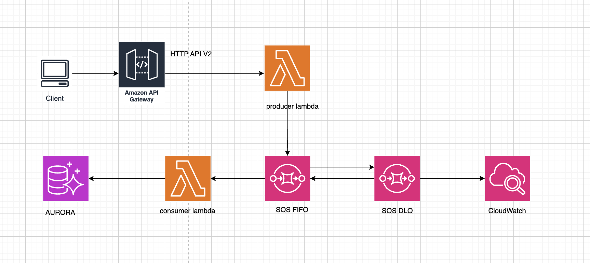
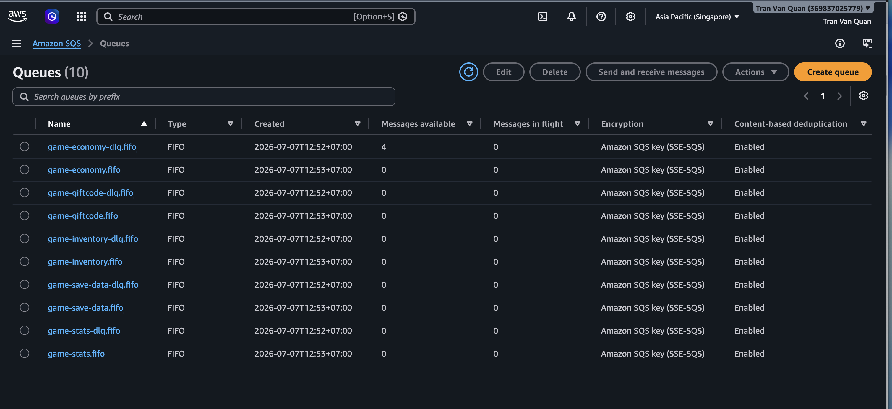
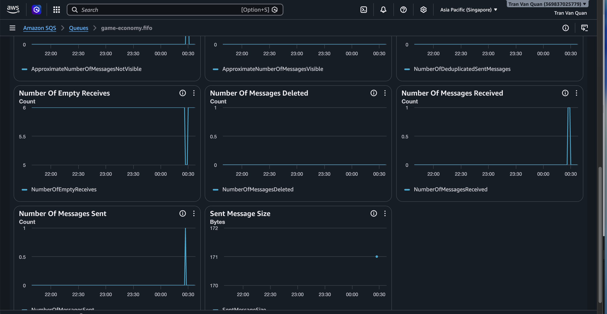
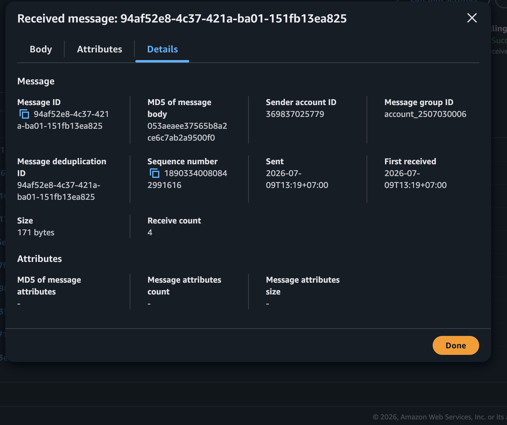
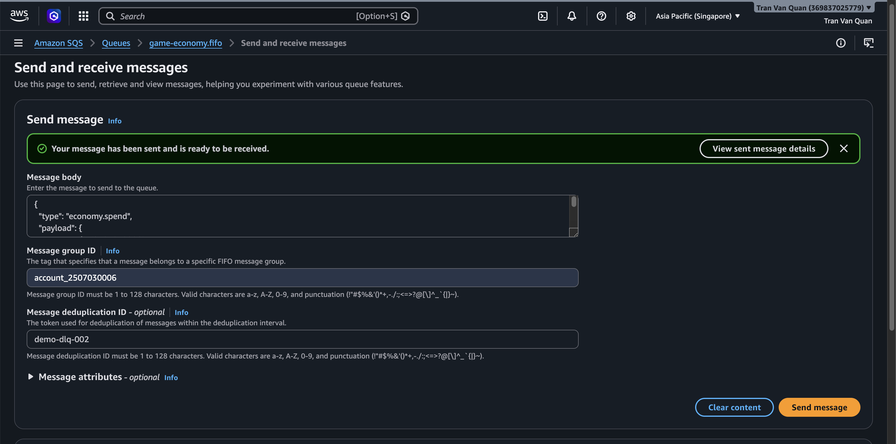
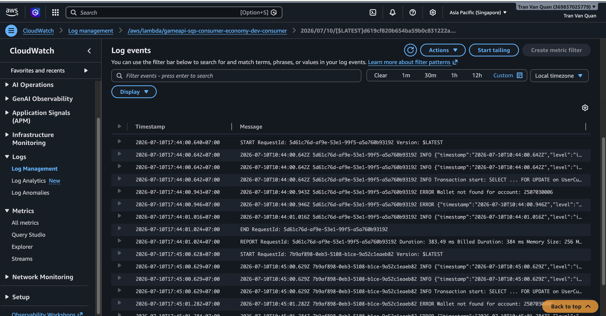
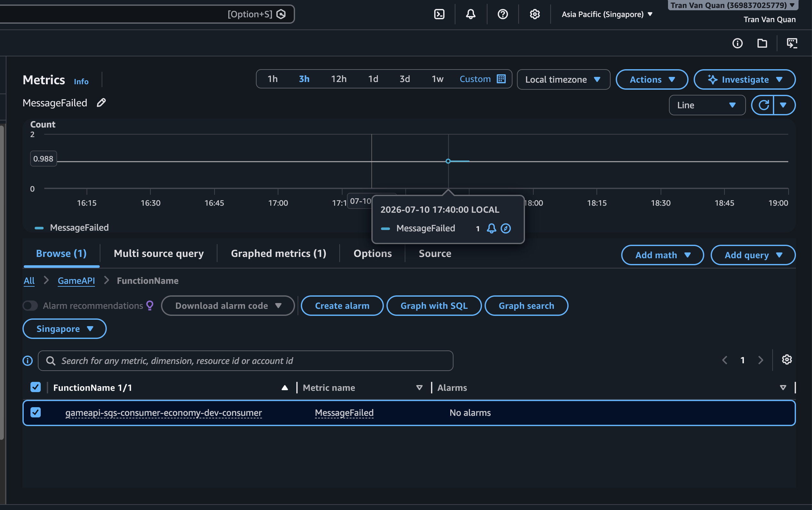
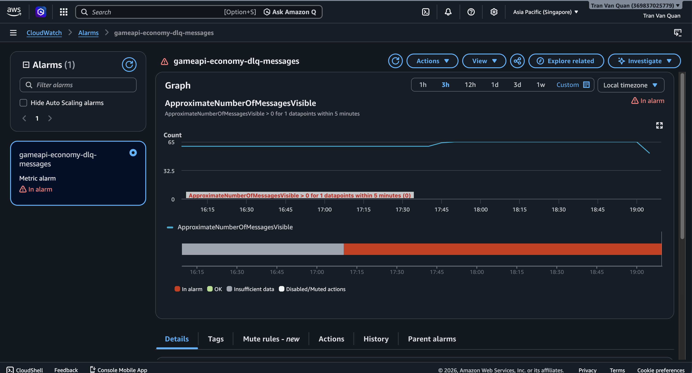

#### AWS DLQ & AWS CloudWatch

#### 5.7.1 Khái niệm

**AWS SQS DLQ (Dead Letter Queue - Hàng đợi thư chết)** không phải là một loại hàng đợi độc lập hay có tính năng kỹ thuật khác biệt, mà là một **vai trò** được gán cho một hàng đợi SQS thông thường (hoặc SQS FIFO) nhằm mục đích **chứa các tin nhắn bị lỗi hoặc không thể xử lý thành công** .

#### 5.7.2 Kiến trúc hệ thống SQS DLQ và CloudWatch



<div align="center"><i>Hình 5.7.1: Sơ đồ hệ thống.</i></div>

#### 5.7.3 Cấu hình DLQ

##### Định nghĩa DLQ trong serverless.yml

DLQ được định nghĩa cùng stack với source queue trong `services/sqs-infrastructure/serverless.yml`:

```YAML
EconomyQueue:
  Type: AWS::SQS::Queue
  Properties:
    QueueName: game-economy.fifo
    FifoQueue: true
    VisibilityTimeout: 60
    RedrivePolicy:
      deadLetterTargetArn: !GetAtt EconomyDLQ.Arn
      maxReceiveCount: 3       # ◄ Sau 3 lần fail → DLQ

EconomyDLQ:
  Type: AWS::SQS::Queue
  Properties:
    QueueName: game-economy-dlq.fifo
    FifoQueue: true
    MessageRetentionPeriod: 1209600  # 14 ngày
```

- **Retry tối đa 3 lần:** Khi Consumer Lambda xử lý message thất bại, Amazon SQS sẽ tự động đưa message trở lại Queue để thử xử lý lại. Trong workshop này, mỗi message được phép thử tối đa **3 lần** .
- **Lần thứ 4 sẽ vào DLQ:** Nếu sau 3 lần xử lý vẫn thất bại, Amazon SQS sẽ tự động chuyển message sang **Dead Letter Queue (DLQ)** để tránh làm ảnh hưởng đến Queue chính.
- **Message được giữ 14 ngày trong DLQ:** Message sẽ được lưu trong DLQ tối đa **14 ngày** , giúp quản trị viên có thời gian kiểm tra nguyên nhân lỗi và xử lý hoặc đưa message trở lại Queue chính nếu cần.

##### Deploy DLQ

```shell
cd services/sqs-infrastructure
npx serverless deploy --stage dev
```



<div align="center"><i>Hình 5.7.2: Deploy DLQ thành công.</i></div>

#### 5.7.4 Cấu hình Redrive Policy

`RedrivePolicy` là thuộc tính của main queue, quyết định **khi nào** message bị đẩy xuống DLQ.

```yaml
RedrivePolicy:
  deadLetterTargetArn: !GetAtt EconomyDLQ.Arn # ARN của DLQ
  maxReceiveCount: 3 # Số lần receive tối đa
```

**Cách hoạt động:**

1. Consumer nhận message → xử lý → throw error
2. `batchItemFailures` trả về `{ itemIdentifier: messageId }`
3. SQS không delete message → message trở lại queue sau `VisibilityTimeout` (60s)
4. SQS tăng `ApproximateReceiveCount` lên 1
5. Lặp lại bước 1-4 cho đến khi `ApproximateReceiveCount > maxReceiveCount`
6. Message được **chuyển sang DLQ** tự động

**Consumer Lambda mechanism**

```YAML
// services/sqs-consumer-economy/src/lambda.ts
export const handler = async (event: SQSEvent): Promise<SQSBatchResponse> => {
  const batchItemFailures: { itemIdentifier: string }[] = [];

  for (const record of event.Records) {
    try {
      const message: SQSMessage = JSON.parse(record.body);
      switch (message.type) {
        case 'economy.earn':
          await handleEarnCurrency(message.payload);
          break;
        case 'economy.spend':
          await handleSpendCurrency(message.payload);
          break;
        default:
          console.error(`Unknown message type: ${message.type}`);
      }
    } catch (error) {
      console.error(`Failed: ${record.messageId}`, error);
      batchItemFailures.push({ itemIdentifier: record.messageId });
    }
  }

  return { batchItemFailures };
};
```

Cấu hình consumer (`serverless.yml`) cần:

```YAML
events:
  - sqs:
      arn: !ImportValue EconomyQueueArn
      batchSize: 1                               # FIFO bắt buộc batchSize=1
      maximumConcurrency: 2
      functionResponseType: ReportBatchItemFailures  # <-- BẮT BUỘC để retry hoạt động
```

`functionResponseType: ReportBatchItemFailures` cho phép consumer báo lại SQS message nào failed. Nếu thiếu, SQS sẽ xem tất cả message trong batch là thành công dù Lambda trả về `batchItemFailures`.

#### 5.7.5 Kiểm thử retry DLQ

##### \* Gửi message vào queue


<div align="center"><i>Hình 5.7.3: Tạo message gửi vào queueTạo message gửi vào queue</i></div>

##### \* Xem retry trong logs consumer


<div align="center"><i>Hình 5.7.4: log event vào DLQ thành công.</i></div>

log lặp lại 3 lần, mỗi lần cách nhau ~60s:

Lần 2 (sau 60s): `ReceiveCount: 2`
Lần 3 (sau 60s): `ReceiveCount: 3`
Lần 4: message biến mất khỏi queue chính → đã vào DLQ

##### \* Kiểm tra ApproximateReceiveCount



<div align="center"><i>Hình 5.7.5: Quan sát các Metrics.</i></div>

Nếu Consumer đang retry vì:

- **Number of Messages Received** tăng.
- **Number of Messages Deleted** vẫn bằng 0 (do xử lý thất bại).

##### \* Kiểm tra message trong DLQ

Gửi một message khiến Consumer Lambda xử lý thất bại

```JSON
{
  "type": "economy.spend",
  "payload": {
    "accountId": "2507030006",
    "currencyType": "coin",
    "amount": 999999999
  },
  "timestamp": "2026-07-09T10:30:00Z"
}
```


<div align="center"><i>Hình 5.7.6: gửi 1 message lỗi vào consumer lambda.</i></div>

##### \* Theo dõi Consumer và chờ retry


<div align="center"><i>Hình 5.7.7: Log chờ retry.</i></div>

Vì Visibility Timeout = 30 giây nên phải chờ đến 90 giây để ReceiveCount = 4 sau đó SQS chuyển message sang DLQ

##### \* Kiểm tra DLQ

o

<div align="center"><i>Hình 5.7.8: message được gửi về DLQ.</i></div>

#### 5.7.6 Triển khai CloudWatch giám sát DLQ

Tích hợp Amazon CloudWatch vào hệ thống SQS Consumer Lambdas để:

- **Structured JSON Logs** — Log có cấu trúc, dễ query, filter, phân tích
- **CloudWatch Metrics** — Theo dõi số liệu xử lý (success/fail, processing time)
- **CloudWatch Alarm** — Cảnh báo khi có message rớt vào DLQ

##### * Structured Logger

```C#
export type LogLevel = 'debug' | 'info' | 'warn' | 'error';

const LOG_LEVELS: Record<LogLevel, number> = {
  debug: 0,
  info: 1,
  warn: 2,
  error: 3,
};

const currentLevel: LogLevel = (process.env.LOG_LEVEL as LogLevel) || 'info';

function shouldLog(level: LogLevel): boolean {
  return LOG_LEVELS[level] >= LOG_LEVELS[currentLevel];
}

function log(level: LogLevel, message: string, meta?: Record<string, unknown>): void {
  if (!shouldLog(level)) return;
  const entry = {
    timestamp: new Date().toISOString(),
    level,
    service: process.env.AWS_LAMBDA_FUNCTION_NAME || 'unknown',
    message,
    ...(meta ? { ...meta } : {}),
  };
  const output = JSON.stringify(entry);
  if (level === 'error') {
    console.error(output);
  } else if (level === 'warn') {
    console.warn(output);
  } else {
    console.log(output);
  }
}

export const logger = {
  debug: (msg: string, meta?: Record<string, unknown>) => log('debug', msg, meta),
  info: (msg: string, meta?: Record<string, unknown>) => log('info', msg, meta),
  warn: (msg: string, meta?: Record<string, unknown>) => log('warn', msg, meta),
  error: (msg: string, meta?: Record<string, unknown>) => log('error', msg, meta),
};
```

Logger được định nghĩa trong shared/src/utils/logger.ts, tự động ghi log dưới dạng JSON với các fields: timestamp, level, service, message, messageId, receiveCount, type, accountId, error.

Consumer Lambdas sử dụng logger này qua các method: logger.info(), logger.warn(), logger.error().

##### * CloudWatch Custom Metrics

```C#
import { CloudWatchClient, PutMetricDataCommand } from '@aws-sdk/client-cloudwatch';

const client = new CloudWatchClient({
  region: process.env.AWS_REGION || 'ap-southeast-1',
});

const NAMESPACE = 'GameAPI';

export async function putMetric(
  metricName: string,
  value: number,
  unit: 'Count' | 'Milliseconds' | 'Seconds' | 'Percent' | 'Bytes' = 'Count',
  dimensions?: { Name: string; Value: string }[],
): Promise<void> {
  try {
    await client.send(new PutMetricDataCommand({
      Namespace: NAMESPACE,
      MetricData: [{
        MetricName: metricName,
        Value: value,
        Unit: unit,
        Dimensions: dimensions || [],
        Timestamp: new Date(),
      }],
    }));
  } catch (error) {
    const err = error as Error;
    console.warn(JSON.stringify({
      timestamp: new Date().toISOString(),
      level: 'warn',
      message: 'Failed to put CloudWatch metric',
      metricName,
      error: err.message,
    }));
  }
}

export async function trackProcessingTime<T>(
  metricName: string,
  fn: () => Promise<T>,
  dimensions?: { Name: string; Value: string }[],
): Promise<T> {
  const start = Date.now();
  try {
    const result = await fn();
    await putMetric(metricName, Date.now() - start, 'Milliseconds', dimensions);
    return result;
  } catch (error) {
    await putMetric(`${metricName}Error`, 1, 'Count', dimensions);
    throw error;
  }
}
```

Metrics helper tại shared/src/cloudwatch/metrics.ts publish 3 metrics vào namespace **GameAPI**:

- MessageProcessed (Count) — Xử lý message thành công
- MessageFailed (Count) — Xử lý message thất bại
- ProcessingTime (Milliseconds) — Sau mỗi message (thành công hoặc thất bại)

##### * DLQ Alarm

```C#
    EconomyDLQAlarm:
      Type: AWS::CloudWatch::Alarm
      Properties:
        AlarmName: gameapi-economy-dlq-messages
        AlarmDescription: Alert when messages are in the Economy DLQ
        Namespace: AWS/SQS
        MetricName: ApproximateNumberOfMessagesVisible
        Statistic: Sum
        Period: 300
        EvaluationPeriods: 1
        Threshold: 0
        ComparisonOperator: GreaterThanThreshold
        Dimensions:
          - Name: QueueName
            Value: game-economy-dlq.fifo
        TreatMissingData: notBreaching
```

Alarm được định nghĩa trong services/sqs-infrastructure/serverless.yml cho mỗi DLQ:

- Alarm: gameapi-economy-dlq-messages — Metric: ApproximateNumberOfMessagesVisible > 0

Hiện tại alarm chỉ log lên CloudWatch, chưa có SNS action.

##### * Deploy

```shell
cd services/sqs-infrastructure
npx serverless deploy --stage dev
```

IAM roles cho CloudWatch đã được cấu hình trong workshop FIFO trước đó.

#### 5.7.7 Kiểm Thử CloudWatch

##### CloudWatch Logs



<div align="center"><i>Hình 5.7.9: Tiến hành gửi massage lỗi gây ra DLQ.</i></div>



<div align="center"><i>Hình 5.7.10: Giao diện log cloudwatch .</i></div>

* Consumer Lambda ghi log đầy đủ lên **Amazon CloudWatch Logs** sau mỗi lần xử lý message.
* Khi xử lý thành công, log hiển thị các bước thực thi và thông tin giao dịch.
* Khi xử lý thất bại, log ghi rõ nguyên nhân lỗi (ví dụ: `Wallet not found for account: 2507030006`).
* Mỗi lần thực thi đều có  **RequestId** , **Timestamp** và  **Duration** , giúp dễ dàng truy vết (tracing) và phân tích lỗi.
* CloudWatch Logs hỗ trợ theo dõi toàn bộ quá trình xử lý message từ SQS, phục vụ việc debug và giám sát hệ thống.

##### CloudWatch Metrics



<div align="center"><i>Hình 5.7.11: Giao diện test cloudwatch metrics.</i></div>

* Khi Consumer Lambda xử lý message thất bại, metric `MessageFailed` được gửi lên CloudWatch.
* CloudWatch ghi nhận giá trị metric bằng 1.
* Metric có thể được sử dụng để tạo Alarm và Dashboard theo dõi hệ thống.

##### CloudWatch Alarm



<div align="center"><i>Hình 5.7.12: Giao diện test cloudwatch Alarms.</i></div>

* Consumer Lambda xử lý thất bại.
* Message được retry tối đa 3 lần.
* Sau lần retry cuối, message được chuyển sang `game-economy-dlq.fifo`.
* CloudWatch ghi nhận `ApproximateNumberOfMessagesVisible > 0`.
* Alarm `gameapi-economy-dlq-messages` chuyển từ **OK** sang  **ALARM** .

#### 5.7.8 Tổng Kết

Qua workshop, hệ thống xử lý bất đồng bộ với **Amazon SQS FIFO** và **Dead Letter Queue (DLQ)** đã được triển khai và kiểm thử thành công. Producer Lambda gửi message vào hàng đợi FIFO, Consumer Lambda nhận và xử lý tuần tự nhằm đảm bảo tính nhất quán của dữ liệu.

Đối với các message xử lý thất bại, hệ thống tự động thực hiện  **retry tối đa 3 lần** . Nếu sau các lần retry message vẫn không được xử lý thành công, SQS sẽ tự động chuyển message sang **Dead Letter Queue (DLQ)** để tránh làm ảnh hưởng đến các message khác trong hàng đợi chính.

Bên cạnh đó, **Amazon CloudWatch** đã được tích hợp để giám sát toàn bộ quá trình xử lý. CloudWatch Logs ghi nhận chi tiết log thực thi của Lambda, CloudWatch Metrics theo dõi số lượng message lỗi thông qua metric `MessageFailed`, và CloudWatch Alarm tự động chuyển sang trạng thái **ALARM** khi DLQ xuất hiện message, giúp phát hiện và cảnh báo sự cố kịp thời.

Thông qua workshop, hệ thống đã đạt được các mục tiêu sau:

* Xây dựng thành công cơ chế xử lý bất đồng bộ bằng Amazon SQS FIFO.
* Triển khai Dead Letter Queue để cô lập các message lỗi sau nhiều lần retry.
* Theo dõi quá trình xử lý message bằng CloudWatch Logs và CloudWatch Metrics.
* Thiết lập CloudWatch Alarm để cảnh báo khi DLQ phát sinh message lỗi.
* Nâng cao khả năng giám sát, phân tích lỗi và tăng độ tin cậy của hệ thống xử lý sự kiện.

Kết quả đạt được cho thấy việc kết hợp **Amazon SQS FIFO, Dead Letter Queue và Amazon CloudWatch** giúp xây dựng một hệ thống xử lý bất đồng bộ ổn định, có khả năng tự phục hồi, dễ giám sát và dễ bảo trì trong môi trường sản xuất. Đây là một kiến trúc phù hợp cho các ứng dụng yêu cầu độ tin cậy cao và khả năng xử lý lỗi hiệu quả.
