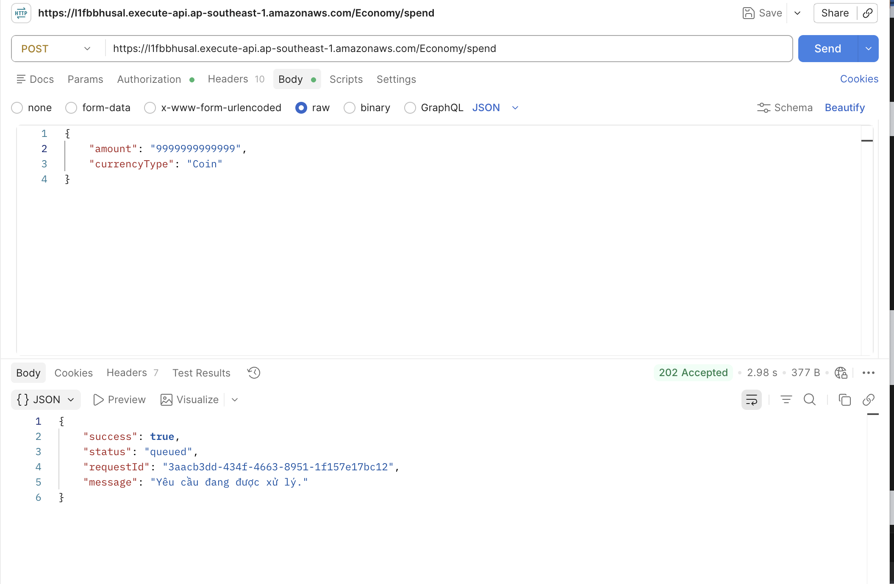
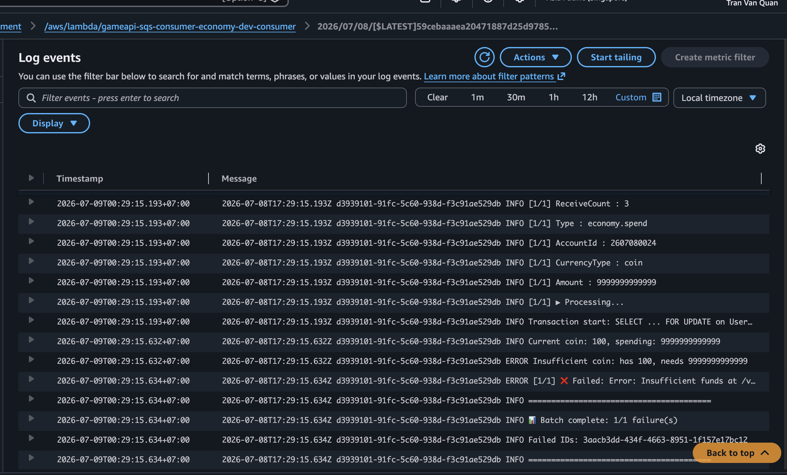
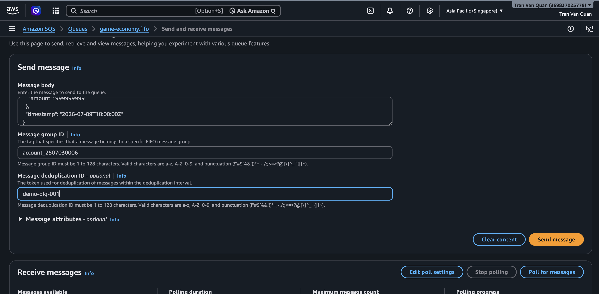
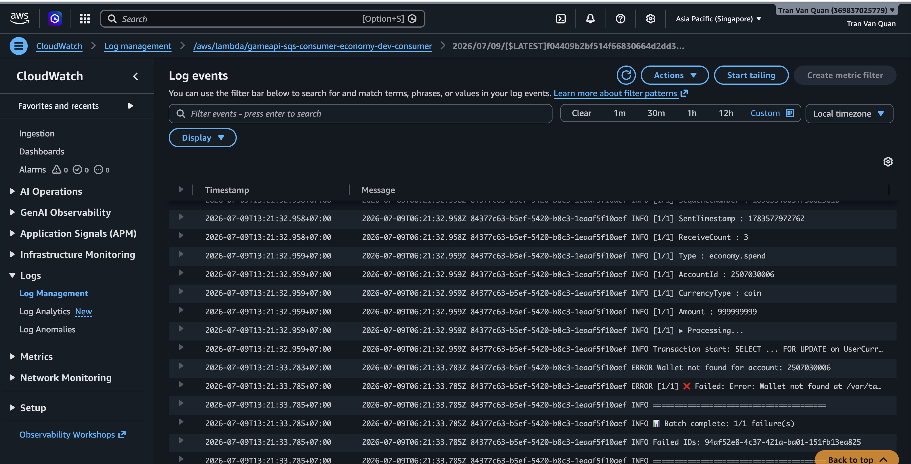

#### AWS SQS Dead Letter Queue

#### 5.7.1 Khái niệm

**AWS SQS DLQ (Dead Letter Queue - Hàng đợi thư chết)** không phải là một loại hàng đợi độc lập hay có tính năng kỹ thuật khác biệt, mà là một **vai trò** được gán cho một hàng đợi SQS thông thường (hoặc SQS FIFO) nhằm mục đích **chứa các tin nhắn bị lỗi hoặc không thể xử lý thành công** .

#### 5.7.2 Kiến trúc DLQ


<div align="center"><i>Hình 5.7.1: Sơ đồ hệ thống.</i></div>

#### 5.7.3 Cấu hình DLQ

##### Định nghĩa DLQ trong serverless.yml

DLQ được định nghĩa cùng stack với source queue trong `services/sqs-infrastructure/serverless.yml`:

```YAML
EconomyQueue:
  Type: AWS::SQS::Queue
  Properties:
    QueueName: game-economy.fifo
    FifoQueue: true
    VisibilityTimeout: 60
    RedrivePolicy:
      deadLetterTargetArn: !GetAtt EconomyDLQ.Arn
      maxReceiveCount: 3       # ◄ Sau 3 lần fail → DLQ

EconomyDLQ:
  Type: AWS::SQS::Queue
  Properties:
    QueueName: game-economy-dlq.fifo
    FifoQueue: true
    MessageRetentionPeriod: 1209600  # 14 ngày
```

- **Retry tối đa 3 lần:** Khi Consumer Lambda xử lý message thất bại, Amazon SQS sẽ tự động đưa message trở lại Queue để thử xử lý lại. Trong workshop này, mỗi message được phép thử tối đa **3 lần** .
- **Lần thứ 4 sẽ vào DLQ:** Nếu sau 3 lần xử lý vẫn thất bại, Amazon SQS sẽ tự động chuyển message sang **Dead Letter Queue (DLQ)** để tránh làm ảnh hưởng đến Queue chính.
- **Message được giữ 14 ngày trong DLQ:** Message sẽ được lưu trong DLQ tối đa **14 ngày** , giúp quản trị viên có thời gian kiểm tra nguyên nhân lỗi và xử lý hoặc đưa message trở lại Queue chính nếu cần.

##### Deploy DLQ

```shell
cd services/sqs-infrastructure
npx serverless deploy --stage dev
```


<div align="center"><i>Hình 5.7.2: Deploy DLQ thành công.</i></div>

#### 5.7.4 Cấu hình Redrive Policy

`RedrivePolicy` là thuộc tính của main queue, quyết định **khi nào** message bị đẩy xuống DLQ.

```yaml
RedrivePolicy:
  deadLetterTargetArn: !GetAtt EconomyDLQ.Arn # ARN của DLQ
  maxReceiveCount: 3 # Số lần receive tối đa
```

**Cách hoạt động:**

1. Consumer nhận message → xử lý → throw error
2. `batchItemFailures` trả về `{ itemIdentifier: messageId }`
3. SQS không delete message → message trở lại queue sau `VisibilityTimeout` (60s)
4. SQS tăng `ApproximateReceiveCount` lên 1
5. Lặp lại bước 1-4 cho đến khi `ApproximateReceiveCount > maxReceiveCount`
6. Message được **chuyển sang DLQ** tự động

**Consumer Lambda mechanism**

```YAML
// services/sqs-consumer-economy/src/lambda.ts
export const handler = async (event: SQSEvent): Promise<SQSBatchResponse> => {
  const batchItemFailures: { itemIdentifier: string }[] = [];

  for (const record of event.Records) {
    try {
      const message: SQSMessage = JSON.parse(record.body);
      switch (message.type) {
        case 'economy.earn':
          await handleEarnCurrency(message.payload);
          break;
        case 'economy.spend':
          await handleSpendCurrency(message.payload);
          break;
        default:
          console.error(`Unknown message type: ${message.type}`);
      }
    } catch (error) {
      console.error(`Failed: ${record.messageId}`, error);
      batchItemFailures.push({ itemIdentifier: record.messageId });
    }
  }

  return { batchItemFailures };
};
```

Cấu hình consumer (`serverless.yml`) cần:

```YAML
events:
  - sqs:
      arn: !ImportValue EconomyQueueArn
      batchSize: 1                               # FIFO bắt buộc batchSize=1
      maximumConcurrency: 2
      functionResponseType: ReportBatchItemFailures  # <-- BẮT BUỘC để retry hoạt động
```

`functionResponseType: ReportBatchItemFailures` cho phép consumer báo lại SQS message nào failed. Nếu thiếu, SQS sẽ xem tất cả message trong batch là thành công dù Lambda trả về `batchItemFailures`.

#### 5.7.5 Kiểm thử retry DLQ

##### \* Gửi message vào queue



<div align="center"><i>Hình 5.7.3: Tạo message gửi vào queueTạo message gửi vào queue</i></div>

##### \* Xem retry trong logs consumer



<div align="center"><i>Hình 5.7.4: log event vào DLQ thành công.</i></div>

log lặp lại 3 lần, mỗi lần cách nhau ~60s:

Lần 2 (sau 60s): `ReceiveCount: 2`
Lần 3 (sau 60s): `ReceiveCount: 3`
Lần 4: message biến mất khỏi queue chính → đã vào DLQ

##### \* Kiểm tra ApproximateReceiveCount


<div align="center"><i>Hình 5.7.5: Quan sát các Metrics.</i></div>

Nếu Consumer đang retry vì:

- **Number of Messages Received** tăng.
- **Number of Messages Deleted** vẫn bằng 0 (do xử lý thất bại).

##### \* Kiểm tra message trong DLQ

Gửi một message khiến Consumer Lambda xử lý thất bại

```JSON
{
  "type": "economy.spend",
  "payload": {
    "accountId": "2507030006",
    "currencyType": "coin",
    "amount": 999999999
  },
  "timestamp": "2026-07-09T10:30:00Z"
}
```



<div align="center"><i>Hình 5.7.6: gửi 1 message lỗi vào consumer lambda.</i></div>

##### \* Theo dõi Consumer và chờ retry



<div align="center"><i>Hình 5.7.7: Log chờ retry.</i></div>

Vì Visibility Timeout = 30 giây nên phải chờ đến 90 giây để ReceiveCount = 4 sau đó SQS chuyển message sang DLQ

##### \* Kiểm tra DLQ


<div align="center"><i>Hình 5.7.8: message được gửi về DLQ.</i></div>
