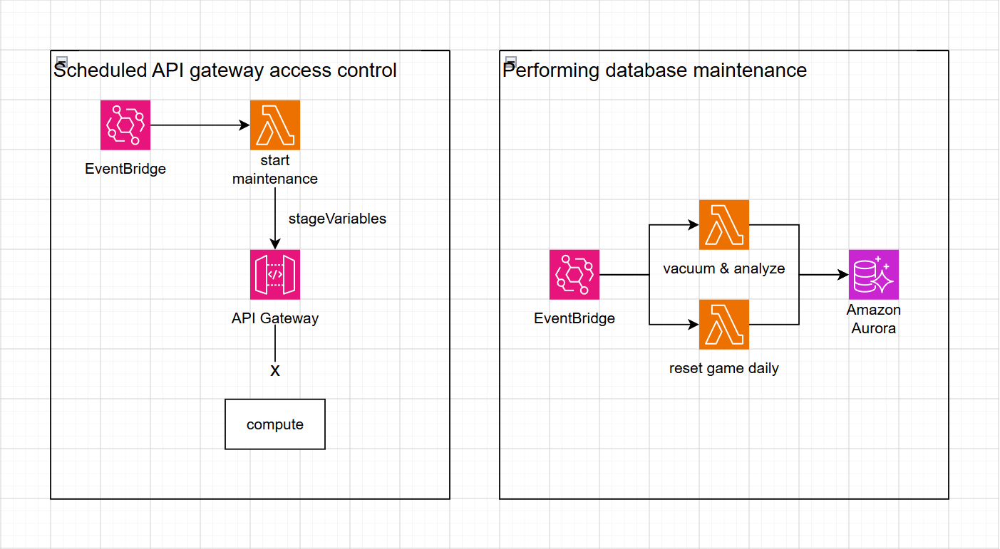

#### AWS EventBridge

#### 5.8.1 Overview

**Amazon EventBridge** is a serverless event bus service from AWS that connects applications using events. EventBridge simplifies building event-driven architectures that are flexible and highly scalable.

#### 5.8.2 EventBridge System Architecture



<div align="center"><i>Figure 5.8.1: Architecture diagram for system maintenance events.</i></div>

- **EventBridge** triggers the Maintenance Lambda on a Cron schedule.
- The **Lambda** enables Maintenance Mode — it updates an API Gateway stage variable (`maintenance=true`) and a DB flag (`SystemConfig.maintenance_mode=true`) to reject new requests.
- The **Lambda** connects directly to Aurora PostgreSQL via TypeORM using IAM authentication.
- The Lambda performs maintenance tasks such as:
  - `start_maintenance`: enable maintenance mode (no DB changes required).
  - `stop_maintenance`: disable maintenance mode.
  - `vacuum_analyze`: run `VACUUM ANALYZE` plus `REINDEX` on 15 tables.
  - `reset_daily`: reset player stamina to 20.0 and record the `last_daily_reset` timestamp.
- After the tasks complete (or when action is not start/stop), the Lambda disables maintenance mode.

#### 5.8.3 Creating EventBridge Schedules

Declare scheduled rules in the Lambda's `events` block (automatic deployment) inside `services/lambda-maintenance/serverless.yml`:

```yaml
functions:
  handler:
    handler: src/lambda.handler
    timeout: 120
    memorySize: 256
    events:
      - eventBridge:
          schedule: cron(0 10 ? * MON *)
          input:
            action: start_maintenance
      - eventBridge:
          schedule: cron(0 12 ? * MON *)
          input:
            action: stop_maintenance
      - eventBridge:
          schedule: cron(0 3 * * ? *)
          input:
            action: vacuum_analyze
      - eventBridge:
          schedule: cron(0 0 * * ? *)
          input:
            action: reset_daily
```

#### 5.8.4 Building the Maintenance Lambda

##### Directory structure

```
services/lambda-maintenance/
├── package.json
├── serverless.yml
├── tsconfig.json
└── src/
    ├── lambda.ts                 # Entry point — EventBridge handler
    ├── index.ts                  # Dev script (run locally)
    └── handlers/
        ├── startMaintenance.ts   # Enable maintenance mode
        ├── stopMaintenance.ts    # Disable maintenance mode
        ├── vacuumAnalyze.ts      # VACUUM + ANALYZE + REINDEX
        ├── resetDaily.ts         # Reset stamina + timestamp
```

##### Entry-point dispatcher

File: `services/lambda-maintenance/src/lambda.ts`

The Lambda receives EventBridge events, parses the `action` field, and dispatches to the corresponding handler:

```typescript
type MaintenanceAction = 'start_maintenance' | 'stop_maintenance'
  | 'vacuum_analyze' | 'reset_daily' | 'cleanup_data';

export const handler = async (event: EventBridgeEvent<'Scheduled Event', MaintenanceEvent>): Promise<void> => {
  await initializeApplicationDbContext();

  const { action } = event.detail;

  switch (action) {
    case 'start_maintenance':  await handleStartMaintenance();  break;
    case 'stop_maintenance':   await handleStopMaintenance();   break;
    case 'vacuum_analyze':     await handleVacuumAnalyze();     break;
    case 'reset_daily':        await handleResetDaily();        break;
  }

  await putMetric('MaintenanceAction', 1, 'Count', ...);
  await putMetric('MaintenanceDuration', elapsed, 'Milliseconds', ...);
};
```

##### Lambda execution flow

For `start_maintenance` action:

- **Enable Maintenance Mode** — call API Gateway `UpdateStageCommand` to set `maintenance=true`.
- **Set DB flag** — upsert `SystemConfig.maintenance_mode = true`.
- **Log to CloudWatch** — each step writes logs.

For `vacuum_analyze` action:

**Overview of VACUUM and ANALYZE:**

* **VACUUM:** Because PostgreSQL utilizes Multi-Version Concurrency Control, when UPDATE or DELETE operations occur, the system does not physically delete old data immediately; instead, it marks them as dead tuples. Over time, this causes table bloat. The VACUUM command is invoked to scan and reclaim storage space from these dead tuples, thereby freeing up capacity and maintaining disk read/write performance.
* **ANALYZE:** This command is responsible for collecting and updating statistics regarding the distribution of data within tables. The PostgreSQL Query Planner relies heavily on these statistics to calculate and determine the most optimal execution plan, ensuring that queries maintain fast response times even as data volumes grow.  

- **Connect to Aurora PostgreSQL** — via `ApplicationDbContext`.
- **VACUUM ANALYZE** — run for each table.
- **REINDEX** — run for each table.
- **Log and emit Metrics** — CloudWatch Logs and custom metrics.

#### 5.8.5 Maintenance Mode Handling

##### Maintenance Mode uses two parallel mechanisms:

- **API Gateway V2 Stage Variable**: `maintenance=true/false` — set via `UpdateStageCommand`.
- **Database Flag**: `SystemConfig` with key=`maintenance_mode`, value=`true/false`.

##### Middleware check

File: `shared/src/middlewares/maintenance.middleware.ts`

```typescript
export const maintenanceMiddleware = async (req, res, next) => {
  const repo = ApplicationDbContext.getRepository(SystemConfig);
  const config = await repo.findOne({ where: { key: "maintenance_mode" } });

  if (config?.value === "true") {
    res.status(503).json({
      error: "Service Unavailable",
      message: "The system is under maintenance. Please try again later.",
    });
    return;
  }
  next();
};
```

This middleware is injected into all six Lambda domain services (auth, economy, inventory, transaction, progression-world, loot-reward). It runs after DB initialization and before route handlers.

##### When `isMaintenance = true`

```
HTTP 503 Service Unavailable
{
  "error": "Service Unavailable",
  "message": "The system is under maintenance. Please try again later."
}
```

##### When `isMaintenance = false`

The system operates normally and the middleware is bypassed.

#### 5.8.6 Testing

##### Manual trigger example

```json
{
  "version": "0",
  "id": "test-event-001",
  "detail-type": "Scheduled Event",
  "source": "aws.events",
  "time": "2026-07-10T10:00:00Z",
  "detail": {
    "action": "start_maintenance"
  }
}
```


<div align="center"><i>Figure 5.8.2: Start maintenance via the Test tab.</i></div>

Click **Test** — the Lambda is invoked and should return success (200 OK).

##### Verify the Lambda invocation


<div align="center"><i>Figure 5.8.3: Observe charts in the Monitor tab.</i></div>

- **Invocations** — chart shows an increase after testing.
- **Duration** — processing time (expected a few to tens of seconds).
- **Error count & success rate (%)** — expected 0% errors.

##### Verify API behavior during maintenance


<div align="center"><i>Figure 5.8.4: API returns HTTP 503 during maintenance.</i></div>

##### Verify CloudWatch Logs


<div align="center"><i>Figure 5.8.5: Inspect logs in CloudWatch.</i></div>

##### Verify CloudWatch Metrics & Alarms


<div align="center"><i>Figure 5.8.6: Inspect metrics charts.</i></div>


<div align="center"><i>Figure 5.8.7: Inspect alarms.</i></div>

Alarms OK — no errors detected; maintenance executed successfully.

##### Stop maintenance example

```json
{
  "version": "0",
  "id": "test-event-002",
  "detail-type": "Scheduled Event",
  "source": "aws.events",
  "time": "2026-07-10T12:00:00Z",
  "detail": {
    "action": "stop_maintenance"
  }
}
```


<div align="center"><i>Figure 5.8.8: Stop maintenance via the Test tab.</i></div>

#### 5.8.7 Results

Maintenance is fully automated using **four EventBridge Rules**, each triggering the `gameapi-maintenance-dev-handler` Lambda on its own Cron schedule. Maintenance Mode is enforced using both an API Gateway stage variable and a DB flag (`SystemConfig.maintenance_mode`), combined with middleware that returns HTTP 503 to block requests during maintenance.

For database optimization, the Lambda runs **VACUUM ANALYZE + REINDEX** on 15 tables daily at 03:00 UTC. Daily resets occur at 00:00 UTC, including cleaning expired data (deactivating expired gift codes, deleting expired shop logs and save data), resetting player stamina to 20.0, and recording the `last_daily_reset` timestamp.

All actions are logged to **CloudWatch Logs** and emitted as three metrics (`MaintenanceAction`, `MaintenanceDuration`, `MaintenanceActionFailed`). The CloudWatch Alarm `gameapi-maintenance-action-failed` notifies the operations team if any maintenance errors occur, enabling timely detection and remediation.
