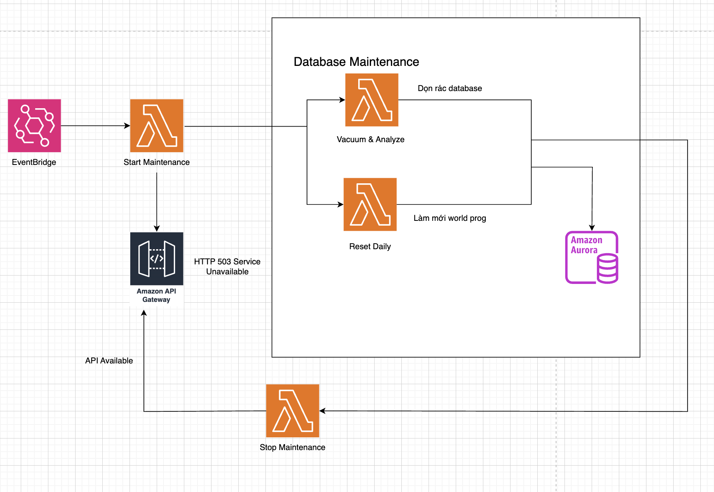
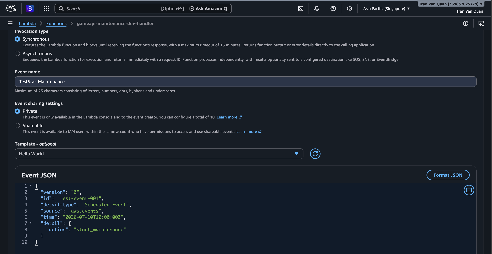
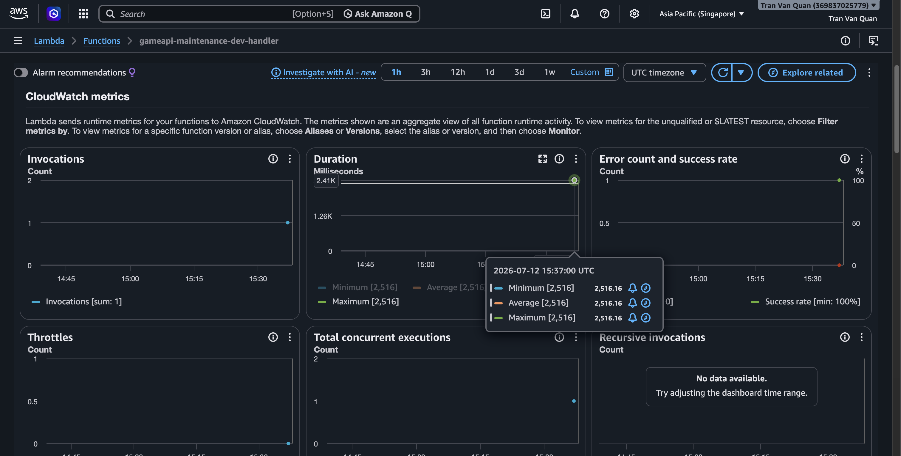
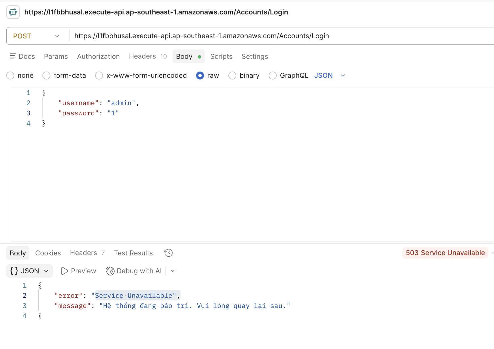
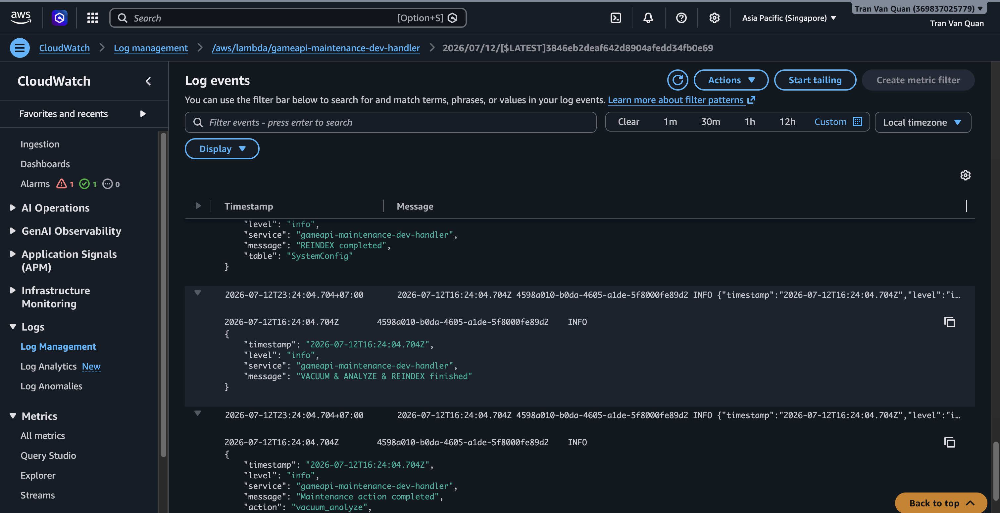
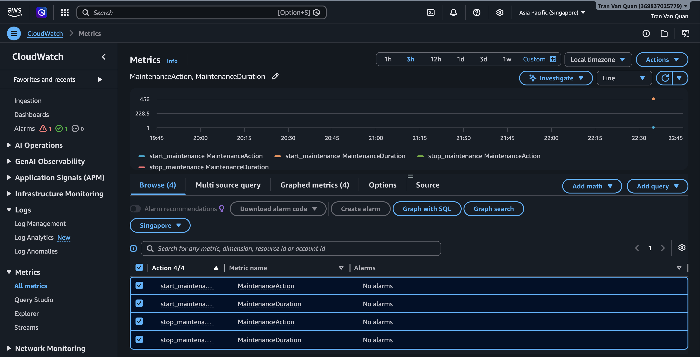
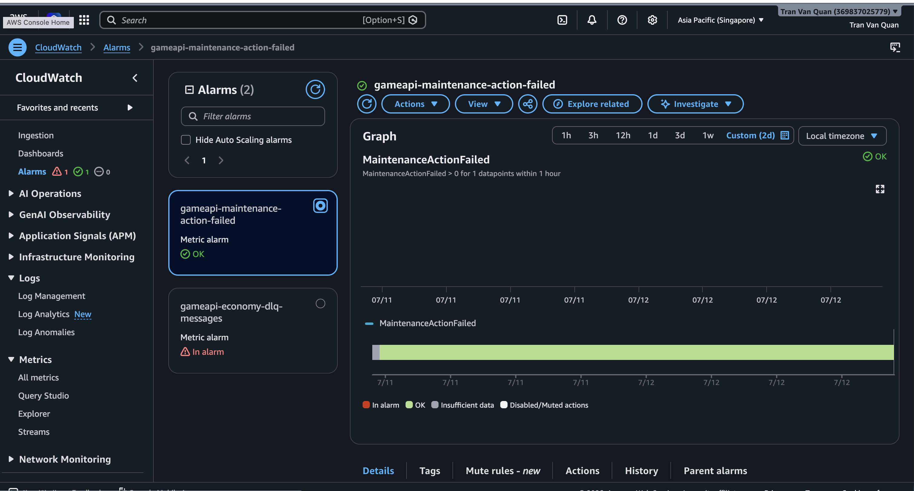
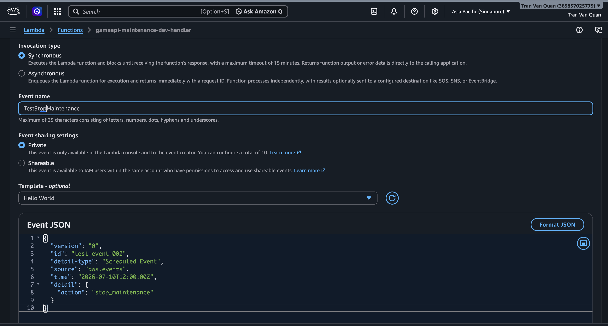

#### AWS EventBridge

#### 5.8.1 Khái niệm

**Amazon EventBridge** là dịch vụ bus sự kiện (event bus) không máy chủ (serverless) do AWS cung cấp, cho phép kết nối các ứng dụng với nhau bằng cách sử dụng các sự kiện (events). EventBridge giúp xây dựng kiến trúc ứng dụng theo hướng sự kiện (Event-Driven Architecture) một cách dễ dàng, linh hoạt và có khả năng mở rộng cao.

#### 5.8.2 Kiến trúc hệ thống EventBridge



<div align="center"><i>Hình 5.8.1: Sơ đồ kiến trúc EventBridge.</i></div>

- **EventBridge** kích hoạt Maintenance Lambda theo lịch Cron.
- **Lambda** bật Maintenance Mode — cập nhật API Gateway stage variable (`maintenance=true`) và DB flag (`SystemConfig.maintenance_mode=true`) để từ chối request mới.
- **Lambda** kết nối trực tiếp đến Aurora PostgreSQL qua TypeORM (IAM authentication).
- Thực hiện các tác vụ bảo trì:
  - `start_maintenance`: Bật maintenance mode (không có tác vụ DB).
  - `stop_maintenance`: Tắt maintenance mode.
  - `vacuum_analyze`: VACUUM ANALYZE + REINDEX trên 15 tables.
  - `reset_daily`: Reset stamina về 20.0, ghi timestamp `last_daily_reset`.
- Sau khi hoàn tất (hoặc nếu action không phải start/stop), Lambda tắt maintenance mode.

#### 5.8.3 Tạo EventBridge Scheduler

Khai báo trong events block của Lambda (tự động) trong file services/lambda-maintenance/serverless.yml :

```YAML
functions:
  handler:
    handler: src/lambda.handler
    timeout: 120
    memorySize: 256
    events:
      - eventBridge:
          schedule: cron(0 10 ? * MON *)
          input:
            action: start_maintenance
      - eventBridge:
          schedule: cron(0 12 ? * MON *)
          input:
            action: stop_maintenance
      - eventBridge:
          schedule: cron(0 3 * * ? *)
          input:
            action: vacuum_analyze
      - eventBridge:
          schedule: cron(0 0 * * ? *)
          input:
            action: reset_daily
```

#### 5.8.4 Xây dựng Maintenance Lambda

##### Cấu trúc thư mục

```
services/lambda-maintenance/
├── package.json
├── serverless.yml
├── tsconfig.json
└── src/
    ├── lambda.ts                 # Entry point — EventBridge handler
    ├── index.ts                  # Dev script (chạy local)
    └── handlers/
        ├── startMaintenance.ts   # Bật maintenance mode
        ├── stopMaintenance.ts    # Tắt maintenance mode
        ├── vacuumAnalyze.ts      # VACUUM + ANALYZE + REINDEX
        ├── resetDaily.ts         # Reset stamina + timestamp
```

##### Entry point dispatcher

File: `services/lambda-maintenance/src/lambda.ts`

Lambda nhận EventBridge event, parse trường `action` và dispatch đến handler tương ứng:

```typescript
type MaintenanceAction = 'start_maintenance' | 'stop_maintenance'
  | 'vacuum_analyze' | 'reset_daily' | 'cleanup_data';

export const handler = async (event: EventBridgeEvent<'Scheduled Event', MaintenanceEvent>): Promise<void> => {
  await initializeApplicationDbContext();

  const { action } = event.detail;

  switch (action) {
    case 'start_maintenance':  await handleStartMaintenance();  break;
    case 'stop_maintenance':   await handleStopMaintenance();   break;
    case 'vacuum_analyze':     await handleVacuumAnalyze();     break;
    case 'reset_daily':        await handleResetDaily();        break;
  }

  await putMetric('MaintenanceAction', 1, 'Count', ...);
  await putMetric('MaintenanceDuration', elapsed, 'Milliseconds', ...);
};
```

##### Lambda sẽ thực hiện lần lượt

Với action `start_maintenance`:

- **Bật Maintenance Mode** — gọi API Gateway `UpdateStageCommand` set `maintenance=true`
- **Ghi flag DB** — upsert `SystemConfig.maintenance_mode = true`
- **Ghi CloudWatch Logs** — mỗi bước đều có log

Với action `vacuum_analyze`:

**Tổng quan về VACUUM và ANALYZE:**
- **VACUUM:** Do PostgreSQL sử dụng cơ chế kiểm soát đồng thời nhiều phiên bản (MVCC - Multi-Version Concurrency Control), khi các tác vụ `UPDATE` hoặc `DELETE` diễn ra, hệ thống không xóa vật lý các dữ liệu cũ ngay lập tức mà chỉ đánh dấu chúng là "dead tuples". Theo thời gian, điều này gây ra hiện tượng phình to dữ liệu (table bloat). Lệnh `VACUUM` được gọi để quét và thu hồi không gian lưu trữ từ các dead tuples này, giúp giải phóng dung lượng và duy trì tốc độ đọc/ghi ổ đĩa.
- **ANALYZE:** Lệnh này có nhiệm vụ thu thập và cập nhật các số liệu thống kê (statistics) về phân bổ dữ liệu bên trong các bảng. Trình tối ưu hóa truy vấn (Query Planner) của PostgreSQL phụ thuộc hoàn toàn vào số liệu này để tính toán và đưa ra kế hoạch thực thi (execution plan) tối ưu nhất, giúp các truy vấn (queries) luôn giữ được tốc độ phản hồi nhanh, ngay cả khi lượng dữ liệu lớn dần.
- Bằng cách kết hợp **VACUUM ANALYZE** và **REINDEX** (chống phân mảnh các chỉ mục) chạy tự động vào giờ thấp điểm, cơ sở dữ liệu luôn tự động làm sạch và duy trì hiệu năng ở mức cao nhất mà không cần can thiệp thủ công.

**Các bước thực thi của Lambda:**
- **Kết nối Aurora PostgreSQL** — qua `ApplicationDbContext`
- **VACUUM ANALYZE** — lặp qua từng table
- **REINDEX** — lặp qua từng table
- **Ghi CloudWatch Logs** + Metrics

#### 5.8.5 Xử lý Maintenance Mode

##### Maintenance Mode sử dụng 2 cơ chế song song:

**API Gateway V2 Stage Variable**: `maintenance=true/false` — set qua `UpdateStageCommand`

**Database Flag**: `SystemConfig` key=`maintenance_mode`, value=`true/false`

##### Middleware kiểm tra

File: `shared/src/middlewares/maintenance.middleware.ts`

```typescript
export const maintenanceMiddleware = async (req, res, next) => {
  const repo = ApplicationDbContext.getRepository(SystemConfig);
  const config = await repo.findOne({ where: { key: "maintenance_mode" } });

  if (config?.value === "true") {
    res.status(503).json({
      error: "Service Unavailable",
      message: "Hệ thống đang bảo trì. Vui lòng quay lại sau.",
    });
    return;
  }
  next();
};
```

Middleware được inject vào tất cả 6 Lambda domain services (auth, economy, inventory, transaction, progression-world, loot-reward), chạy ngay sau DB initialization và trước routes.

##### Khi isMaintenance = true

```
HTTP 503 Service Unavailable
{
  "error": "Service Unavailable",
  "message": "Hệ thống đang bảo trì. Vui lòng quay lại sau."
}
```

##### Khi isMaintenance = false

Hệ thống hoạt động bình thường, middleware bypass.

#### 5.8.6 Kiểm Thử

##### \* Kích hoạt thủ công

```json
{
  "version": "0",
  "id": "test-event-001",
  "detail-type": "Scheduled Event",
  "source": "aws.events",
  "time": "2026-07-10T10:00:00Z",
  "detail": {
    "action": "start_maintenance"
  }
}
```



<div align="center"><i>Hình 5.8.2: Khởi động bảo trì ở tab Test.</i></div>

Nhấn **Test** — Lambda được kích hoạt, kỳ vọng trả về thành công (200 OK).

##### \* Kiểm tra Lambda được kích hoạt



<div align="center"><i>Hình 5.8.3: Quan sát biểu đồ ở tab Monitor.</i></div>

- **Invocations** — biểu đồ hiển thị số lần gọi tăng lên sau khi test
- **Duration** — thời gian xử lý (kỳ vọng vài giây đến vài chục giây)
- **Error count & success rate (%)** — kỳ vọng 0% errors

##### * Kiểm tra API trong thời gian bảo trì



<div align="center"><i>Hình 5.8.4: Trả HTTP 503 vì đang trong thời gian bảo trì.</i></div>

##### * Kiểm tra CloudWatch Logs



<div align="center"><i>Hình 5.8.5: Kiểm tra log trong CloudWatch.</i></div>

##### * Kiểm tra CloudWatch Metrics & Alarm



<div align="center"><i>Hình 5.8.6: Kiểm tra biểu đồ metrics.</i></div>



<div align="center"><i>Hình 5.8.7: Kiểm tra Alarms.</i></div>

Alarms OK Không có lỗi — maintenance hoạt động tốt

##### * Tắt maintenance

```json
{
  "version": "0",
  "id": "test-event-002",
  "detail-type": "Scheduled Event",
  "source": "aws.events",
  "time": "2026-07-10T12:00:00Z",
  "detail": {
    "action": "stop_maintenance"
  }
}
```



<div align="center"><i>Hình 5.8.8: Tắt bảo trì ở tab Test.</i></div>


#### 5.8.7 Kết quả đạt được

Hệ thống maintenance được tự động hóa hoàn toàn qua **4 EventBridge Rules**, mỗi rule kích hoạt Lambda `gameapi-maintenance-dev-handler` theo lịch Cron riêng. Maintenance Mode sử dụng song song API Gateway stage variable và DB flag (`SystemConfig.maintenance_mode`), kết hợp middleware trả về HTTP 503 để chặn request khi đang bảo trì.

Về tối ưu database, Lambda chạy **VACUUM ANALYZE + REINDEX** trên 15 tables vào lúc 03:00 UTC mỗi ngày. Reset dữ liệu định kỳ diễn ra lúc 00:00 UTC hàng ngày, bao gồm dọn dẹp dữ liệu cũ (deactivate gift code hết hạn, xóa shop log và save data quá hạn), reset stamina player về 20.0 và ghi timestamp `last_daily_reset`.

Toàn bộ quá trình được ghi nhận chi tiết qua **CloudWatch Logs** và 3 metrics (`MaintenanceAction`, `MaintenanceDuration`, `MaintenanceActionFailed`). CloudWatch Alarm `gameapi-maintenance-action-failed` sẽ cảnh báo nếu có bất kỳ lỗi nào xảy ra trong quá trình maintenance, giúp đội ngũ vận hành phát hiện và xử lý kịp thời.
