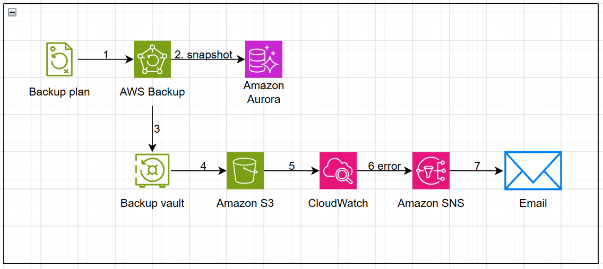
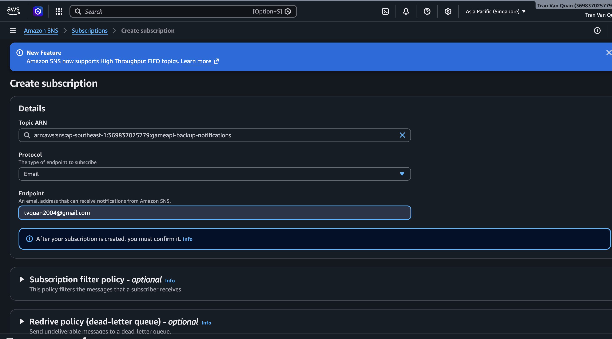
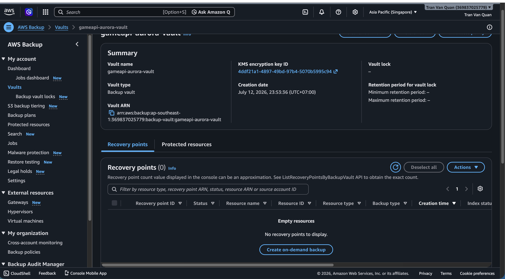
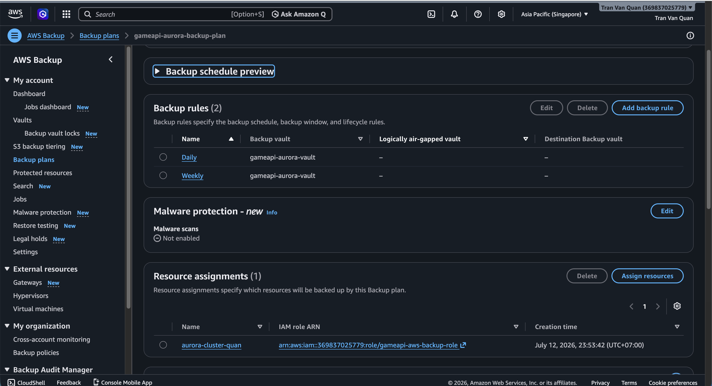
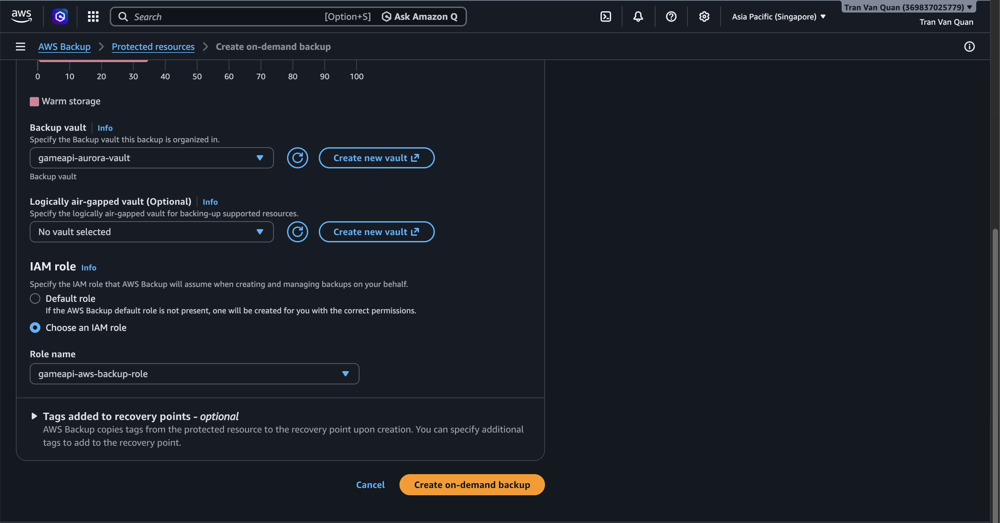
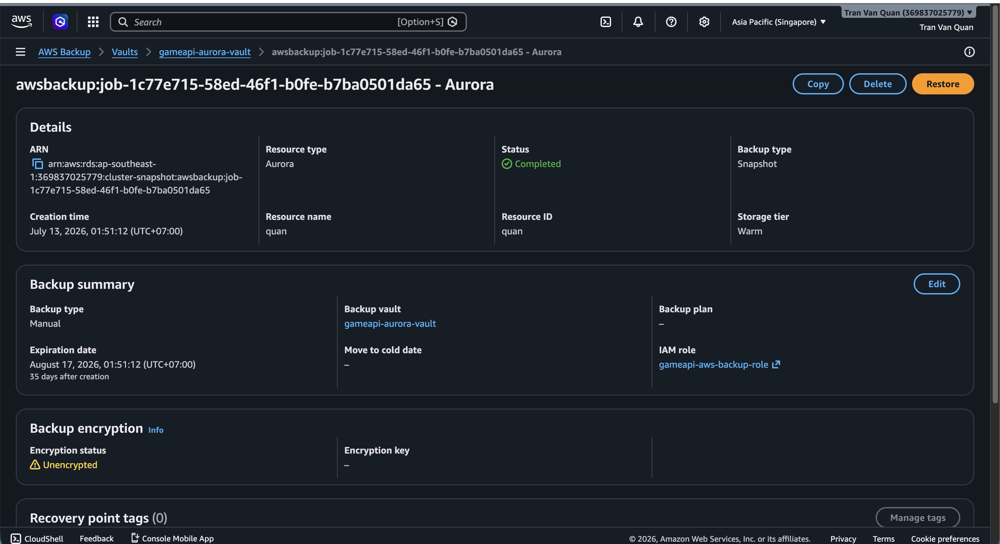
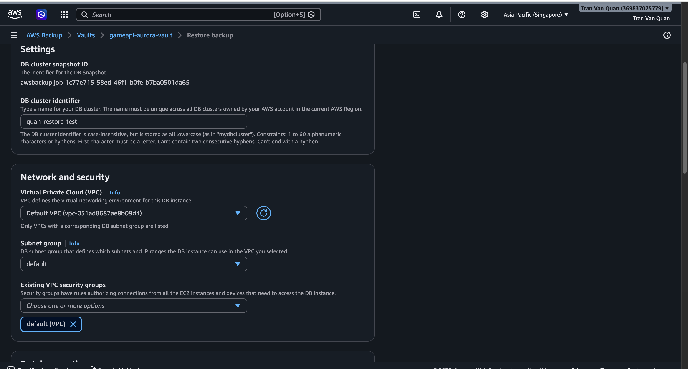
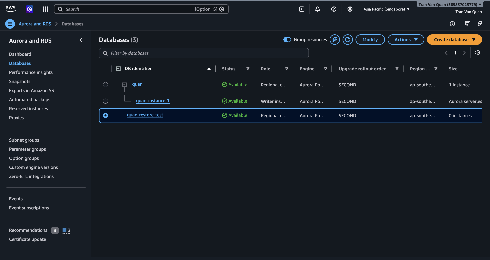
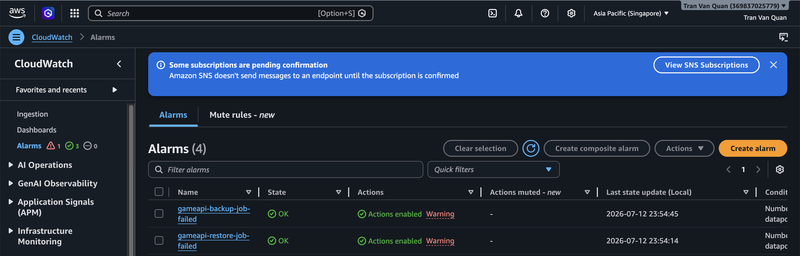
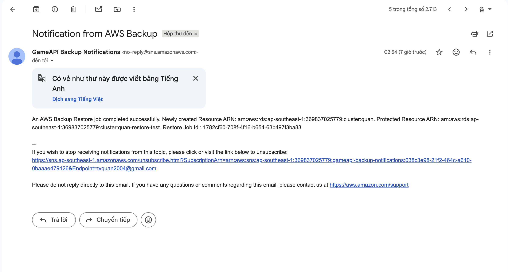

#### AWS Backup

#### 5.9.1 Introduction

**AWS Backup** is a fully managed service that centralizes data backup across multiple AWS services. AWS Backup allows you to define centralized backup policies, automate backup schedules, and manage data restoration in a unified manner.

#### 5.9.2 AWS Backup Architecture



<div align="center"><i>Figure 5.9.1: AWS Backup system architecture.</i></div>

Backup workflow:

* **Backup Plan** triggers according to the configured schedule (Daily/Weekly).
* **AWS Backup** automatically backs up **Amazon Aurora PostgreSQL**.
* Backups are stored in **Backup Vault** and create **Recovery Points**.
* When restoration is needed, **Restore Job** uses **Recovery Points** to create **Aurora PostgreSQL (Restored Cluster)**.
* **Amazon CloudWatch** monitors Backup/Restore Jobs and triggers **Alarms** on errors.
* **Amazon SNS** sends alert notifications to the administrator's **Email**.

The backup process operates as follows:

**Daily at 05:00 UTC** — AWS Backup triggers a full snapshot of the Aurora cluster.

- Snapshot is encrypted using KMS key and stored in the vault.
- Snapshot is retained for **14 days**, then automatically deleted.

**Weekly on Sunday at 05:00 UTC** — AWS Backup creates a weekly snapshot.

- Snapshot is retained for **56 days** (8 weeks), then automatically deleted.

**When backup completes or fails** — SNS Topic receives the event and sends notification.

**CloudWatch Alarm** — immediately alerts if any backup/restore job fails.

#### 5.9.3 Creating Backup Vault & KMS Key

##### Directory structure

```
services/aws-backup-infrastructure/
├── serverless.yml    # CloudFormation: vault, plan, selection, IAM, alarm
```

##### KMS Key

The backup vault uses a dedicated KMS CMK (Customer Managed Key):

```yaml
BackupKmsKey:
  Type: AWS::KMS::Key
  Properties:
    Description: KMS key for GameAPI Aurora backup vault encryption
    Enabled: true
    KeyPolicy:
      Statement:
        - Sid: EnableAdminPermissions
          Effect: Allow
          Principal:
            AWS: !Sub arn:aws:iam::${AWS::AccountId}:root
          Action: kms:*
          Resource: '*'
        - Sid: AllowBackupService
          Effect: Allow
          Principal:
            Service: backup.amazonaws.com
          Action:
            - kms:Decrypt
            - kms:GenerateDataKey
            - kms:DescribeKey
          Resource: '*'

BackupKmsKeyAlias:
  Type: AWS::KMS::Alias
  Properties:
    AliasName: alias/gameapi-aurora-backup
    TargetKeyId: !Ref BackupKmsKey
```

The key has alias `alias/gameapi-aurora-backup` for easy reference later.

##### Backup Vault

```yaml
BackupVault:
  Type: AWS::Backup::BackupVault
  Properties:
    BackupVaultName: gameapi-aurora-vault
    EncryptionKeyArn: !GetAtt BackupKmsKey.Arn
    Notifications:
      BackupVaultEvents:
        - BACKUP_JOB_COMPLETED
        - BACKUP_JOB_FAILED
        - RESTORE_JOB_COMPLETED
        - RESTORE_JOB_FAILED
      SNSTopicArn: !Ref BackupSnsTopic
```

The vault is configured to send notifications to the SNS Topic for 4 event types: backup completed, backup failed, restore completed, restore failed.

#### 5.9.4 Creating Backup Plan & Selection

##### IAM Role

AWS Backup needs an IAM Role to have permission to snapshot RDS:

```yaml
BackupRole:
  Type: AWS::IAM::Role
  Properties:
    RoleName: gameapi-aws-backup-role
    AssumeRolePolicyDocument:
      Statement:
        - Effect: Allow
          Principal:
            Service: backup.amazonaws.com
          Action: sts:AssumeRole
    ManagedPolicyArns:
      - arn:aws:iam::aws:policy/service-role/AWSBackupServiceRolePolicyForBackup
```

The `AWSBackupServiceRolePolicyForBackup` policy is an AWS managed policy that grants backup permissions for RDS, DynamoDB, EFS, Storage Gateway, etc.

##### Backup Plan with 2 Rules

```yaml
BackupPlan:
  Type: AWS::Backup::BackupPlan
  Properties:
    BackupPlan:
      BackupPlanName: gameapi-aurora-backup-plan
      BackupPlanRule:
        - RuleName: Daily
          TargetBackupVault: !Ref BackupVault
          ScheduleExpression: cron(0 5 * * ? *)
          StartWindowMinutes: 60
          CompletionWindowMinutes: 120
          Lifecycle:
            DeleteAfterDays: 14
        - RuleName: Weekly
          TargetBackupVault: !Ref BackupVault
          ScheduleExpression: cron(0 5 ? * SUN *)
          StartWindowMinutes: 60
          CompletionWindowMinutes: 180
          Lifecycle:
            DeleteAfterDays: 56
```

`StartWindowMinutes`: The time AWS Backup is allowed to delay the job (if resources are busy).
`CompletionWindowMinutes`: The maximum time for the job to complete.

##### Resource Assignment

```yaml
BackupSelection:
  Type: AWS::Backup::BackupSelection
  Properties:
    BackupPlanId: !Ref BackupPlan
    BackupSelection:
      SelectionName: aurora-cluster-<cluster-name>
      IamRoleArn: !GetAtt BackupRole.Arn
      Resources:
        - arn:aws:rds:<region>:<aws-account-id>:cluster:<cluster-name>
```

The assigned resource is the Aurora cluster `<cluster-name>` (full ARN). Can be extended by using tag-based selection instead of hardcoded ARN:

```yaml
Resources: []
ResourcesTags:
  - Key: backup
    Value: true
```

#### 5.9.5 Monitoring & Alerting

##### SNS Topic

```yaml
BackupSnsTopic:
  Type: AWS::SNS::Topic
  Properties:
    TopicName: gameapi-backup-notifications
    DisplayName: GameAPI Backup Notifications
```

The SNS Topic receives events from Backup Vault and CloudWatch Alarms.

##### CloudWatch Alarms

```yaml
BackupFailedAlarm:
  Type: AWS::CloudWatch::Alarm
  Properties:
    AlarmName: gameapi-backup-job-failed
    Namespace: AWS/Backup
    MetricName: NumberOfBackupJobsFailed
    Statistic: Sum
    Period: 86400
    EvaluationPeriods: 1
    Threshold: 0
    ComparisonOperator: GreaterThanThreshold
    TreatMissingData: notBreaching
    AlarmActions:
      - !Ref BackupSnsTopic
    Dimensions:
      - Name: BackupVaultName
        Value: gameapi-aurora-vault

RestoreFailedAlarm:
  Type: AWS::CloudWatch::Alarm
  Properties:
    AlarmName: gameapi-restore-job-failed
    Namespace: AWS/Backup
    MetricName: NumberOfRestoreJobsFailed
    Statistic: Sum
    Period: 86400
    EvaluationPeriods: 1
    Threshold: 0
    ComparisonOperator: GreaterThanThreshold
    TreatMissingData: notBreaching
    AlarmActions:
      - !Ref BackupSnsTopic
```

These two alarms check every 24 hours (86400s); if any backup or restore job fails → transitions to `ALARM` and sends notification via SNS.

#### 5.9.6 Deploy

##### Deploy Stack

```bash
cd services/aws-backup-infrastructure
npx serverless deploy --stage dev
```

##### Subscribe SNS

After deployment, go to **AWS Console → SNS → Topics → `gameapi-backup-notifications` → Create subscription**: Confirm the subscription via email before receiving notifications.



<div align="center"><i>Figure 5.9.2: Confirm email for backup failure notifications.</i></div>

#### 5.9.7 Testing

##### * Check Backup Vault



<div align="center"><i>Figure 5.9.3: Backup Vault created successfully.</i></div>

##### * Check Backup Plan



<div align="center"><i>Figure 5.9.4: Backup Plan created successfully.</i></div>

- **Rules**: Daily (14 days) + Weekly (56 days)
- **Resource assignments**: Aurora cluster `<cluster-name>`

##### * Run Manual Backup



<div align="center"><i>Figure 5.9.5: Configure manual backup run.</i></div>



<div align="center"><i>Figure 5.9.6: Backup run successful.</i></div>

- **Resource**: `<cluster-name>`
- **Backup size**: snapshot size
- **Creation time**: time of creation
- **Expiration date:** backup expiration time

##### * Check Restore

* Go to AWS Console → **AWS Backup** → **Backup vaults** → `gameapi-aurora-vault` → Recovery points
* Select recovery point → Click **Restore**



<div align="center"><i>Figure 5.9.7: Configure new Aurora cluster.</i></div>

* Click **Restore backup** — the restore job will create a new Aurora cluster from the snapshot.



<div align="center"><i>Figure 5.9.8: New cluster appears.</i></div>

* After confirming success, remember to delete the test cluster to avoid additional costs.

##### * Check Monitoring & Notification



<div align="center"><i>Figure 5.9.9: CloudWatch Alarms in OK state.</i></div>



<div align="center"><i>Figure 5.9.10: SNS Email receives notification when Backup or Restore completes.</i></div>
