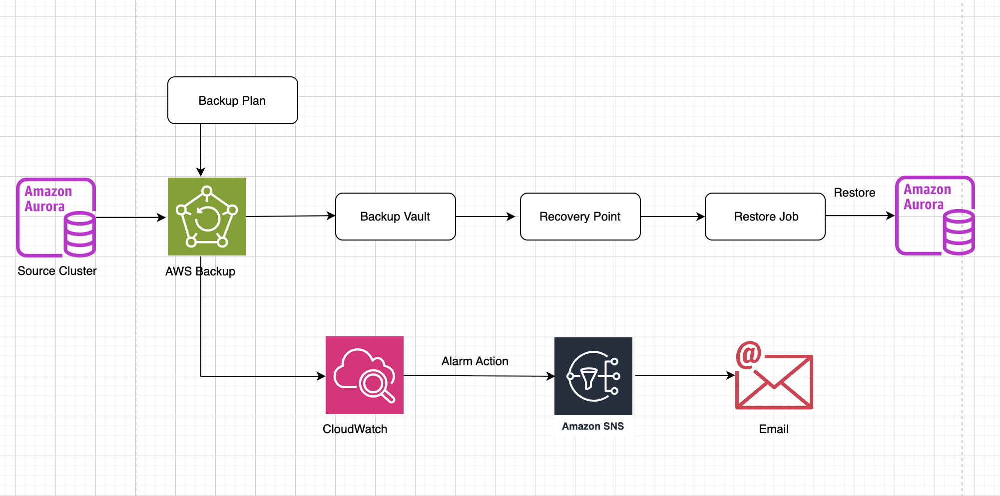

#### AWS Backup

#### 5.9.1 Giới thiệu

**AWS Backup** là dịch vụ được quản lý hoàn toàn (fully managed) giúp tập trung hóa việc sao lưu dữ liệu trên nhiều dịch vụ AWS khác nhau. AWS Backup cho phép bạn định nghĩa các chính sách sao lưu (backup policies) tập trung, tự động hóa lịch sao lưu, và quản lý việc khôi phục (restore) dữ liệu một cách thống nhất.

#### 5.9.2 Kiến trúc AWS Backup



<div align="center"><i>Hình 5.9.1: Kiến trúc hệ thống AWS Backup.</i></div>

Workflow backup :

* **Backup Plan** kích hoạt theo lịch đã cấu hình (Daily/Weekly).
* **AWS Backup** tự động sao lưu  **Amazon Aurora PostgreSQL** .
* Bản sao lưu được lưu trong **Backup Vault** và tạo  **Recovery Point** .
* Khi cần khôi phục, **Restore Job** sử dụng **Recovery Point** để tạo  **Aurora PostgreSQL (Restored Cluster)** .
* **Amazon CloudWatch** giám sát các Backup/Restore Job và kích hoạt **Alarm** khi có lỗi.
* **Amazon SNS** gửi thông báo cảnh báo đến **Email** của quản trị viên.

Quy trình backup hoạt động như sau:

**Hàng ngày lúc 05:00 UTC** — AWS Backup kích hoạt snapshot toàn bộ Aurora cluster.

- Snapshot được mã hóa bằng KMS key và lưu vào vault.
- Snapshot được giữ lại **14 ngày**, sau đó tự động xóa.

**Chủ nhật hàng tuần lúc 05:00 UTC** — AWS Backup tạo snapshot weekly.

- Snapshot được giữ lại **56 ngày** (8 tuần), sau đó tự động xóa.

**Khi backup hoàn tất hoặc thất bại** — SNS Topic nhận event và gửi thông báo.

**CloudWatch Alarm** — cảnh báo ngay lập tức nếu có backup/restore job failed.

#### 5.9.3 Tạo Backup Vault & KMS Key

##### Cấu trúc thư mục

```
services/aws-backup-infrastructure/
├── serverless.yml    # CloudFormation: vault, plan, selection, IAM, alarm
```

##### KMS Key

Backup vault sử dụng KMS CMK (Customer Managed Key) riêng:

```yaml
BackupKmsKey:
  Type: AWS::KMS::Key
  Properties:
    Description: KMS key for GameAPI Aurora backup vault encryption
    Enabled: true
    KeyPolicy:
      Statement:
        - Sid: EnableAdminPermissions
          Effect: Allow
          Principal:
            AWS: !Sub arn:aws:iam::${AWS::AccountId}:root
          Action: kms:*
          Resource: '*'
        - Sid: AllowBackupService
          Effect: Allow
          Principal:
            Service: backup.amazonaws.com
          Action:
            - kms:Decrypt
            - kms:GenerateDataKey
            - kms:DescribeKey
          Resource: '*'

BackupKmsKeyAlias:
  Type: AWS::KMS::Alias
  Properties:
    AliasName: alias/gameapi-aurora-backup
    TargetKeyId: !Ref BackupKmsKey
```

Key có alias `alias/gameapi-aurora-backup` để dễ dàng tham chiếu sau này.

##### Backup Vault

```yaml
BackupVault:
  Type: AWS::Backup::BackupVault
  Properties:
    BackupVaultName: gameapi-aurora-vault
    EncryptionKeyArn: !GetAtt BackupKmsKey.Arn
    Notifications:
      BackupVaultEvents:
        - BACKUP_JOB_COMPLETED
        - BACKUP_JOB_FAILED
        - RESTORE_JOB_COMPLETED
        - RESTORE_JOB_FAILED
      SNSTopicArn: !Ref BackupSnsTopic
```

Vault được cấu hình gửi thông báo ra SNS Topic cho 4 loại sự kiện: backup completed, backup failed, restore completed, restore failed.

#### 5.9.4 Tạo Backup Plan & Selection

##### IAM Role

AWS Backup cần một IAM Role để có quyền snapshot RDS:

```yaml
BackupRole:
  Type: AWS::IAM::Role
  Properties:
    RoleName: gameapi-aws-backup-role
    AssumeRolePolicyDocument:
      Statement:
        - Effect: Allow
          Principal:
            Service: backup.amazonaws.com
          Action: sts:AssumeRole
    ManagedPolicyArns:
      - arn:aws:iam::aws:policy/service-role/AWSBackupServiceRolePolicyForBackup
```

Policy `AWSBackupServiceRolePolicyForBackup` là AWS managed policy, cấp quyền backup cho RDS, DynamoDB, EFS, Storage Gateway,...

##### Backup Plan với 2 Rules

```yaml
BackupPlan:
  Type: AWS::Backup::BackupPlan
  Properties:
    BackupPlan:
      BackupPlanName: gameapi-aurora-backup-plan
      BackupPlanRule:
        - RuleName: Daily
          TargetBackupVault: !Ref BackupVault
          ScheduleExpression: cron(0 5 * * ? *)
          StartWindowMinutes: 60
          CompletionWindowMinutes: 120
          Lifecycle:
            DeleteAfterDays: 14
        - RuleName: Weekly
          TargetBackupVault: !Ref BackupVault
          ScheduleExpression: cron(0 5 ? * SUN *)
          StartWindowMinutes: 60
          CompletionWindowMinutes: 180
          Lifecycle:
            DeleteAfterDays: 56
```

`StartWindowMinutes`: thời gian AWS Backup được phép trì hoãn job (nếu tài nguyên đang bận).
`CompletionWindowMinutes`: thời gian tối đa để job hoàn thành.

##### Resource Assignment

```yaml
BackupSelection:
  Type: AWS::Backup::BackupSelection
  Properties:
    BackupPlanId: !Ref BackupPlan
    BackupSelection:
      SelectionName: aurora-cluster-<cluster-name>
      IamRoleArn: !GetAtt BackupRole.Arn
      Resources:
        - arn:aws:rds:<region>:<aws-account-id>:cluster:<cluster-name>
```

Assigned resource là Aurora cluster `<cluster-name>` (ARN đầy đủ). Có thể mở rộng bằng cách dùng tag-based selection thay vì hardcode ARN:

```yaml
Resources: []
ResourcesTags:
  - Key: backup
    Value: true
```

#### 5.9.5 Monitoring & Alerting

##### SNS Topic

```yaml
BackupSnsTopic:
  Type: AWS::SNS::Topic
  Properties:
    TopicName: gameapi-backup-notifications
    DisplayName: GameAPI Backup Notifications
```

SNS Topic nhận event từ Backup Vault và CloudWatch Alarms.

##### CloudWatch Alarms

```yaml
BackupFailedAlarm:
  Type: AWS::CloudWatch::Alarm
  Properties:
    AlarmName: gameapi-backup-job-failed
    Namespace: AWS/Backup
    MetricName: NumberOfBackupJobsFailed
    Statistic: Sum
    Period: 86400
    EvaluationPeriods: 1
    Threshold: 0
    ComparisonOperator: GreaterThanThreshold
    TreatMissingData: notBreaching
    AlarmActions:
      - !Ref BackupSnsTopic
    Dimensions:
      - Name: BackupVaultName
        Value: gameapi-aurora-vault

RestoreFailedAlarm:
  Type: AWS::CloudWatch::Alarm
  Properties:
    AlarmName: gameapi-restore-job-failed
    Namespace: AWS/Backup
    MetricName: NumberOfRestoreJobsFailed
    Statistic: Sum
    Period: 86400
    EvaluationPeriods: 1
    Threshold: 0
    ComparisonOperator: GreaterThanThreshold
    TreatMissingData: notBreaching
    AlarmActions:
      - !Ref BackupSnsTopic
```

Hai alarm này kiểm tra mỗi 24 giờ (86400s), nếu có bất kỳ backup hoặc restore job nào failed → chuyển sang `ALARM` và gửi thông báo qua SNS.

#### 5.9.6 Deploy

##### Deploy Stack

```bash
cd services/aws-backup-infrastructure
npx serverless deploy --stage dev
```

##### Subscribe SNS

Sau deploy, vào **AWS Console → SNS → Topics → `gameapi-backup-notifications` → Create subscription**: Xác nhận subscription qua email trước khi nhận thông báo


<div align="center"><i>Hình 5.9.2: Xác nhận email nhận thông báo khi backup lỗi.</i></div>

#### 5.9.7 Kiểm thử

##### * Kiểm tra Backup Vault


<div align="center"><i>Hình 5.9.3: Backup Vault được tạo thành công.</i></div>

##### * Kiểm tra Backup Plan


<div align="center"><i>Hình 5.9.4: Backup Plan được tạo thành công.</i></div>

- **Rules**: Daily (14 days) + Weekly (56 days)
- **Resource assignments**: Aurora cluster `<cluster-name>`

##### * Chạy Backup thủ công


<div align="center"><i>Hình 5.9.5: Cấu hình chạy backup thủ công.</i></div>


<div align="center"><i>Hình 5.9.6: Chạy backup thành công.</i></div>

- **Resource**: `<cluster-name>`
- **Backup size**: dung lượng snapshot
- **Creation time**: thời gian tạo
- **Expiration date:** thời gian kết thúc backup

##### * Kiểm tra Restore

* Vào AWS Console → **AWS Backup** → **Backup vaults** → `gameapi-aurora-vault` → Recovery points
* Chọn recovery point → Click **Restore**


<div align="center"><i>Hình 5.9.7: Cấu hình Aurora cluster mới.</i></div>

* Nhấn **Restore backup** — job restore sẽ tạo một Aurora cluster mới từ snapshot.


<div align="center"><i>Hình 5.9.8: Cluster mới xuất hiện.</i></div>

* Sau khi xác nhận thành công, nhớ xóa cluster test để tránh phát sinh chi phí.

##### * Kiểm tra Monitoring & Notification


<div align="center"><i>Hình 5.9.9: CloudWatch Alarms ở trạng thái OK.</i></div>


<div align="center"><i>Hình 5.9.10: SNS Email nhận thông báo khi Backup hoặc Restore hoàn thành.</i></div>
